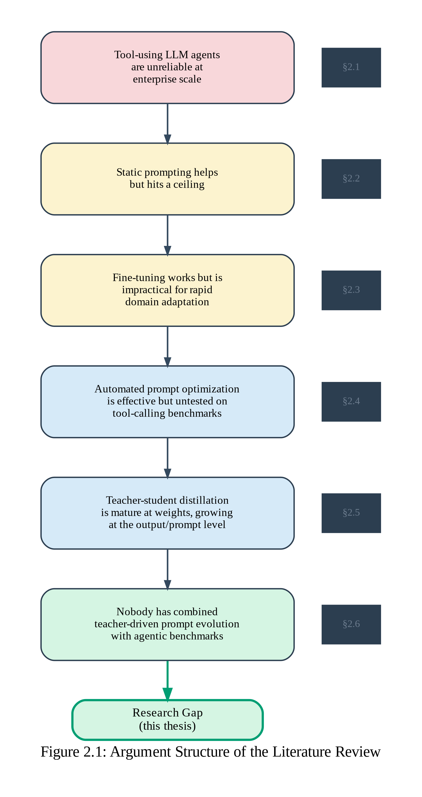
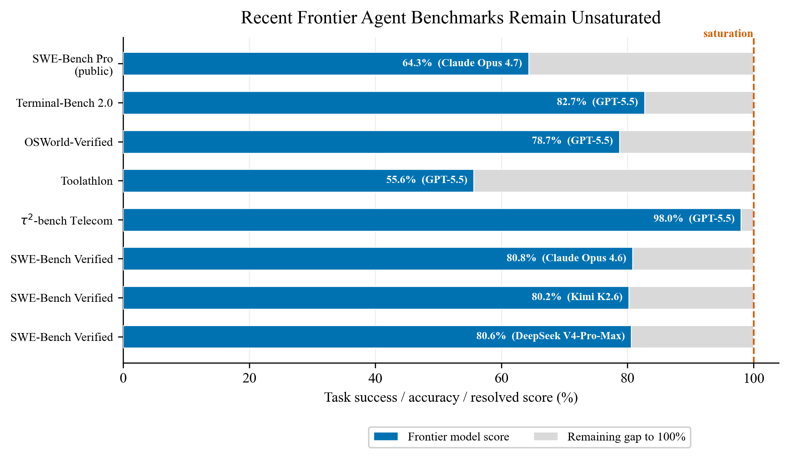
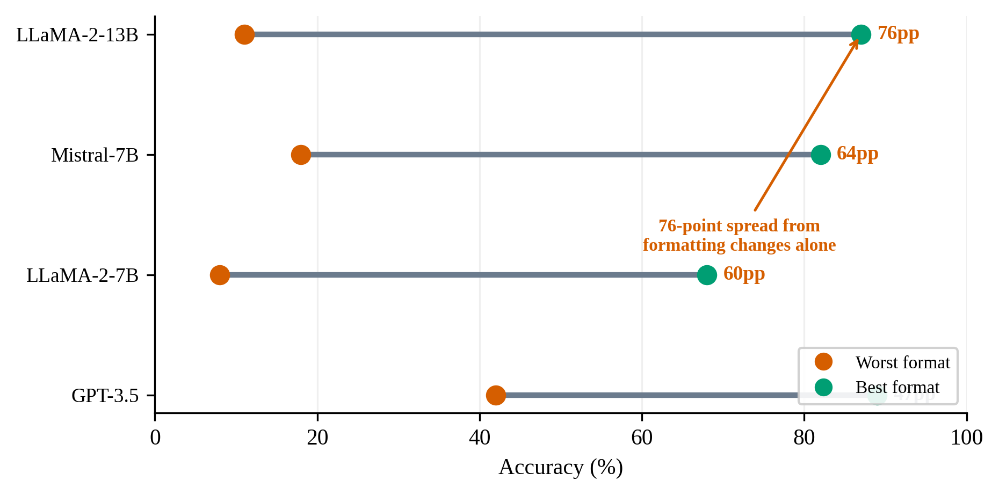
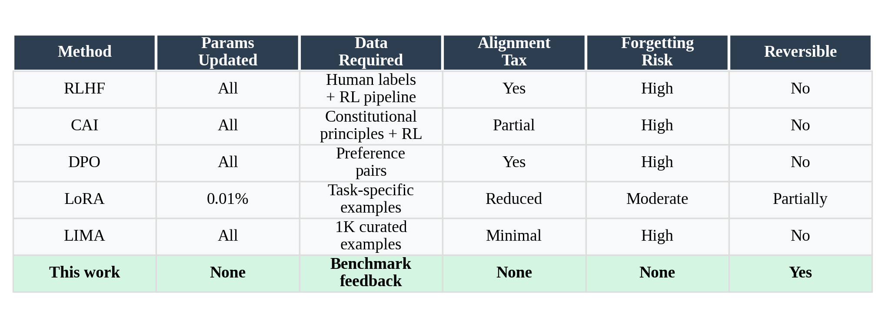
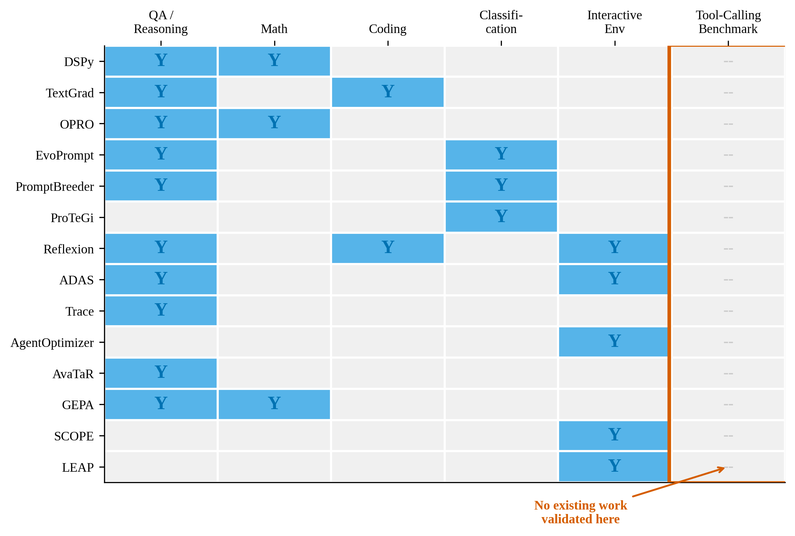
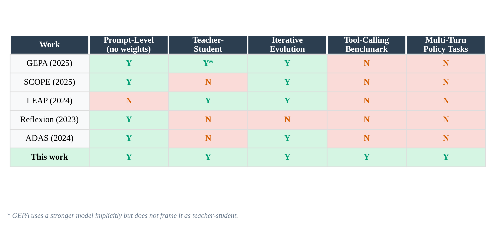

# 2. Literature Review

We start by discussing the areas that converge on the research gap this work fills, namely benchmarking agents, automatically optimizing prompts, and transferring knowledge in a teacher--student architecture. We show the necessity of this work in six steps, by demonstrating that tool-using LLM agents are unreliable at enterprise scale; that this can be partially fixed by static prompting, and by fine-tuning and RLHF, but that neither are practical for achieving enterprise-grade reliability. To combat this, one can automatically iterate on prompts, as recent research has shown---but the performance of this approach is untested on tool-calling. Somewhat tangentially, smaller models have been distilled for some time now from their larger brethren, but that has been limited to weight adaptation. If we were to combine the above, it would appear that attacking agentic benchmarks with teacher-driven prompt evolution has not yet been attempted, but appears a possibly fruitful endeavour. Underlying this academic argument is a business one, reviewed in Section 2.1.1: the recurring human cost of diagnosing agent failures and manually editing prompts---what this thesis terms the *implementation tax*---is the primary barrier to enterprise AI adoption at scale, and automating this loop has direct economic value. Section 2.6 synthesizes these observations into the specific gap this thesis fills. @Fig:argument-flow visualizes this six-step argument structure.

{#fig:argument-flow}

A useful lens for understanding the thesis's core architectural decision comes from dual-process theory in cognitive psychology. @kahneman2011 distinguishes between System 1---fast, automatic, and intuitive processing that operates with minimal effort---and System 2---slow, deliberate, and analytical reasoning that requires concentration and conscious effort. This distinction has been widely adopted in the AI research community as a metaphor for different modes of model computation [@bengio2019; @lecun2022]. Standard autoregressive language models, which generate tokens sequentially from learned distributions, function analogously to System 1: they produce fluent and contextually appropriate outputs through pattern recognition, but struggle with tasks requiring multi-step planning, self-correction, or policy adherence [@yao2023react]. Reasoning models---such as OpenAI's o1 [@openai2024], DeepSeek-R1 [@deepseek2025], and Kimi K1.5 [@kimi2025a]---attempt to endow LLMs with System 2 capabilities by scaling test-time compute through extended chains of thought trained via reinforcement learning. @snell2024 formally demonstrated that scaling test-time compute can be more effective than scaling model parameters, establishing a new axis for capability improvement.

This distinction is hsa implications for enterprise deployment of AI agents. In voice AI customer service---the primary application domain for τ²-bench---latency is often the critical constraint. Research shows that voice agents are to respond within 500--800 milliseconds if they are to retain a natural flow of the conversation. Failing that and reaching latency of one second will raise customer abandonment rates by ~40% [@cresta2025; @retellai2025]. Reasoning improves model performance by producing intermediate tokens before a final response (so-called test-time compute), but is therefore fundamentally incompatible with latency requirements. This puts consumers into a predicament: enterprises require System 2-like capabilities for reliable behavior, but at the same time they need System 1 latency. What this work attempts is resolving this tention by temporal disjunction: leveraging System 2 at design time (the teacher model analyzing failures and generating prompt patches offline) to improve System 1 performance at run time (the student model responding within latency constraints using improved prompts and harness). This framing positions the contribution not as a workaround but as a principled architectural pattern that mirrors how human organizations operate: experts spend time deliberating on procedures so that frontline staff can execute quickly and reliably.

## 2.1 The Enterprise Reliability Gap in Tool-Using Agents

LLMs are most useful as agents, replicating human behavior. As such, their performance on tasks requiring agency has to be somehow measured. A cottage industry of benchmarks arose that attempt exactly this---evaluate LLMs on real-world multi-turn conversations, tool calls, and policy following. This work builds on the τ-bench family. The original 2024 benchmark [@yao2024] measured tool--agent--user interaction in retail and airline customer service; GPT-4o failed 50%+ of the tasks, and the probability of solving the same task 8 times consecutively was <25% in retail domain. τ²-bench [@barres2025] complicate the tasks by testing tool calls and end database state, and by adding a telecom domain. It is on this benchmark that we will be building in this work.

There are numerous other benchmarks. We will consider a) agentic benchmarks; b) AgentBench [@liu2023] tested 29 models across 8 various environments and found that long-term reasoning, decision-making, and instruction following were the main bottlenecks. SWE-bench [@jimenez2024] pulled 2,294 software engineering tasks from GitHub; the best model solved under 2% of them. While these benchmarks underscore poor performance of frontier models on real world tasks, they do not directly translate to enterprise use cases.

ToolBench [@qin2023] threw over 16,000 real-world RESTful APIs at open-source instruction-tuned models; they scored zero percent, and even ChatGPT needed a bespoke depth-first search decision tree to perform reasonably. API-Bank [@li2023] found that GPT-4 still failed at parameter extraction, API selection, and sequential planning across 73 tools. GAIA [@mialon2023] asked 466 real-world questions requiring reasoning, browsing, and tool use; humans scored 92%, GPT-4 with plugins scored 15%. A 77-point gap, running precisely opposite to the usual narrative of LLMs matching or beating human performance. Most recently, CRMArena and its successor CRMArena-Pro [@huang2025crmarena; @huang2025crmarenapro] brought enterprise customer service benchmarking into a realistic Salesforce sandbox with 19 expert-validated tasks across service, sales, and CPQ scenarios. Leading agents achieved only 58% single-turn success, dropping to 35% in multi-turn settings---a decay pattern directly relevant to the multi-turn customer service tasks in τ²-bench. CRMArena-Pro also pioneered confidentiality-awareness evaluation and found a troubling tension: prompting agents to respect data sensitivity reduced task accuracy, suggesting that enterprise constraints actively conflict with task performance rather than being orthogonal to it.

@Fig:benchmark-gap summarizes the best-model scores across these benchmarks, illustrating the scale of the enterprise reliability gap.

{#fig:benchmark-gap}

Two meta-analyses frame these results. @kapoor2024 analyzed agent benchmarking practices and found fifty-fold cost variation for similar accuracy levels; complex agent architectures buy marginal accuracy gains at exponential cost. This supports the argument that prompt-level optimization is a more efficient improvement path than architectural scaling. @rabanser2025 proposed twelve metrics decomposing agent reliability across consistency, robustness, predictability, and safety. Testing fourteen models over eighteen months on GAIA and τ-bench, they identified a persistent *capability--reliability gap*: accuracy improves faster than reliability. They argue that enterprise autonomous operation requires three to five nines (99.9%--99.999%); current LLM agents are not on track to reach this threshold through scaling alone. @reliabilitybench2026 formalized this production gap quantitatively, introducing a three-dimensional reliability surface $R(k, \varepsilon, \lambda)$ that unifies consistency (over $k$ trials), robustness (under perturbation level $\varepsilon$), and fault tolerance (at fault intensity $\lambda$). Testing 1,280 episodes across GPT-4o variants, they found that perturbations alone cause 8.8% reliability degradation, and that simpler ReAct architectures outperform Reflexion in surface volume---suggesting that complex self-reflection mechanisms may amplify fault impacts rather than mitigate them. Their practical heuristic is sobering: if a benchmark reports 90% accuracy, expect 70--80% in production once consistency and faults are accounted for. Telling a model to be more reliable is akin to urging a student to try harder on an exam---a fine sentiment, scarcely a strategy. The economic consequences of this reliability gap are reviewed in Section 2.1.1. @brynjolfsson2025, studying 5,172 customer support agents in a paper published in *The Quarterly Journal of Economics*, found that AI assistance increases worker productivity by 14--15% on average and by 34% for novice workers, because AI disseminates best practices of more able workers. This finding directly supports the thesis's approach: a system that continuously learns from best practices---whether human-identified or teacher-model-diagnosed---can create compounding productivity gains without sustained human intervention.

### 2.1.1 The economic context of the reliability gap

The reliability gap documented above acquires urgency when set against the economics of customer service. Fully automated AI interactions cost \$0.50--\$2.00 per interaction versus \$5--\$15 for human agents [@gartner2023cost; @quidget2025], creating a 5--10$\times$ cost advantage that has driven rapid market growth: the contact center AI market is expanding at 21--25% CAGR, from roughly \$2 billion in 2024 to a projected \$7--13 billion by 2030--2034 [@grandviewresearch2024; @fortunebi2025]. Yet the gap between market aspiration and operational reality is wide. The RAND Corporation, based on interviews with 65 data scientists, found that over 80% of AI projects fail---twice the rate of non-AI IT projects---with root causes including misaligned problem framing, inadequate data, and infrastructure gaps [@ryseff2024]. MIT's 2025 report found that 95% of generative AI pilots fail to deliver measurable P\&L impact, with specialized vendor-led projects succeeding approximately 67% of the time versus only 33% for internal builds [@mitnanda2025]. Only 25% of enterprises have moved more than 40% of their AI pilots into production [@deloitte2026ai].

The most prominent case study illustrates both the promise and the fragility. Klarna's AI assistant handled 2.3 million conversations in its first month---equivalent to 700 full-time agents---reducing resolution time from 11 to 2 minutes and projecting \$40 million in annual profit improvement [@klarna2025]. Yet within a year, customer satisfaction had declined, and the company began rehiring human agents, with CEO Sebastian Siemiatkowski acknowledging that the company had "focused too much on efficiency and cost" [@forrester2025regret]. The pattern is not isolated: Gartner has predicted that 50% of organizations will abandon plans to reduce their customer-service workforce through AI by 2027 [@gartner2025abandon], and among companies that did pursue AI-driven layoffs, 55% reported regretting the decision [@forrester2025regret].

The talent required to close the reliability gap through manual prompt engineering is in acute shortage. PwC's 2025 Global AI Jobs Barometer, analyzing nearly one billion job postings, found that workers with AI skills command a 56% wage premium, up from 25% in 2024 [@pwc2025aijobs]. Prompt engineers specifically earn a median of \$126,000--\$128,000, with senior roles at top firms reaching \$300,000+ [@glassdoor2025prompt]. IDC projects that over 90% of global enterprises will face critical AI skills shortages by 2026, with sustained gaps risking \$5.5 trillion in losses from delayed products, missed revenue, and impaired competitiveness [@idc2025skills]. Forrester estimates that three out of four firms attempting to build agentic architectures independently will fail, citing the need for diverse models, sophisticated retrieval stacks, and niche expertise that most organizations lack [@forrester2025].

The problem is compounded by *agent drift*: unlike traditional software, LLM agents exhibit progressive behavioral degradation over extended deployment even without explicit parameter changes, as input distributions shift and accumulated context alters model behavior [@agentdrift2025]. @informatica2025 quantify the scope: 91% of AI models experience quality degradation over time, requiring continuous re-optimization rather than one-time configuration. Post-deployment maintenance requires 0.5 to 3 full-time equivalents and \$50,000--\$100,000 per year per deployment [@gartner2025complexity], and enterprise implementations routinely cost three to five times the initially advertised price once integration and maintenance are included [@acceldata2025].

A concurrent pricing shift intensifies the pressure on vendor economics. The industry is moving from per-seat licensing to outcome-based models: Intercom charges \$0.99 per resolution [@intercom2024], Sierra implements pure outcome-based pricing [@sierra2024], and seat-based pricing has dropped from 21% to 15% of companies in twelve months. Under outcome-based pricing, vendors bear the economic risk of agent performance directly---every unresolved interaction is revenue forgone. AI-first companies already operate at 50--60% gross margins, well below the 75--90% typical of traditional SaaS [@bessemer2025], and professional services account for 60--70% of total project cost versus only 30--40% for platform licensing [@opexengine2024]. Gartner has further warned that generative AI cost per resolution will exceed \$3 by 2030 as current LLM vendor pricing---subsidized by up to 90%---normalizes and frontier models consume 3--10$\times$ more tokens than their predecessors [@gartner2026costwarning].

The scale of the opportunity, however, is commensurate with these challenges. Foundation Capital estimates the "Services as Software" market---where AI delivers outcomes previously requiring human labor---at \$4.6 trillion [@foundationcapital2024]. McKinsey projects that agentic AI could unlock \$100--400 billion in incremental spending in tech services alone by decade's end, with a new approximately \$200 billion pool in "agentic AI workflow services" including orchestration, agent engineering, security, and governance [@mckinsey2025techservices]. The combination of massive market opportunity, structural cost advantages, and persistent implementation failure creates the business case for automated prompt evolution: a mechanism that reduces the recurring human cost of agent maintenance without requiring weight access, training infrastructure, or scarce ML talent.

## 2.2 The Ceiling of Static Prompting and Scaffolding

It has long become apparent that model performance on the benchmark is not the ceiling it can truly attain. By editing the model input - specifically, its instruction and tools - improvements can be garnered. Additionally, expending more tokens at test time was also shown to be useful.

For instance, chain-of-thought prompting [@wei2022] showed that a few hand-crafted reasoning exemplars can substantially improve reasoning, with a frontier-2 model PaLM-540B reaching state-of-the-art on GSM8K. 

The ReAct framework [@yao2023react] interleaved reasoning traces with task-specific actions, letting models call external tools while maintaining reasoning chains; it outperformed both pure chain-of-thought and pure action-generation baselines on question answering, fact verification, and interactive decision-making. @yao2023tot generalized this with Tree of Thoughts, where LMs explore multiple reasoning paths via tree search with self-evaluation, reaching 74% on Game of 24 compared to chain-of-thought's 4%.

On the tool-use front, since @openai2023 introduced function calling, moving interaction from free-form text generation to schema-driven structured output---many have employed this format to produce more valid responses, including the above mentioned benchmarks. @schick2023 trained Toolformer in a self-supervised manner to invoke external tools autonomously, matching much larger models at zero-shot performance. @patil2023 fine-tuned LLaMA through Gorilla to surpass GPT-4 on API call generation, while also showing that GPT-4 frequently hallucinates incorrect API usage under prompting alone. @willard2023 tackled format reliability with constrained decoding via finite-state machines, guaranteeing valid structured output but only addressing format---not reasoning, not planning.

For all these advances, static approaches share a basic limitation: they fix the agent's behavioral repertoire at design time. ReAct exemplars are hand-crafted and task-specific. Function schemas consume tokens and need careful engineering. Chain-of-thought reasoning only emerges at roughly 100 billion parameters [@wei2022]. @brown2020 showed that in-context few-shot learning has task-dependent ceilings, with GPT-3 failing on ANLI and QuAC. @zhou2022 found through Automatic Prompt Engineer (APE) that optimal prompts are fragile: small wording changes alter effectiveness, making prompt engineering look more like program synthesis over a brittle search space than the craft it is often advertised as.

@sclar2023 provide the sharpest evidence for this ceiling. Meaning-preserving formatting changes in few-shot prompts---changes as trivial as spacing and delimiter choice---produce up to 76 accuracy points of variation on LLaMA-2-13B. Larger models, more examples, and instruction tuning did not eliminate this sensitivity. @Fig:prompt-sensitivity visualizes the magnitude of this effect across models. The consequence for agent deployment is clear: static prompt scaffolds, however carefully designed, cannot guarantee consistent behavior. Performance depends on design-time decisions that may be suboptimal or brittle under distribution shift, and the agent has no built-in mechanism to adapt when it hits new failure modes in production. A scaffold is only as good as the moment it was built for; the moment passes. In business terms, every policy change, new product, or regulatory update requires a human expert to revisit and re-engineer the agent's prompts and tool schemas---a recurring cost compounded by the agent drift phenomenon documented in Section 2.1.1.

{#fig:prompt-sensitivity}

## 2.3 The Impracticality of Fine-Tuning for Rapid Enterprise Adaptation

The previous section established that static prompting hits a ceiling; the natural next question is whether updating model weights can break through it. The answer is yes---but at a cost that makes the approach structurally incompatible with how enterprises need to operate. This section reviews the three principal methods for modifying LLM behavior through weight updates---supervised fine-tuning (SFT), reinforcement learning from human feedback (RLHF), and direct preference optimization (DPO)---alongside parameter-efficient techniques that reduce their cost. The claim is that all weight-modification methods, regardless of how they differ in mechanism, share three liabilities: high upfront cost, an alignment tax on general capabilities, and irreversibility that compounds with each successive adaptation.
It is worth stating the taxonomy clearly, because the literature sometimes conflates these approaches. Supervised fine-tuning trains the model on input--output pairs: given an instruction, produce this response. It teaches capability and format, and it needs labeled demonstration data. RLHF is a multi-stage pipeline that follows SFT: first, train a reward model on human preference rankings (which response is better?), then optimize the LLM's policy against that reward model using reinforcement learning, typically PPO. RLHF teaches alignment with human preferences beyond what demonstrations alone can capture. DPO collapses the RLHF pipeline into a single step by directly optimizing the language model on preference pairs using a classification loss, eliminating the separate reward model and RL stage. All three modify weights. Parameter-efficient methods like LoRA reduce the computational cost of any of these by limiting the number of updated parameters, but they do not change what data or infrastructure is required. The standard recipe at major labs---used for ChatGPT, Claude, and others---is SFT to establish capabilities, then RLHF or DPO to refine alignment.

### Supervised Fine-Tuning
SFT is the most direct form of weight modification: show the model what good outputs look like, and it learns to produce them. @zhou2023lima demonstrated this can work with remarkably little data---fine-tuning LLaMA-65B on just 1,000 carefully curated examples produced alignment quality competitive with RLHF-trained models. Their "Superficial Alignment Hypothesis" holds that alignment primarily teaches style and format rather than injecting new knowledge; the knowledge is already in the pretrained weights, and SFT just teaches the model how to present it. This is a provocative claim, and it aligns directly with the premise of this thesis: if alignment is primarily about style and format, then prompt-level interventions---which operate on exactly this surface---should be capable of producing real behavioral changes without touching the weights at all. Still, LIMA's effectiveness depends on painstaking manual curation, and each new enterprise domain would need its own expert-curated dataset. SFT reduces the scale of the data problem, but it does not eliminate it---and every time an enterprise's policies change, the dataset must be rebuilt and the model retrained.
### Reinforcement Learning on Human Feedback and Variations
RLHF goes beyond SFT by training the model to satisfy preferences that are difficult to express as input--output pairs. @ouyang2022 introduced InstructGPT, the foundational demonstration: a 1.3B-parameter model fine-tuned with RLHF was preferred by human annotators over 175B-parameter GPT-3 in 85% of comparisons---a 100×\times
× parameter disadvantage overcome purely by alignment. InstructGPT also improved truthfulness and reduced toxic output generation. But the paper is equally informative about what RLHF *requires*. The pipeline involves three stages---supervised fine-tuning on labeler-written demonstrations, reward model training on ranked outputs, and PPO-based reinforcement learning---each demanding its own dataset, infrastructure, and iteration cycle. The authors explicitly identified an "alignment tax": alignment improved preference ratings but caused performance regressions on public NLP benchmarks (HellaSwag, DROP, SQuADv2, translation). Their proposed mitigation---mixing PPO updates with pretraining log-likelihood updates via PPO-ptx---only partially compensated. For enterprise deployment, where each new domain, product, or policy change would trigger a new round of this pipeline, the cost is not just high---it is recurring.

@bai2022 proposed Constitutional AI to reduce the human feedback burden further, replacing human harmlessness labels with model-generated critiques guided by constitutional principles. CAI is an important step---it shows that AI-generated feedback can partially substitute for human annotation---but it still requires a complex multi-phase pipeline of supervised self-critique followed by reinforcement learning. RLHF necessarily requires touching the weights, and not with GPU-efficient approaches: maintaining two models (the LLM and the reward model) and performing many model queries per update step is feasible on large clusters but prohibitive for organizations that need to iterate on agent behavior weekly or daily.
## DPO and LoRA 
@rafailov2023 introduced Direct Preference Optimization, which eliminates the separate reward model and RL stage by directly optimizing the language model on preference data with a classification loss. DPO matches or exceeds PPO-based RLHF with much less complexity and far greater training stability---no delicate RL hyperparameters, no reward model to maintain. It is genuinely simpler engineering. But the core bottleneck---the need for domain-specific preference data---is unchanged. A new policy, a workflow change, or integrating a new system in the enterprise context would require new preference pairs; DPO is cleaner engineering, but no more practical than RLHF for rapid adaptation.
@hu2022 reduced fine-tuning costs through LoRA, injecting trainable low-rank matrices while freezing pretrained weights and cutting trainable parameters by up to 10,000×\times
×. LoRA makes any of the above methods---SFT, RLHF, DPO---cheaper to execute. But it does not eliminate the need for task-specific training data, and it does not solve the compounding problem described next. LoRA is an efficiency improvement within the weight-modification paradigm, not an escape from it.

### Alignment tax
The deeper issue with any weight-modification approach---whether SFT, RLHF, or DPO---is not just cost but irreversibility. Fine-tuning for one enterprise objective risks degrading performance on another, and this risk compounds with each successive adaptation. @luo2023 provided the most direct evidence: evaluating catastrophic forgetting across LLMs from 1B to 7B parameters during continual instruction tuning, they found that forgetting is universal across model sizes and, counterintuitively, that larger models forget more severely---the higher the initial performance, the greater the percentage drop after fine-tuning on a new task. For an enterprise deploying a customer service agent, this means that fine-tuning for compliance checking risks degrading performance on order processing, and fine-tuning for order processing risks degrading both compliance and general conversational ability. Each adaptation step makes the next one riskier.
@lin2024 quantified the alignment tax more precisely: RLHF alignment degrades pretrained LLM abilities in translation, reading comprehension, and common-sense reasoning, and existing mitigations---LoRA, regularization, knowledge distillation---do not fully compensate. The trade-off is structural: the same gradient updates that improve alignment on the target domain displace the representations that support general capability.
In an overview paper, @casper2023 surveyed the landscape of RLHF challenges more broadly---noisy and biased human feedback, reward hacking, distributional shift, instability, sycophancy---and argued that RLHF is not a complete alignment framework; human evaluators miss over half of critical errors. For enterprise contexts, where domain-specific errors are the ones that matter most, the limitations compound: obtaining reliable domain-specific human feedback at scale is prohibitively expensive, and the resulting alignment may not generalize beyond the narrow distribution of the preference data.

Recent work has elevated these observations from empirical patterns to theoretical results. @young2026 provided the first mathematical definition of the alignment tax: under linear representation assumptions, the alignment tax rate equals the squared projection of the safety direction onto the capability subspace, and the Pareto frontier governing safety--capability trade-offs admits an *irreducible component* determined by data structure that cannot be eliminated by algorithmic improvements. The implication is stark: the alignment tax is not an engineering limitation to be optimized away but a structural property of weight modification itself. On the SFT side, @shenfeld2026 introduced Self-Distillation Fine-Tuning (SDFT) and documented that standard supervised fine-tuning "substantially degrades performance" and "sharply shortens responses, indicating a collapse in reasoning behavior" when applied to reasoning models---even on the target task. The finding that SFT can destroy the very capabilities it aims to harness further undermines its suitability for rapid enterprise iteration.

### The case for operating above the weight level
Across the board---SFT, RLHF, DPO, LoRA---weight-modification approaches impose costs in data collection, compute, and maintenance that make them unsuitable for the rapid, reversible, domain-specific agent improvement that enterprises need. The alignment tax, catastrophic forgetting, and recurring data requirements are not incidental limitations of specific methods; they are structural consequences of modifying weights. Even practitioners within the reinforcement learning community have begun to acknowledge this. @cai2025 proposed Training-Free GRPO, a variant of Group Relative Policy Optimization that shifts optimization from parameter space to context space entirely, iteratively distilling experiential knowledge as a "token prior" from trial-and-error rollouts. Applied to DeepSeek-V3.1-Terminus, it outperformed fine-tuned 32B models while reducing learning costs from roughly \$800 to \$8. The authors explicitly argue that standard GRPO "incurs prohibitive computational costs and risks catastrophic forgetting, often making it impractical for resource-constrained scenarios"---an indictment from within the weight-modification paradigm itself. All of this motivates the search for an alternative that operates at a different level of abstraction entirely: the prompt and tool description layer, where changes are instant, reversible, and composable without risk of degrading the underlying model. From a business perspective, prompt-level optimization is also the most accessible: it requires no GPU infrastructure, no access to model weights, and no ML engineering team---only API access and a structured evaluation pipeline, resources within reach of typical enterprise IT organizations. @Fig:finetuning-comparison summarizes the trade-offs across methods, highlighting the unique position of prompt-level optimization.

{#fig:finetuning-comparison}

## 2.4 Automated Prompt Optimization

Given RLHF's limitations, it naturally becomes attractive to optimize prompts instead of weights. This section reviews the main approaches and establishes two claims. First, automated prompt optimization is a mature paradigm---it produces  gains across a range of tasks, and the field has developed requied machinery for it. Second, despite this, every method shares a blind spot: none have been validated on structured tool-agent-user benchmarks with  enterprise-grade success criteria. While optimization tools and the benchmarks exist; the the two have not met.
### Gradient-inspired and search-based optimizers
The first family of approaches treats prompt optimization as a principled optimization problem, borrowing metaphors from numerical optimization. @khattab2023 introduced DSPy, a framework that abstracts language model pipelines as declarative modules with learnable parameters---prompts and demonstrations---and provides a compiler that automatically optimizes pipelines against a target metric. The key insight is that LM pipelines should be programs, not prompt templates: DSPy's informal study found that the LangChain codebase contains 50 strings exceeding 1,000 characters (i.e., hand-crafted prompts), compared to none in DSPy. When compiled, GPT-3.5 and Llama2-13b self-bootstrap pipelines that outperform expert-created demonstrations by 5--46% on multi-hop QA (HotPotQA) and math reasoning (GSM8K). DSPy's architecture is the most general in this space: it can compose prompting, fine-tuning, augmentation, and reasoning techniques within a single pipeline. But its evaluations---HotPotQA, GSM8K, retrieval tasks---are single-turn or few-turn reasoning problems, not multi-turn policy-following agent interactions.
@yuksekgonul2024 proposed TextGrad, which takes the gradient metaphor further: it performs automatic "differentiation" via text by backpropagating LLM-generated textual feedback through computation graphs to optimize compound AI system components. TextGrad follows PyTorch's syntax and abstraction, and it works out-of-the-box across remarkably diverse domains---from coding (20% relative gain on LeetCode-Hard) to science (GPT-4o zero-shot accuracy on GPQA improved from 51% to 55%, at the time the best known result) to molecule optimization and radiotherapy planning. The generality is impressive: users provide only the objective function, and the framework handles the rest. Published in Nature in 2025, TextGrad represents perhaps the strongest evidence that prompt-level optimization is a serious paradigm, not a hack. But again, evaluations are on single-turn QA, coding, and scientific optimization---not on multi-turn tool-calling agent benchmarks.
@yang2023 developed OPRO, which uses LLMs as black-box optimizers by describing optimization tasks in natural language: the LLM iteratively generates new prompt candidates from a meta-prompt containing previous solutions with scores, outperforming human-designed prompts by up to 8% on GSM8K and 50% on Big-Bench Hard. While this work is significant, there is no "optimization function" to be described for enterprise policies. They can be treated as arbitrary rules, which have no real grounding, no "gradient descent" so to speak which the optimizers could capture. τ²-bench reveals that much---looking into the internals, it becomes apparent that airline or retail policies simply have human-readable conditions.
### Evolutionary approaches
A second family takes a different tack: rather than gradient-like optimization, it uses evolutionary search to explore the combinatorial space of possible prompts. @guo2023 combined LLMs with evolutionary algorithms (genetic algorithms and differential evolution) in EvoPrompt, significantly outperforming human-engineered prompts across 31 datasets covering language understanding, generation, and reasoning---up to 25% on Big-Bench Hard. The LLM serves as the evolutionary operator, generating coherent mutations rather than random perturbations. @fernando2023 introduced PromptBreeder, which evolves both task-prompts and the mutation-prompts that generate them in a self-referential loop, outperforming Chain-of-Thought and Plan-and-Solve on arithmetic and commonsense reasoning. @pryzant2023 proposed ProTeGi, using LLM-generated natural language "gradients"---that is, criticisms of current prompt performance on minibatches---to iteratively edit prompts in the opposite semantic direction, reaching up to 31% improvement on classification tasks (hate speech detection, fake news, jailbreak detection). @agarwal2024promptwizard introduced PromptWizard, a self-evolving, self-adapting mechanism where the LLM generates, critiques, and refines its own prompts; it outperformed all baselines (APE, DSPy, OPRO, EvoPrompt, PromptBreeder) on 45 tasks at a cost of just \$0.05 per task---a 5--60$\times$ cost reduction compared to competitors, demonstrating that automated optimization can be both effective and economical.
These evolutionary methods are clever and effective. They discover prompts that humans would not think to write. But testing is confined to NLU/NLG benchmarks---EvoPrompt to 31 classification and generation datasets, PromptBreeder to GSM8K and SVAMP, ProTeGi to text classification. None involve tool calling, multi-turn conversation, or policy adherence.
### Agentic self-improvement
More recent work begins to target agentic systems directly, and this is where the field gets closest to the thesis without quite arriving. @shinn2023 introduced Reflexion, where agents verbally reflect on task feedback and store reflections in episodic memory, producing gains on AlfWorld (household tasks), HotPotQA (multi-hop QA), and HumanEval (code generation). Reflexion is the closest to agentic prompt optimization among the methods reviewed, but reflections are ephemeral per-episode memory---they do not produce permanent prompt patches---and the benchmarks, while interactive, do not involve realistic tool-calling with domain policies.
@hu2024 proposed ADAS, defining agents in code and using a meta-agent to iteratively program new designs from an ever-growing archive, outperforming hand-designed agents on ARC, DROP, MGSM, and other benchmarks. ADAS operates at the level of entire agent architectures---inventing new agents in code---rather than iteratively patching prompts and tool descriptions for a fixed agent. @cheng2024 developed Trace and OptoPrime, framing workflow optimization over execution traces with rich feedback; it beat DSPy's COPRO by roughly 10% on Big-Bench Hard. @zhang2024 introduced AgentOptimizer, treating an agent's tools as learnable parameters that an LLM-based optimizer can add, revise, or remove---the closest to tool-description optimization, but evaluated on MATH and tabular reasoning, not on multi-turn customer service. @wu2024 proposed AvaTaR, using contrastive reasoning to generate prompts for tool-assisted knowledge retrieval, integrated into DSPy as AvatarOptimizer; but evaluations are on STaRK (knowledge retrieval), not tool-agent-user interaction.

### Tool description optimization
The most recent wave of work has begun to target the specific artifact that this thesis optimizes: tool descriptions and agentic prompts, validated on tool-calling benchmarks rather than classification or reasoning tasks. @fang2025 introduced PLAY2PROMPT, a zero-shot framework that "plays" with tools---iteratively exploring input--output behaviors via beam search---to refine tool documentation and generate usage examples without any labeled data. The method improved zero-shot tool performance by 10--30% on the Berkeley Function-Calling Leaderboard and StableToolBench across both open and closed models, establishing that tool descriptions are a viable optimization target. @guo2026 proposed Trace-Free+, a curriculum learning framework that trains LLMs to rewrite tool descriptions, including parameter schemas, without requiring execution traces at deployment time. Trace-Free+ showed consistent gains on StableToolBench and RestBench with strong cross-domain generalization and robustness even with 100+ candidate tools. @artemis2025 developed Artemis, a no-code evolutionary optimization platform that jointly optimizes agent configurations---prompts, tool descriptions, model parameters, and execution settings---through semantically-aware genetic operators, achieving 9.3--13.6% improvement on competitive programming, coding, and mathematical reasoning benchmarks.

These three papers represent genuine progress: tool description optimization is no longer hypothetical. But none of them employ a teacher--student paradigm where a frontier reasoning model explicitly diagnoses failures in a weaker student; none evaluate on multi-turn customer service benchmarks with domain-specific policies; and none target τ²-bench or its predecessor. They optimize tool *interfaces* for generic tool-calling accuracy, not agent *behavior* for enterprise policy compliance. The gap has narrowed, but it remains open.

@Fig:optimization-coverage maps each method against its evaluation domains, making the absence of τ-bench-style benchmark validation visually explicit. DSPy's optimizers are validated on GSM8K and HotPotQA; TextGrad on GPQA and LeetCode; OPRO on GSM8K and Big-Bench Hard; Reflexion on AlfWorld and HumanEval; ADAS on ARC and DROP; AvaTaR on STaRK; PLAY2PROMPT and Trace-Free+ on BFCL and StableToolBench; Artemis on competitive programming. None of these are structured multi-turn tool-calling benchmarks with realistic user simulation, domain-specific policies, and enterprise-grade success criteria. The τ-bench family, which tests exactly these conditions, has not been used as an optimization target for any automated prompt evolution method.
It is this gap---not a shortage of ingenuity, but a shortage of connection---that the present work addresses. The optimization tools exist; the benchmarks exist; but the two have not met. The business case for connecting them is clear: if prompt evolution can be automated on the benchmarks that approximate real customer-service operations, it directly reduces the human labor that currently makes AI agent deployment economically fragile.

{#fig:optimization-coverage}

## 2.5 From Weight-Level Distillation to Prompt-Level Knowledge Transfer

The previous two sections established that static prompting plateaus and weight modification is impractical for enterprise deployment. But there is a third option: use a strong model to improve a weaker one without modifying either model's weights. This section traces the evolution of teacher--student knowledge transfer from weight-level distillation through output-level and instruction-level transfer, showing that each generation trades fidelity for practicality---getting lighter, cheaper, and more reversible. The thesis is that prompt-level transfer is the natural next step in this trajectory, and that the ingredients for it already exist in the literature, though they have not been assembled.
## Weight-level distillation
The idea that a strong model can transfer knowledge to a weaker one was formalized by @hinton2015, who trained a smaller "student" network to replicate the soft probability distributions of a larger "teacher" via temperature-scaled softmax. The key insight---which Hinton called "dark knowledge"---is that the teacher's soft targets carry far more information than hard labels: a digit classifier that assigns a 2 a tiny probability of being a 3 and an even tinier probability of being a 7 is encoding a similarity structure that the student can learn from. On MNIST, a small network trained with soft targets from a large network achieved 74 test errors, versus 146 errors when trained conventionally---nearly doubling the small network's accuracy without changing its architecture. In NLP, @sanh2019 applied distillation during pre-training to produce DistilBERT, 40% smaller than BERT while retaining 97% of its language understanding. @jiao2020 pushed further with TinyBERT, distilling at multiple Transformer layers (embedding, attention, hidden states, prediction) to produce a model 7.5×\times
× smaller and 9.4×\times
× faster than BERT-Base at 96.8% of its performance. These results are impressive, but weight-level distillation requires full retraining of the student on teacher-generated targets---exactly the kind of compute-intensive process that Section 2.3 showed to be impractical for rapid enterprise iteration.

### Output-level distillation
Large language models shifted the distillation paradigm. Instead of matching soft probability distributions---which requires access to the teacher's logits, often unavailable for proprietary models---researchers discovered that matching the teacher's behavioral outputs could transfer substantial capability. @taori2023 fine-tuned LLaMA-7B on 52,000 instruction-following examples generated by text-davinci-003 to create Stanford Alpaca, which behaves similarly to GPT-3.5 for under 600 US dollars. @chiang2023 fine-tuned LLaMA-13B on roughly 70,000 user-shared ChatGPT conversations to create Vicuna, reaching about 90% of ChatGPT quality. @wang2023 formalized this pattern with Self-Instruct, where a model generates its own instruction-following training data through a bootstrapping pipeline starting from just 175 seed tasks, yielding a 33% improvement on Super-NaturalInstructions.
The medium of transfer changed---from probability distributions to text outputs---but the principle did not: a capable teacher generates the signal, and a cheaper student learns from it. What also did not change is the final step: the student's weights are still updated. Alpaca, Vicuna, and Self-Instruct all require fine-tuning. This is cheaper than RLHF, but it is still weight modification, still irreversible, and still subject to the catastrophic forgetting problems documented in Section 2.3.

### Iterative distillation
A crucial advance came when researchers made the transfer loop iterative and failure-aware---the teacher doesn't just provide examples, it identifies where the student struggles and targets those weaknesses. This pattern is directly relevant to the present thesis.
@jiang2023 proposed Lion, an adversarial distillation framework with three stages: imitation (student mimics teacher responses), discrimination (teacher identifies "hard" instructions where student fails), and generation (teacher creates new challenging instructions targeting those weaknesses). The loop repeats, with each cycle focusing on progressively harder edge cases. Using just 70k training examples, Lion-13B surpassed Vicuna-13B by 55.4% on Big-Bench Hard---a dramatic improvement from targeted, failure-driven data rather than brute-force scaling. @xu2023wizard introduced Evol-Instruct through WizardLM, where a strong LLM progressively rewrites simple instructions into more complex ones through in-depth and in-breadth evolution. Of existing methods, WizardLM comes closest to prompt-level distillation---the teacher's knowledge is encoded as increasingly sophisticated instructions---though the final step is still fine-tuning weights. @zheng2023 studied the LLM-as-judge paradigm systematically and showed that GPT-4 agrees with human preferences over 80% of the time, validating the idea that a strong model can serve as a diagnostic supervisor---a credentialed examiner, if not an infallible one.
The pattern across Lion, WizardLM, and LLM-as-judge is clear: the teacher's role is evolving from "provide examples" to "diagnose failures and generate targeted corrections." This is the mechanism that the present thesis adopts---but at the prompt level rather than the weight level.
## Reasoning, test-time compute
The most recent development in teacher--student knowledge transfer is the emergence of reasoning models that achieve their capabilities not through larger pretraining but through scaled test-time computation. OpenAI's o1 [@openai2024] pioneered this approach, training models via reinforcement learning to generate and refine extended chains of thought before producing a final answer. On the AIME 2024 mathematics competition, o1 solved approximately 79% of problems compared to GPT-4's 9%---an order-of-magnitude improvement attributable entirely to test-time compute scaling. @snell2024 formally demonstrated that scaling test-time compute can be more effective than scaling model parameters, establishing a new axis for capability improvement.
@deepseek2025 replicated and extended this approach with DeepSeek-R1, demonstrating that reasoning capabilities can be incentivized through pure reinforcement learning without supervised fine-tuning on human-labeled reasoning trajectories. Published in Nature, DeepSeek-R1 showed that advanced reasoning patterns---self-reflection, verification, and dynamic strategy adaptation---emerge naturally during RL training. Crucially for the thesis, DeepSeek-AI demonstrated that the reasoning patterns of larger models can be distilled into smaller ones, producing distilled models (1.5B--70B parameters) that outperform the reasoning patterns discovered through RL on small models directly. This is weight-level distillation again, but the source of the teacher's knowledge is novel: it comes from extended reasoning at inference time, not from a larger training corpus.
The Kimi model family, developed by Moonshot AI, is particularly relevant because Kimi K2.5 serves as the teacher model in this thesis. Kimi K1.5 [@kimi2025a] reported state-of-the-art reasoning performance matching OpenAI's o1 across mathematics (77.5 on AIME, 96.2 on MATH-500), coding (94th percentile on Codeforces), and multimodal reasoning (74.9 on MathVista), using a streamlined RL framework without Monte Carlo tree search or process reward models. A key innovation is Kimi K1.5's long-to-short (long2short) transfer methodology, which uses long chain-of-thought techniques to improve short-CoT models, yielding state-of-the-art short-CoT reasoning that outperforms GPT-4o and Claude Sonnet 3.5 by up to 550%. This long2short paradigm---transferring the benefits of extended reasoning into a more compact execution format---directly parallels the thesis's approach of transferring a thinking model's diagnostic capabilities into prompt patches for a non-thinking model. Kimi K2, the successor, further validates the relevance of this model family by achieving a score of 66.1 on τ²-bench in non-thinking mode [@kimi2025], one of the highest reported open-source results on the benchmark used in this thesis.
## Prompt-level transfer
An important precedent for operating at the prompt level is SPoT [@vu2022], which showed that soft prompts learned for one task can initialize prompts for new tasks, improving performance across 26 NLP tasks. This establishes that knowledge encoded in prompts---not just in weights---can be reused across contexts.
The trajectory across this section is clear. Hinton's original distillation transferred knowledge through soft probability distributions, requiring full student retraining. Alpaca and Vicuna transferred knowledge through behavioral outputs, still requiring weight updates. Lion and WizardLM made the transfer iterative and failure-driven, but the final step remained fine-tuning. Reasoning models like DeepSeek-R1 showed that extended thinking can be distilled into smaller models, but again via weight modification. SPoT showed that prompt-level knowledge transfer is feasible. Each generation has gotten lighter, cheaper, and more reversible; each has moved the locus of knowledge closer to the surface.
This thesis takes the next step: a strong teacher model (Kimi K2.5, in thinking mode) iteratively diagnoses failures and optimizes the prompts and tool descriptions of weaker student models (Qwen3-30B-A3B, GLM-4-9B-0414, Qwen3.5-Flash), transferring knowledge without modifying any weights. The transfer medium is natural language patches to prompts and tool descriptions---the lightest, cheapest, and most reversible form of knowledge transfer in this lineage. This is also the form most compatible with how enterprises actually consume AI: through APIs, without weight access, and with change-management workflows that require human-readable, auditable modifications.

## 2.6 Identifying the Research Gap

Before examining the research gap, it is important to ground the thesis's experimental design in the specific model capabilities that motivate it. The thesis evaluates prompt evolution across three student models, each representing a different family of cost-efficient, non-thinking LLMs suitable for enterprise deployment. The first is Qwen3-30B-A3B [@qwen2025], a mixture-of-experts model from the Qwen3 series with 30 billion total parameters but only 3 billion activated per token. Qwen3 was pretrained on 36 trillion tokens across 119 languages and introduces a unified thinking/non-thinking framework; for this thesis, the model is used exclusively in non-thinking mode. Despite its small activated parameter count, Qwen3-30B-A3B outperforms QwQ-32B---a model with ten times the activated parameters---on several benchmarks, making it a strong representative of the class of models enterprises would deploy where inference cost matters. The second student is GLM-4-9B-0414 [@thudm2025], a 9-billion-parameter model from Zhipu AI's GLM-4 series, pretrained on 15 trillion tokens of high-quality data including substantial reasoning-type synthetic data. GLM-4-9B-0414 is optimized for large-scale batch operations and supports function calling, making it relevant for tool-calling customer service scenarios while being small enough for cost-efficient serving. The third is Qwen3.5-Flash, a lightweight variant from the Qwen3.5 series designed for high-throughput, low-latency inference. Testing across multiple model families is essential for demonstrating that prompt evolution is framework-independent---that the teacher's improvements transfer regardless of the student's architecture.

The sole teacher model is Kimi K2.5 [@kimi2026], a native multimodal agentic model built by Moonshot AI through continual pretraining on approximately 15 trillion mixed visual and text tokens atop Kimi-K2-Base. Kimi K2.5 supports both instant and thinking modes, with the thinking mode enabling extended chain-of-thought reasoning competitive with frontier models such as Claude Opus 4.5 and GPT-5.2 across reasoning, coding, and agentic benchmarks. The choice of Kimi K2.5 as the exclusive teacher is motivated by three factors: first, its strong agentic performance, with the predecessor Kimi K2 scoring 66.1 on τ²-bench in non-thinking mode [@kimi2025]---one of the highest reported open-source results on the thesis's evaluation benchmark; second, its explicit thinking mode, which produces the diagnostic reasoning traces needed to identify failure patterns and generate prompt patches; and third, its availability as an open-weight model, ensuring full reproducibility. Using a single teacher across all three students isolates the effect of prompt evolution from teacher variance. The pairing of a frontier thinking model as teacher with cost-efficient non-thinking models as students operationalizes the System 1/System 2 design-time/runtime separation described in the introduction.

The previous sections cover three research areas that have developed mostly in parallel: agentic benchmarking, automated prompt optimization, and teacher--student knowledge transfer. No existing work combines automated prompt optimization driven by a frontier teacher model with validation on structured tool-agent-user benchmarks. Several recent papers approach this intersection from different directions; all leave the gap open.

The closest existing work is GEPA [@agrawal2025], a Genetic-Pareto prompt optimizer integrated into DSPy that uses natural language reflection from a stronger model to diagnose failures from execution traces and propose targeted mutations for a weaker task model, outperforming reinforcement learning baselines by up to 20%. Accepted as an Oral at ICLR 2026 and subsequently extended with an MCP Adapter for optimizing tool descriptions and system prompts in MCP-based agents, GEPA represents the most mature prompt optimizer to date. Yet its evaluations remain on reasoning benchmarks (HotPotQA, AIME) and instruction-following (IFBench)---not on multi-turn customer service benchmarks with tool calls and domain policies. It is the right mechanism applied to the wrong problem.

@pei2025 proposed SCOPE, framing agent prompt management as an online optimization problem and synthesizing guidelines from execution traces via a dual-stream mechanism. SCOPE provides automated prompt evolution for agents and tests on agentic benchmarks (GAIA, HLE), but it does not employ a teacher--student paradigm where a stronger model explicitly diagnoses and patches the behavior of a weaker one. @choudhury2024 introduced LEAP, an iterative framework where an AI expert teacher with privileged state information provides corrective feedback to a weaker student agent. LEAP has a clear teacher--student architecture and evaluates on interactive agent benchmarks (ALFWorld, WebShop), but it improves the student via fine-tuning---weight updates rather than prompt optimization---and does not target tool-calling customer service benchmarks.

Reflexion [@shinn2023] improves agent performance through verbal self-reflection without weight updates, but reflections are ephemeral per-episode memory rather than permanent prompt patches; there is no separate teacher model. ADAS [@hu2024] automates agent design including prompt discovery but operates at the level of entire agent architectures rather than iterative prompt patching and lacks an explicit teacher--student mechanism.

The most recent wave of tool description optimizers---PLAY2PROMPT [@fang2025], Trace-Free+ [@guo2026], and Artemis [@artemis2025]---comes closest to this thesis's optimization target by explicitly improving tool descriptions and validating on tool-calling benchmarks (BFCL, StableToolBench). However, none employ a teacher--student paradigm with a frontier reasoning model diagnosing failures in a weaker student, none evaluate on multi-turn customer service benchmarks with domain-specific policies, and none target τ²-bench. They optimize tool *interfaces* for generic calling accuracy; this thesis optimizes agent *behavior* for enterprise policy compliance.

@Fig:gap-matrix positions the closest related work against five criteria that define the research gap. No existing method satisfies all five; this thesis is the first to do so.

{#fig:gap-matrix}

The academic gap is paralleled by the business gap documented in Section 2.1.1: the implementation tax persists precisely because none of the reviewed methods automate the full diagnose-patch-validate cycle on realistic customer-service tasks. Automating this loop would shift the economics of AI agent deployment from services-heavy to product-led, addressing both the vendor margin problem and the talent shortage simultaneously.

The pieces are all there but have not been assembled. Agentic benchmarks like τ²-bench show precisely where tool-using agents fail and provide reproducible, domain-specific success criteria. Automated prompt optimization---DSPy, TextGrad, GEPA---shows that prompts and tool descriptions can be improved algorithmically at costs far below fine-tuning. Teacher--student distillation, from Hinton's original work through Alpaca and Lion to LLM-as-judge, shows that a strong model can reliably supervise a weaker one. What this thesis contributes is the empirical demonstration that a frontier reasoning model can iteratively evolve the prompts and tool descriptions of a smaller, cheaper model on a structured tool-agent-user benchmark, producing measurable reliability improvements without modifying any model weights. The approach operates at the prompt level, is validated on τ²-bench with standardized metrics, and mirrors the operational reality where a capable but expensive system improves the behavior of a cheaper execution-tier agent. It is, in a sense, the natural conclusion of the trajectory traced in the preceding sections: if knowledge transfer keeps getting lighter, eventually it arrives at the prompt---the thinnest possible layer of intervention, and the most reversible. @Fig:timeline places the key works reviewed in this chapter on a chronological axis, showing how the three research threads have converged over the past decade.

{#fig:timeline}
