# 3. Methodology

This chapter describes the research design, experimental setup, and implementation of the prompt evolution framework evaluated in this thesis. Section 3.1 situates the research within a design-science paradigm; Section 3.2 describes the evaluation benchmark; Section 3.3 defines the three experimental conditions; Section 3.4 justifies model choices; Sections 3.5--3.7 detail the evolution framework, its patch mechanisms, and the failure taxonomy; Section 3.8 defines evaluation metrics; Section 3.9 documents reproducibility provisions; and Section 3.10 discusses threats to validity.

## 3.1 Research Design

The research follows a design-science approach [@hevner2004; @peffers2007]: the primary contribution is a software artifact---the prompt evolution framework---and the primary evaluation is an empirical measurement of its effect on a standardized benchmark. The study is quantitative and experimental, with a pre-test/post-test design in which the same agent is evaluated before and after the intervention (automated prompt and tool-schema evolution), with an additional ceiling condition provided by a stronger model. @hevner2004's Design Evaluation guideline requires demonstrating that the artifact improves upon a baseline and contextualizing improvement against an upper bound; the three-condition design satisfies both requirements.

The research question---*How can AI agent performance on structured benchmarks be improved through automated, teacher-model-driven prompt and tool evolution?*---is operationalized as a measurable change in pass rate on the τ²-bench benchmark across three experimental conditions. The sub-questions map to specific analyses: failure-mode responsiveness is assessed through the failure taxonomy and ablation of patch types; the efficiency question is addressed by the iterative structure of the loop, which tracks marginal gains per iteration; and the comparison with static agents is enabled by the floor--intervention--ceiling design.

## 3.2 Benchmark: τ²-bench

### 3.2.1 Selection Rationale

The evaluation benchmark is τ²-bench [@barres2025], an extension of τ-bench [@yao2024]. It was selected over four alternative benchmarks for reasons that reduce to a single requirement: the benchmark must combine multi-turn dialogue with tool calling, a simulated user that reveals information incrementally, and domain-specific policy constraints---what makes customer-service automation realistic in practice.

AgentBench [@liu2023] covers eight interactive environments but features no simulated user interaction; the agent operates autonomously given all information upfront. SWE-bench [@jimenez2024] is confined to single-shot code generation with no dialogue or tool-calling APIs. GAIA [@mialon2023] evaluates single-turn factual question answering with no conversational back-and-forth. ToolBench [@qin2023] tests tool use across 16,000+ APIs, but---as noted in the τ-bench paper---instructions are provided upfront in their entirety: there is no multi-turn user dialogue, no domain policies, and no customer-service workflows. τ²-bench is the only benchmark that combines all four elements: multi-turn conversations with an LLM-simulated user providing partial information, domain-specific policies, tool-calling APIs that modify database state, and the pass^k^ reliability metric that the thesis requires.

### 3.2.2 Domains and Tasks

τ²-bench provides three customer-service domains, each with its own database, policy document, tool set, and task catalog.

| Domain  | Tasks | Description                                               |
|---------|-------|-----------------------------------------------------------|
| Airline | 50    | Flight reservations, cancellations, upgrades, baggage     |
| Retail  | 114   | Order management, returns, exchanges, account issues      |
| Telecom | 114   | Mobile plans, data issues, billing, service changes       |

: τ²-bench domain characteristics.

Each task defines a user scenario (visible only to the simulated customer), expected agent actions with specific tool calls and arguments, post-conversation database state assertions, and natural-language assertions about the conversation. A task passes if and only if the agent satisfies all criteria simultaneously---the strict binary pass^1^ metric standard in τ-bench publications. @rabanser2025 note that 24 of the original 50 airline tasks contain ground-truth errors; where practical, this thesis uses verified task subsets for the airline domain.

### 3.2.3 Conversation Mechanics

During evaluation, a simulated orchestrator manages a turn-by-turn conversation between the agent and a user simulator. On each turn the agent may either send a text message or invoke a tool; it cannot do both. Tool calls are executed against a simulated database, and the result is returned. The conversation ends when the user simulator signals completion or a maximum step count is reached. Each completed conversation is evaluated against the task's criteria, producing a reward between 0.0 and 1.0. The full trace---user messages, agent messages, tool calls, tool results---is preserved for analysis by the teacher model. @Fig:conversation-mechanics illustrates this turn-by-turn flow.

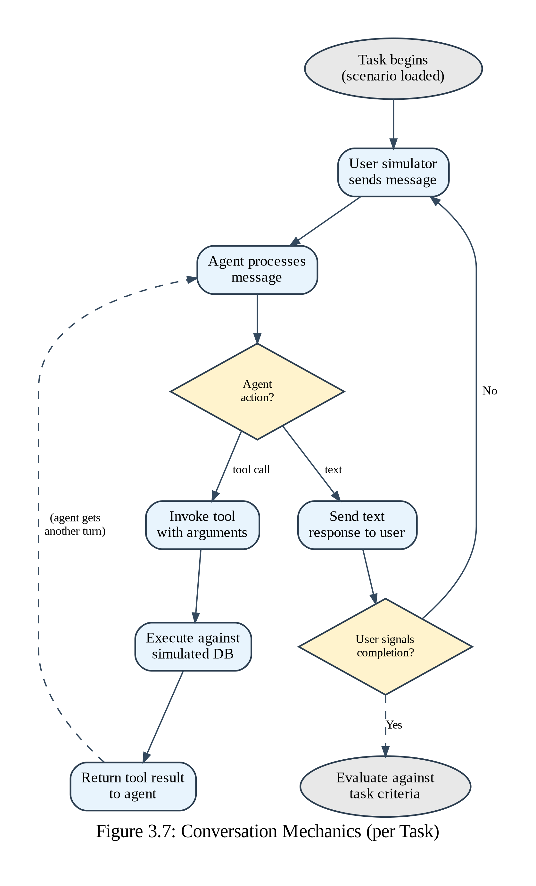{#fig:conversation-mechanics}

### 3.2.4 Integration

τ²-bench is integrated as a git submodule pinned to commit 37bfc31 (based on tag v0.1.1), installed as an editable Python package. No modifications were made to the upstream codebase; all integration occurs through τ²-bench's public API: the RunConfig data model, the run_domain() function, the agent registry, and the Tool and Environment classes. Because nothing in the upstream code was changed, benchmark results are directly comparable to published baselines.

## 3.3 Experimental Conditions

The experiment evaluates three conditions across the three τ²-bench domains. Each uses identical evaluation infrastructure, and they differ only in the agent's model and prompt configuration. As recommended by @wornow2024, the design brackets the intervention between a floor (unoptimized student) and a ceiling (frontier model).

### 3.3.1 Condition B: Baseline

The student model runs on τ²-bench tasks with no modifications. The system prompt is τ²-bench's default instruction template, which directs the agent to follow the domain policy and produce valid JSON. Tool schemas are the originals. This establishes the performance floor---how well the student performs out of the box.

### 3.3.2 Condition K: Evolved

The student model runs with an evolved prompt and tool configuration produced by the evolution framework (Sections 3.5--3.6). The evolved state comprises three components: (1) a modified system prompt containing the original plus additions produced by the teacher's patch_prompt calls---typically concrete behavioral rules such as identity verification requirements or tool-call sequencing instructions; (2) modified tool schemas with clarified parameter descriptions, added constraints, or edge-case notes; and (3) tool preprocessors---sandboxed Python functions that transform tool inputs before execution, that guard against common LLM formatting errors.

### 3.3.3 Condition F: Frontier Ceiling

The teacher model (Kimi K2.5) runs as the agent directly, using the default, unmodified τ²-bench prompt and tools. This measures the upper bound---how well the strongest available model performs without any evolution---and provides a normalization denominator for the gap-closure metric (Section 3.8).

@Fig:three-conditions illustrates the three-condition design and the gap closure metric.

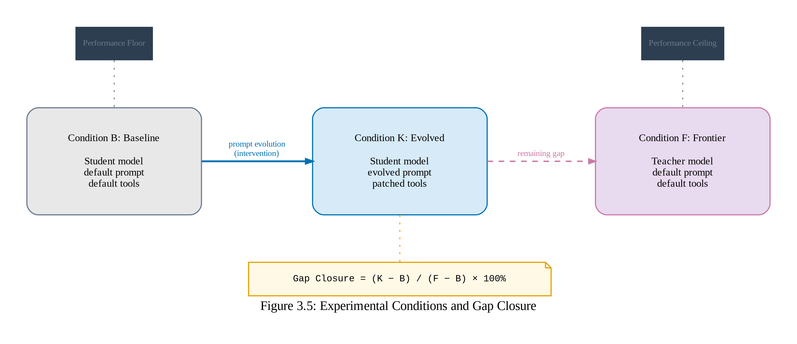{#fig:three-conditions}

### 3.3.4 Three-Way Comparison Logic

The three conditions form a floor--intervention--ceiling comparison analogous to teacher--student distillation studies, where a teacher's performance defines the ceiling, a student's pre-distillation performance defines the floor, and the post-distillation student occupies the intervention position [@hinton2015]. The difference is that knowledge transfer operates at the prompt level, not the weight level. The baseline alone is uninterpretable: a pass rate of 60 percent means nothing without context. The frontier provides that context. If it achieves 90 percent, the gap is 30 percentage points, and the evolved condition's position within that gap indicates how much of the teacher's advantage was transferred through prompt engineering alone, with no weight changes.

### 3.3.5 Per-Domain Independence

Each domain is evolved independently. There is no cross-domain transfer of patches. A rule learned from airline cancellation failures ("always check refund eligibility before cancelling") is irrelevant in the telecom domain. The evolution loop runs separately per domain, producing domain-specific evolved prompts. This also allows per-domain analysis of which failure types respond to the intervention.

## 3.4 Model Selection and Justification

All models are accessed through OpenRouter using a single API key.

| Role           | Model          | Access Method              |
|----------------|----------------|----------------------------|
| Student agent  | Qwen3 30B-A3B  | litellm via τ²-bench       |
| User simulator | Qwen3 30B-A3B  | litellm via τ²-bench       |
| Teacher        | Kimi K2.5      | OpenAI client direct       |

: Model assignments and access methods.

### 3.4.1 Student Model: Qwen3 30B-A3B

The student model is Qwen3 30B-A3B [@qwen2025], a Mixture-of-Experts Transformer with 30.5 billion total parameters but only 3.3 billion active per token. It employs 128 experts with top-8 routing across 48 layers and supports 32,768 native context tokens extensible to 131,072 with YaRN scaling. Despite activating barely 10 percent of its parameters per forward pass, the model outperforms Qwen2.5-14B on all reported benchmarks and leads the Berkeley Function Calling Leaderboard (BFCL v3). The selection reflects a trade-off: the model needs non-trivial τ²-bench scores, but must be weak enough relative to the frontier that meaningful headroom exists, and cheap enough for the many evaluation runs the iterative process requires. Qwen3 30B-A3B fits: its MoE architecture makes it fast and inexpensive via API, it handles tool-calling and multi-turn dialogue, and it is demonstrably imperfect on τ²-bench tasks.

Alternative student models---Qwen3.5 Flash and GLM 4.7 Flash---are supported by the implementation for cross-student ablation, but the primary evaluation uses Qwen3 30B-A3B.

### 3.4.2 Teacher Model: Kimi K2.5

The teacher model is Kimi K2.5 [@kimi2026], a visual-agentic extension of the Kimi K2 base model [@kimi2025]. The base model is a MoE Transformer with approximately one trillion total parameters and 32 billion active per token, employing 384 experts---50 percent more than DeepSeek-V3---with Multi-head Latent Attention. Its 256K-token context window accommodates full conversation traces (often 5--15 turns with tool calls and results), the system prompt, all tool schemas, and task requirements in a single prompt. The teacher was chosen for significantly stronger performance than the student on target domains, strong tool-calling comprehension, a long context window, architectural independence from the student (Moonshot AI, not Alibaba), and cost-effectiveness for hundreds of reflection calls.

Using a separate, stronger model to diagnose and correct the student's failures draws on knowledge distillation [@hinton2015] and more recent teacher--student paradigms, including adversarial distillation [@jiang2023] and the LLM-as-judge approach. @zheng2023 established that GPT-4 agrees with human preferences over 80 percent of the time; subsequent work has tightened this estimate. @zhuge2024 showed that an agent-based judge achieves approximately 90 percent agreement with human experts in agentic evaluation settings, while @gilardi2023 found that ChatGPT outperforms crowd-workers by 25 percentage points on annotation tasks with intercoder agreement of 91--97 percent. These results support using a frontier model as a diagnostic supervisor. Here, though, knowledge transfer happens through prompt and tool-schema patches only---no training data, no weight updates. This is a lighter mechanism, consistent with the Superficial Alignment Hypothesis [@zhou2023lima]: if alignment mostly teaches style and format, prompt text should suffice.

### 3.4.3 User Simulator

The user simulator uses the same model as the student (Qwen3 30B-A3B). τ²-bench's user simulator follows scripted scenarios; it does not require frontier-level capabilities. Using the same inexpensive model keeps costs low without affecting evaluation validity.

## 3.5 The Evolution Framework

### 3.5.1 Architecture Overview

The evolution framework implements a diagnose-patch-validate loop. A weaker student model runs on benchmark tasks and fails on some. A stronger teacher model analyzes each failure, proposes modifications to the student's prompt and tool configuration, and those modifications are validated by re-running the student on the failed task. Successful patches are merged into a progressively improved agent configuration. The architecture operates at two levels: an outer loop iterates over the full task set, and an inner loop handles individual failure repair. @Fig:system-architecture provides a high-level view of the system components and data flow.

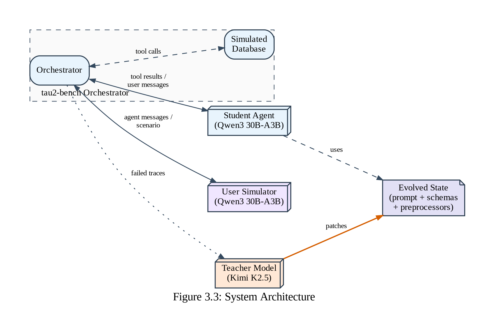{#fig:system-architecture}

In the automated prompt optimization literature, this is a teacher-driven variant of reflective prompt evolution. The closest precedent is GEPA [@agrawal2025], a Genetic-Pareto prompt optimizer accepted as an oral at ICLR 2026, which uses natural language reflection from a stronger model to diagnose failures from execution traces and propose targeted mutations for a weaker task model, outperforming reinforcement learning baselines by up to 20 percent while using 35x fewer rollouts. The present framework shares GEPA's core mechanism---a strong reflection model inspecting the weaker model's failures and proposing prompt edits---but departs from it in three respects. First, the patches target prompt text, tool schemas, and sandboxed input preprocessors---three distinct surfaces. Second, every proposed patch is validated by re-running the student on the specific failed task before merging, so only verified improvements enter the production prompt. Third, the evaluation target is a structured tool-agent-user benchmark (τ²-bench) instead of reasoning or classification tasks. As noted in the literature review, automated prompt optimization methods have not been tested on multi-turn tool-calling benchmarks.

DSPy [@khattab2023] compiles declarative modules against a target metric through self-bootstrapping; TextGrad [@yuksekgonul2024] backpropagates textual feedback through computation graphs. The present framework does neither---it uses a separate teacher model to perform structured diagnosis and targeted patching on a per-failure basis. In Reflexion [@shinn2023], reflections are ephemeral per-episode memory; here, patches are permanent modifications persisted across episodes and iterations.

### 3.5.2 The Outer Loop

The outer loop proceeds as follows for each iteration. First, the student is evaluated on all benchmark tasks (excluding previously dropped tasks) with the current evolved state, and results are saved. Second, tasks with reward strictly less than 1.0 are extracted as failures. Third, for each failed task, a teacher session is spawned in parallel to diagnose the failure and propose patches; each patch set is validated by re-running the student on that task. Fourth, all accepted patches are merged into the global state. Fifth, all attempted tasks---both fixed and unfixed---are dropped from future evaluation. The loop repeats until no failures remain, all tasks have been dropped, or the maximum iteration count is reached. @Fig:outer-loop visualizes this process.

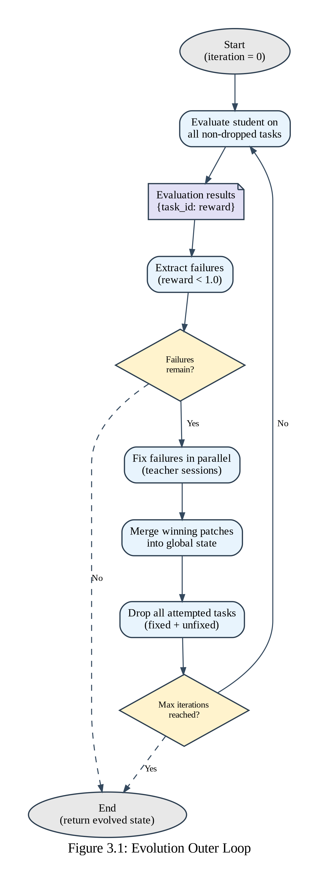{#fig:outer-loop}

The parallel fix phase uses a thread pool to process multiple failures concurrently, as shown in @fig:parallel-architecture. Each thread operates on a deep copy of the global state, preventing interference between concurrent teacher sessions. Results are collected and merged sequentially after all threads complete.

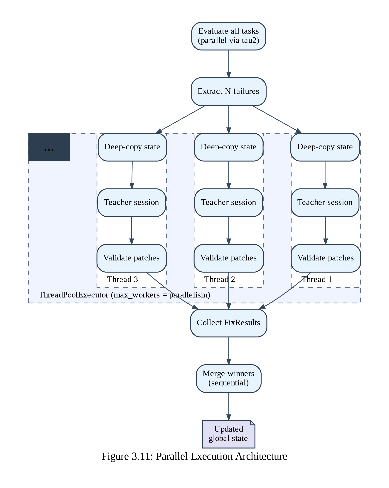{#fig:parallel-architecture}

Dropping both fixed and unfixed tasks is deliberate. Fixed tasks were already validated during the fix phase; re-evaluating them wastes API budget. Unfixed tasks could not be repaired within the allotted retries; re-attempting with a marginally different global prompt is unlikely to succeed and risks conflicting patches. These tasks are treated as intractable for the current teacher--student pair.

### 3.5.3 The Inner Loop: Per-Failure Fix Attempts

For each failed task, a teacher session is created with deep copies of the current global state. The session enters a reflect-validate loop with up to 1 + *max_retries* attempts, as shown in @fig:inner-loop. In the reflection step, the teacher receives a comprehensive prompt containing the agent's current system prompt, all tool schemas, the full failed conversation trace, the task requirements, and the reward breakdown. It diagnoses the root cause, classifies it (Section 3.7), and calls patch tools to propose modifications. In the validation step, the student is re-run on the same task with the patches applied. If the patched reward exceeds the baseline reward, the fix is accepted. If not, the teacher receives the new conversation trace, the new reward breakdown, and the current state of all its modifications, and is asked to try again.

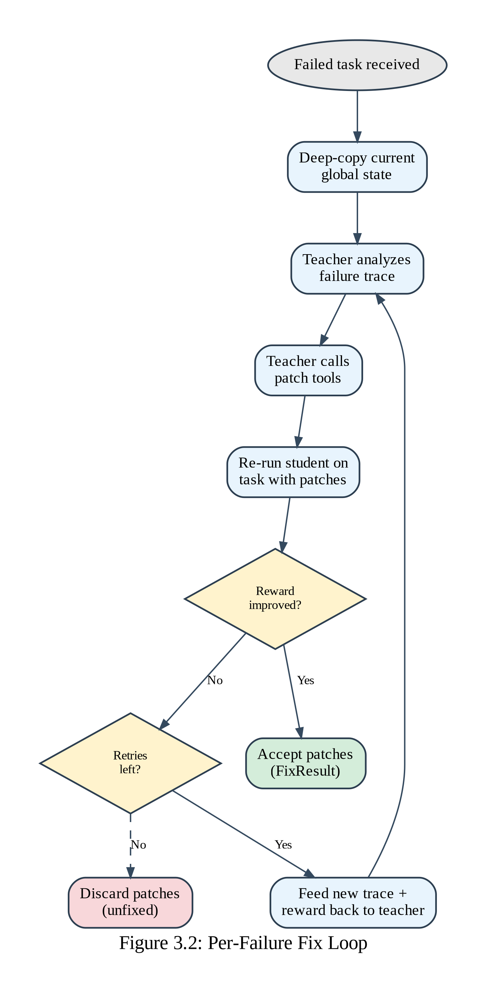{#fig:inner-loop}

Patches are merged into the global state only if validation succeeds. Failed patches are discarded entirely. The fix success criterion is permissive: any improvement in reward counts, not just reaching a perfect 1.0. A patch improving a task's reward from 0.0 to 0.5 is accepted and merged, potentially enabling further improvement in subsequent iterations.

### 3.5.4 The Teacher Session

The teacher session maintains a stateful conversation with the teacher model using function calling. The teacher has access to four tools: **patch_prompt** (find-and-replace on the system prompt), **patch_tool** (find-and-replace on a tool's JSON schema), **read_tool_code** (inspect a tool's parameters and current preprocessor), and **patch_tool_code** (find-and-replace on a tool's preprocessor source). The initial prompt is a structured template containing five sections: the current system prompt, all tool schemas serialized to JSON, the full failed conversation trace with role labels and preserved tool-call arguments, the task requirements, and the reward breakdown. Automated tests verify that no data is lost or truncated during formatting, since the teacher cannot diagnose what it cannot see. The teacher may make up to 10 rounds of tool calls per session; in practice, most sessions complete in two to four rounds. @Fig:teacher-session illustrates the multi-round tool-calling flow.

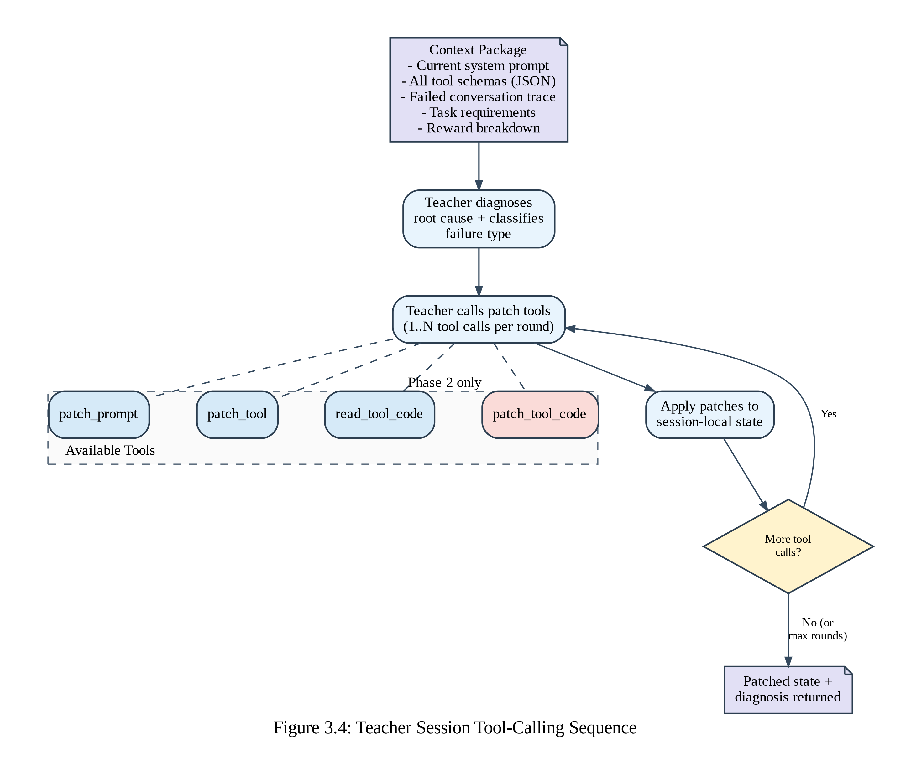{#fig:teacher-session}

The teacher session employs a two-phase escalation strategy, depicted in @fig:escalation. In Phase 1 (teaching), the teacher can only modify the prompt and tool schemas. If Phase 1 exhausts its attempts without fixing the task, Phase 2 (guardrails) unlocks the patch_tool_code tool, allowing the teacher to add defensive preprocessors. This staged approach ensures that lighter-weight interventions are attempted first.

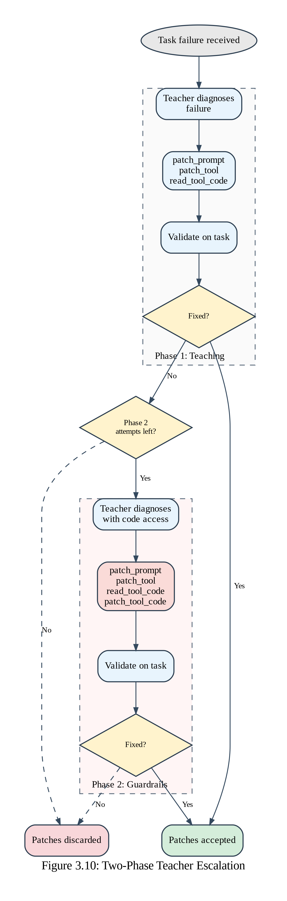{#fig:escalation}

## 3.6 Patch Surfaces and Mechanisms

The framework operates on three distinct patch surfaces, each for a different class of agent failure, as illustrated in @fig:patch-surfaces. All patches use a find-and-replace mechanism: the teacher specifies an old_text to locate and a new_text to substitute, which keeps modifications precise, minimal, and reversible.

{#fig:patch-surfaces}

### 3.6.1 Prompt Patches

Prompt patches modify the agent's system prompt, typically adding concrete behavioral rules the student was not following. When old_text is empty, new_text is appended to the prompt's end. Instead of fine-tuning weights to encode a behavioral rule, the rule is simply stated in natural language within the prompt. The Superficial Alignment Hypothesis [@zhou2023lima] suggests this should work: alignment primarily teaches style and format, which prompt text can supply. @sclar2023 demonstrated up to 76 accuracy points of variation from meaning-preserving formatting changes alone (spacing, delimiters, example ordering), a sensitivity that persisted even with increased model size or instruction tuning. The patches in this framework are meaning-bearing---rewriting instructions, adding policy constraints---not formatting noise. Sclar et al. show that arbitrary formatting changes cause chaotic performance swings; the question here is whether deliberate, diagnostic-driven edits behave differently.

### 3.6.2 Tool Schema Patches

Tool schema patches modify the JSON schemas that define how the agent calls each tool. These schemas are presented as part of the function-calling interface and directly affect tool selection, argument formatting, and constraint adherence. Common modifications include clarifying parameter descriptions (adding "must start with #" to a reservation_id field), expanding tool descriptions to note when a tool should or should not be used, and adding constraint notes. After each edit, the JSON string is parsed to ensure syntactic validity; patches producing invalid JSON are rejected.

Parameter and formatting errors in tool calling are well studied. @qin2023 showed that without their depth-first search approach, an initial parameter error "can lead to a cascade of subsequent errors" that trap the model in a faulty loop of incorrect API calls. @xu2023tool found that generation style regulation---fixing formatting and parameter errors---was effective, with targeted constraints boosting open-source LLMs to competitive with GPT-4 on 4 of 8 tasks. @guo2024 found that up to 50 percent of queries and 75 percent of trajectories in the original ToolBench data suffered from hallucinations, meaning parameter extraction errors are systemic, not incidental.

### 3.6.3 Tool Preprocessors

Tool preprocessors are sandboxed Python functions that transform tool-call arguments before execution. Every tool starts with an identity preprocessor. The teacher can modify the code to add defensive input coercion---ensuring an ID field has the correct prefix, casting strings to integers, normalizing date formats. Preprocessors are sandboxed: a static analysis pass rejects forbidden constructs (imports, eval, exec, file I/O), the execution namespace restricts available builtins, and runtime exceptions fall back to the original arguments.

Some formatting errors persist even when the prompt and schema are clear: the model understands the requirement but still gets it wrong. An agent may understand that reservation IDs should start with "#" but occasionally omit the prefix due to tokenization or sampling artifacts. A preprocessor guardrail catches such errors at the tool-call boundary. The design parallels findings from the ARTEMIS framework [@brookes2025], which jointly optimizes agent prompts, tool descriptions, and parameters using evolutionary methods, reporting 13.6 percent improvement on competitive programming and 22 percent on GSM8K for Qwen2.5-7B.

### 3.6.4 Patch Application and Merging

Patches are applied sequentially using first-occurrence-only string replacement to prevent cascading substitutions. Failed patches (old_text not found) are logged and skipped without aborting the batch. When multiple tasks are fixed in a single iteration, winning patches are merged into the global state in sequence. The evolved state is serialized to disk as a JSON file containing the full prompt, all tool schemas, and all preprocessor source code, so the exact evolved agent can be reconstructed at any point. @Fig:patch-pipeline details the validation gates for each patch type.

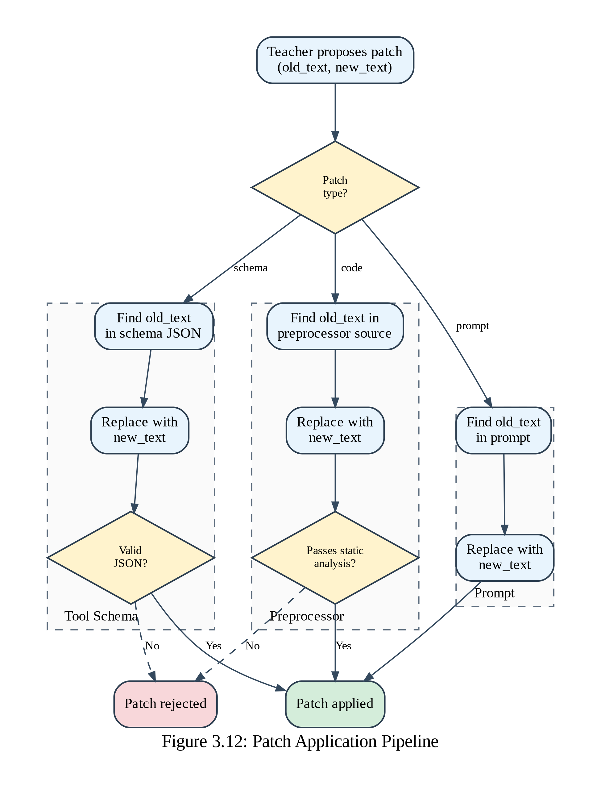{#fig:patch-pipeline}

## 3.7 Failure Taxonomy

The teacher classifies each failure into one of four categories as part of its diagnostic output, shown in @fig:failure-taxonomy.

| Category            | Description                                      | Examples                                                   |
|---------------------|--------------------------------------------------|------------------------------------------------------------|
| TOOL_MISUSE         | Wrong tool, wrong parameters, missing tool call  | Using get_flight_details instead of get_reservation_details |
| POLICY_VIOLATION    | Skipped validation step or broke a constraint    | Cancelling without checking refund eligibility              |
| REASONING_ERROR     | Incorrect assumption, incomplete plan            | Assuming a flight is direct when it has connections         |
| COMMUNICATION_ERROR | Confusing message, failed to guide user          | Not explaining applicable fees to the customer             |

: Failure taxonomy for teacher-model diagnosis. {#tbl:failure-taxonomy}

{#fig:failure-taxonomy}

Classification is automated: the teacher includes the failure type in its diagnostic text, and the category is extracted by string matching. This is a heuristic---the teacher might use different phrasing, or a failure might span multiple categories. The implementation takes the first match, defaulting to REASONING_ERROR when none is found. @kapoor2024 identified similar categorization challenges in their analysis of agent benchmarking practices, noting that benchmark shortcomings can be organized by failure mode (narrow accuracy focus, benchmark overfitting, cost blindness) but that any taxonomy risks oversimplification. A more robust classification mechanism---for example, a structured output field---could improve accuracy in future work.

The taxonomy enables per-category analysis of which failure types are most responsive to prompt evolution versus tool-schema patching versus preprocessor guardrails, which is what the sub-question about failure-mode responsiveness requires.

## 3.8 Evaluation Metrics

### 3.8.1 Primary Metric: pass^1^

The primary metric is pass^1^---the fraction of tasks achieving a perfect reward of 1.0. This is the standard metric in τ-bench publications [@yao2024; @barres2025]. Any reward below 1.0 constitutes failure. The strictness is intentional: @rabanser2025 argue that enterprise autonomous operation requires three to five nines of reliability (99.9--99.999 percent) and that current LLM agents are not on track to reach this threshold through scaling alone, with accuracy improving faster than reliability across 14 models spanning 18 months of releases. Under such a standard, partial credit is meaningless.

### 3.8.2 Reward Breakdown

τ²-bench's evaluator produces a multi-dimensional reward: an action score (correct tools with correct arguments), environment assertions (expected database state), and a communication score (correct user-facing messages), as shown in @fig:reward-breakdown. This breakdown is passed in full to the teacher during diagnosis so it can identify exactly which criteria failed and why.

{#fig:reward-breakdown}

### 3.8.3 Gap Closure

To normalize for domain difficulty, gap closure is computed as: (K − B) / (F − B) × 100%, where K is the evolved pass rate, B the baseline, and F the frontier. A gap closure of 50 percent means the evolved prompt captured half the teacher's advantage through prompt and tool-schema patching alone. The metric is defined only when F > B. @Fig:gap-closure provides a visual illustration.

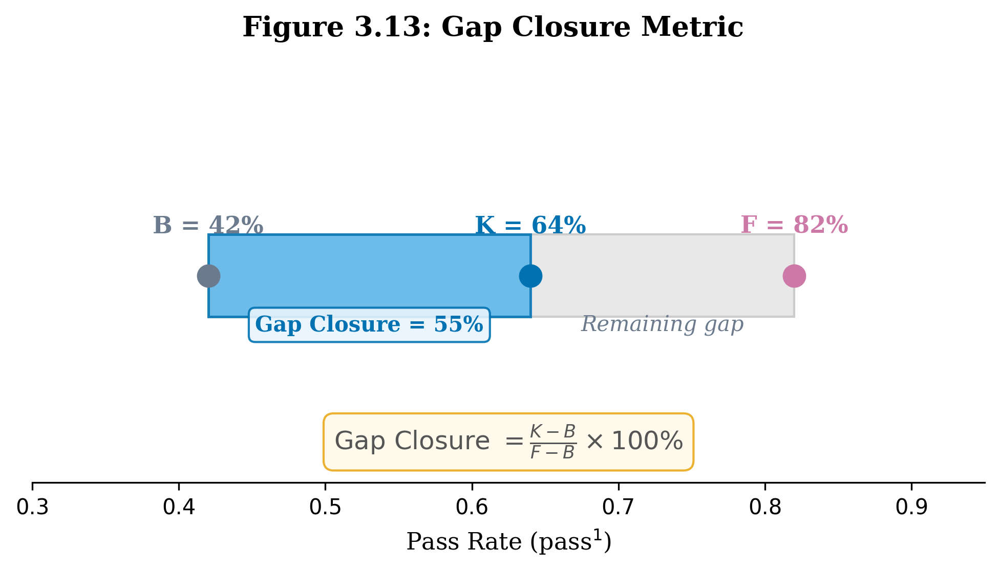{#fig:gap-closure}

### 3.8.4 Fix Success Rate

A fix succeeds when the patched reward strictly exceeds the baseline reward. The fix success rate---the fraction of attempted fixes that succeed---measures the evolution process's efficiency.

## 3.9 Reproducibility

### 3.9.1 Fixed Parameters

| Parameter              | Value   | Rationale                                                  |
|------------------------|---------|------------------------------------------------------------|
| Random seed            | 42      | Deterministic task selection and ordering                  |
| Trials per task        | 1       | Single trial per evaluation                                |
| Teacher temperature    | 0.3     | Focused diagnostic output                                  |
| Reasoning suppression  | Enabled | Prevents reasoning tokens from breaking content parsing    |
| Max teacher rounds     | 10      | Multi-step diagnosis without unbounded cost                |

: Fixed experimental parameters.

### 3.9.2 Software Environment

The implementation uses Python 3.12 with τ²-bench at commit 37bfc31, the uv build system with hatchling backend, litellm for LLM routing, and the OpenAI Python SDK (>=1.0) for teacher calls. All models are accessed through OpenRouter. The source code is publicly available at github.com/glebdementev/tau-evo.

### 3.9.3 State Persistence and Task Locking

The complete evolution state is serialized to JSON after each iteration: the current system prompt, all tool schemas, all preprocessor source, iteration history with fix results, and metadata. Loading this state reconstructs the exact evolved agent. After the first evaluation in a run, task IDs are locked and reused for all subsequent iterations, so pass-rate changes reflect patches, not sampling variation.

## 3.10 Threats to Validity

### 3.10.1 Internal Validity

**Single trial per task.** Each task is evaluated once per iteration, introducing variance from stochastic LLM generation. @yao2024 introduced the pass^k^ metric precisely to capture this variance, showing that pass^8^ can drop below 25 percent even when pass^1^ exceeds 50 percent. The limitation is mitigated by the fixed seed and by reporting results across multiple tasks, but full confidence intervals would require multiple trials per task at additional cost.

**Teacher model bias.** The teacher's diagnoses and patches reflect the capabilities and blind spots of Kimi K2.5. A different teacher might produce different patches and improvement trajectories. The mitigation is empirical validation: only patches that demonstrably improve the student's performance enter the global state. @dorner2024 showed that when the judge is no more capable than the evaluated model, debiasing cannot fully compensate; this limitation does not apply here, since Kimi K2.5 is substantially stronger than Qwen3 30B-A3B.

**Heuristic failure classification.** The four-category taxonomy is applied through string matching on the teacher's free-text diagnosis. Misclassification is possible. This affects per-category analysis but not primary pass-rate results.

### 3.10.2 External Validity

**Benchmark versus production.** τ²-bench tasks are simulated customer-service interactions. While designed to approximate operational settings, they lack the full diversity and adversarial nature of real interactions. @kapoor2024 documented that 7 of 8 major agent benchmarks lack appropriate holdout sets and that benchmark-specific overfitting is common---the top WebArena agent hardcodes policies for specific tasks. Whether the framework works in production is untested.

**Model generalization.** The framework is evaluated with one student--teacher pair. Whether results generalize to stronger students (where headroom is smaller) or weaker teachers (where diagnostic quality degrades) is an open question. Alternative student models are supported for future ablation.

**Domain specificity.** Patches are domain-specific by design. The framework does not claim cross-domain transfer; the claim is that domain-specific diagnostic knowledge can be transferred efficiently to a weaker model's prompt configuration.

### 3.10.3 Construct Validity

**pass^1^ as reliability proxy.** The metric treats all failures equally---a catastrophic wrong action and a minor communication lapse both count. @rabanser2025 decompose reliability into four dimensions (consistency, robustness, predictability, safety) with twelve metrics, of which pass^1^ captures only the consistency dimension. The reward breakdown provides more granular information, but the primary metric does not weight by severity or dimension.

**Prompt evolution as distillation.** The thesis frames prompt patching as a form of knowledge transfer from teacher to student. There is precedent: weight-level distillation [@hinton2015], output-level distillation (Alpaca, Vicuna), and prompt-level transfer [SPoT, @vu2022; GEPA, @agrawal2025] form a progression toward lighter-weight knowledge transfer, as depicted in @fig:knowledge-transfer. However, the patches may encode surface-level heuristics (add a "#" prefix) without transferring deep domain understanding, and their durability under distribution shift is untested.

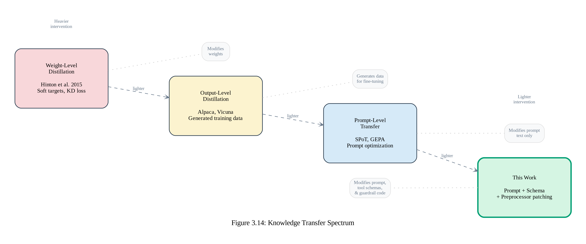{#fig:knowledge-transfer}
