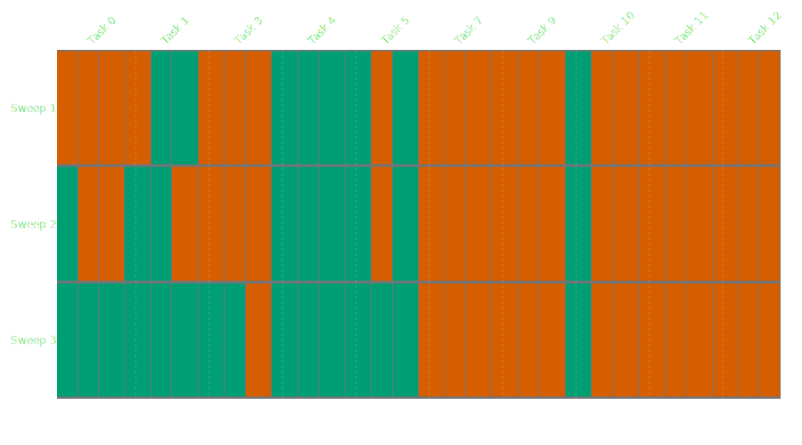
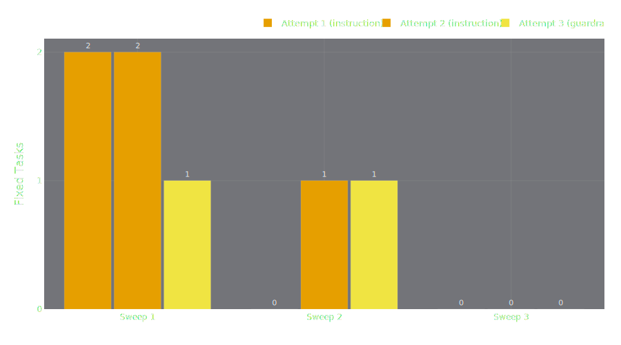

# 4. Results

This chapter presents the experimental results. Section 4.1 describes the shared experimental setup. Sections 4.2--4.4 report the results for three experiments at increasing task-set sizes (5, 10, and 20 tasks), designed to test whether the evolution framework's gains hold as the evaluation surface grows. Section 4.5 compares results across experiments, and Section 4.6 discusses implications and limitations.

## 4.1 Experimental Setup

All experiments use the airline domain of τ²-bench with the configuration described in Section 3.9. The student model is Qwen3 30B-A3B in non-thinking mode, the teacher is Kimi K2.5, and the user simulator is Qwen3 30B-A3B. Each experiment runs the evolution loop for up to three sweeps with up to two retries per failed task per sweep. Every task is evaluated with three trials to capture stochastic variation; a task is considered passing in a given sweep if it passes in at least two of three trials (majority vote). The seed is fixed at 42 throughout. Task IDs are locked after the first evaluation so that pass-rate changes between sweeps reflect the effect of accumulated patches, not sampling variation.

The three experiments differ only in the number of tasks drawn from the airline domain:

| Experiment | Tasks | Task IDs | Status |
|------------|-------|----------|--------|
| 1 | 5 | 0, 1, 3, 4, 5 | Complete |
| 2 | 10 | 0, 1, 3, 4, 5, 7, 9, 10, 11, 12 | Complete |
| 3 | 20 | TBD | In progress |

: Experimental conditions. All other parameters are identical across experiments.

The scaling sequence is deliberate. If the evolution framework captures task-specific fixes that do not generalise, then gains should be largest when the task set is smallest---each fix represents a larger share of the total---and should diminish as the denominator grows. If, on the other hand, the teacher discovers transferable rules, gains should persist or even compound across larger task sets.

## 4.2 Experiment 1: Five-Task Evolution

### 4.2.1 Baseline Performance

The baseline (Condition B) evaluates the unmodified student on five airline tasks with three trials each. @Tbl:exp1-heatmap shows the per-task, per-trial results across all three sweeps, and @tbl:exp1-passrate summarises pass rates.

| Sweep | Task 0 | Task 1 | Task 3 | Task 4 | Task 5 | Trial pass rate | Majority-vote pass rate |
|-------|--------|--------|--------|--------|--------|-----------------|-------------------------|
| 1 (baseline) | 0/3 | 2/3 | 1/3 | 3/3 | 2/3 | 8/15 (53%) | 3/5 (60%) |
| 2 (after sweep 1 patches) | 1/3 | 2/3 | 2/3 | 3/3 | 3/3 | 11/15 (73%) | 4/5 (80%) |
| 3 (after sweep 2 patches) | 1/3 | 3/3 | 3/3 | 3/3 | 1/3 | 11/15 (73%) | 3/5 (60%) |

: Per-sweep evaluation results for Experiment 1 (5 tasks, airline domain). Each cell shows trial passes out of three. Majority-vote pass rate treats a task as passing if it passes in at least two of three trials. {#tbl:exp1-passrate}

@Fig:exp1-heatmap provides a visual representation of the same data. Each cell represents a single trial; green indicates a pass, red a fail. The heatmap makes the per-task trajectories immediately legible: Task 4's solid green column, Task 0's persistent red, and the progressive greening of Tasks 1 and 3 across sweeps.

{#fig:exp1-heatmap}

The baseline is non-trivial: the student already passes 60% of tasks by majority vote without any intervention. This is consistent with the model's strong showing on the Berkeley Function Calling Leaderboard and confirms that the student is not helplessly incapable---the teacher is refining, not teaching from scratch. The headroom for improvement is 40 percentage points (two tasks: 0 and 3).

### 4.2.2 Evolution Trajectory

The evolution loop ran three sweeps. @Tbl:exp1-outcomes shows the per-sweep breakdown of task outcomes during the evolution process.

| Sweep | Already passing | Fixed (instruction) | Fixed (guardrail) | Unfixed |
|-------|----------------|--------------------|--------------------|---------|
| 1 | 1 | 3 | 1 | 0 |
| 2 | 2 | 2 | 1 | 0 |
| 3 | 3 | 0 | 0 | 2 |

: Per-sweep task outcomes during the evolution loop. "Already passing" means the task passed before the teacher intervened; "Fixed" means the teacher's patches caused the task to pass validation; "Unfixed" means all retry attempts were exhausted without success. {#tbl:exp1-outcomes}

@Fig:exp1-outcomes visualises the same data as a stacked bar chart. The shrinking of the "Fixed" segments and the growth of the "Already passing" segment across sweeps illustrates the diminishing-returns dynamic: each sweep has fewer tasks to fix because previous patches have promoted them to the passing pool.

{#fig:exp1-outcomes}

Sweep 1 is the most productive: all four failing tasks are repaired, three by instruction patches and one by a guardrail preprocessor. The loop achieves 100% fix success rate in sweep 1---every failing task is repaired within the allotted retries. Sweep 2 fixes three of three failing tasks (Tasks 0, 1, and 3 failed again in re-evaluation despite sweep 1 patches, likely due to stochastic variation and the strict majority-vote criterion). Sweep 3 produces no new fixes; the two remaining failures resist further patching.

@Tbl:exp1-fixes details the individual fix attempts, including the teacher's patch tier, retry count, and session cost.

| Sweep | Task | Base → Patch | Tier | Attempt | Teacher msgs | Tool calls | Duration |
|-------|------|-------------|------|---------|-------------|------------|----------|
| 1 | 3 | Fail → Pass | instruction | 2 | 10 | 3 | 2m 26s |
| 1 | 0 | Fail → Pass | instruction | 2 | 8 | 2 | 2m 33s |
| 1 | 1 | Fail → Pass | instruction | 1 | 15 | 6 | 1m 13s |
| 1 | 5 | Fail → Pass | guardrail | 3 | 44 | 18 | 8m 22s |
| 2 | 0 | Fail → Pass | instruction | 1 | 6 | 2 | 2m 3s |
| 2 | 3 | Fail → Pass | guardrail | 3 | 20 | 6 | 9m 28s |
| 2 | 1 | Fail → Pass | instruction | 2 | 14 | 5 | 7m 32s |

: Individual fix attempts across sweeps in Experiment 1. Tier indicates the escalation phase: "instruction" means the fix was achieved with prompt or schema patches only (Phase 1); "guardrail" means the teacher escalated to tool preprocessors (Phase 2). Attempt is the retry number within the sweep. {#tbl:exp1-fixes}

### 4.2.3 Fix Type Analysis

@Fig:exp1-fix-attempts shows the number of tasks fixed per attempt and tier across sweeps as a grouped bar chart.

{#fig:exp1-fix-attempts}

Of seven successful fixes across sweeps 1 and 2, five (71%) were instruction-tier patches and two (29%) were guardrail-tier. This is consistent with the two-phase escalation design (Section 3.5.3): instruction patches are attempted first and succeed most of the time; guardrail preprocessors serve as a fallback for failures that resist prompt-level correction.

Instruction-tier fixes are also cheaper. The median instruction fix took 2 attempts, 10 messages, and 2.5 tool calls; the median guardrail fix took 3 attempts, 32 messages, and 12 tool calls. Guardrail fixes required the teacher to exhaust Phase 1 attempts before escalating to Phase 2, explaining the higher cost. Task 5 in sweep 1 is the most expensive fix in the dataset: 44 messages, 18 tool calls, and over 8 minutes of wall-clock time, suggesting that the underlying failure mode was difficult for the teacher to diagnose at the prompt level and required a defensive code intervention.

The dominance of instruction-tier patches supports the Superficial Alignment Hypothesis [@zhou2023lima]: the student model's failures are primarily failures of instruction following, not of capability. The model *can* perform the required actions---it simply does not know that it should, or in what order. Telling it, in explicit natural language, is sufficient in the majority of cases.

### 4.2.4 Diminishing Returns and Saturation

The trajectory across sweeps shows clear diminishing returns. Sweep 1 fixes 4 of 4 failing tasks (100%). Sweep 2 fixes 3 of 3 (100%, but two of these tasks had already been fixed in sweep 1 and regressed). Sweep 3 fixes 0 of 2 (0%). By sweep 3, the pool of fixable failures is exhausted; the remaining two tasks appear to require interventions beyond what prompt and tool-schema patching can provide---or the specific failure modes interact adversely with existing patches.

This saturation effect is expected on a small task set. With only five tasks, each sweep's patches target a narrow set of failure modes. Once those modes are addressed, the marginal value of further sweeps drops to zero. Whether this saturation persists at larger task-set sizes---or whether more tasks provide more diverse failure signals that keep the teacher productive for longer---is the question that Experiments 2 and 3 address.

### 4.2.5 Patch Interference and Regression

The most notable negative result is the regression of Task 5 between sweeps 2 and 3. In sweep 2, Task 5 passes all three trials (3/3). In sweep 3, it passes only one (1/3). Since no patches targeted Task 5 between sweeps 2 and 3 (it was already passing), the regression is attributable either to stochastic variation or to interference from patches accumulated during sweep 2's fixes of other tasks.

Patch interference is a known risk in prompt optimisation. @sclar2023 showed that meaning-preserving formatting changes can swing accuracy by up to 76 percentage points; meaning-bearing changes---the kind the teacher produces---could interact in unpredictable ways. In this experiment the interference is mild (one task regresses while two others improve), but it highlights a limitation of the greedy, per-task patching strategy: patches are validated against the target task but not against all other tasks, so global side effects go undetected until the next full evaluation.

### 4.2.6 Task-Level Analysis

Task 4 is the easiest: it passes 3/3 in all three sweeps, requiring no intervention. Whatever this task tests, the baseline student already handles it reliably.

Task 0 is the hardest: even after evolution, it never passes more than 1/3 trials. The teacher fixes it in every sweep (it keeps regressing), but the fixes produce only marginal reliability improvement. This suggests that the underlying failure mode is not addressable through instruction-level guidance alone---the student understands what to do but fails stochastically in execution, possibly due to long-horizon planning or multi-step tool-call sequencing that the model handles unreliably regardless of prompt quality.

Tasks 1 and 3 show the clearest improvement arc: from baseline failure (2/3 and 1/3 respectively) to reliable passing (3/3 each in sweep 3). These are the tasks where prompt evolution delivers its intended effect---converting intermittent failures into consistent passes through targeted behavioral rules.

### 4.2.7 Summary

Experiment 1 demonstrates that teacher-driven prompt evolution can improve a weak non-thinking model's performance on τ²-bench tasks. The aggregate trial pass rate rises from 53% (baseline) to 73% (after two sweeps of evolution). Instruction-level patches account for the majority of successful fixes. However, the five-task setting saturates quickly: by sweep 3, no further fixes are possible, and patch interference introduces mild regression. The improvement is real but bounded by the small evaluation surface.

## 4.3 Experiment 2: Ten-Task Evolution

Experiment 2 doubles the task set from five to ten, introducing five additional tasks (7, 9, 10, 11, 12) alongside the original five. This tests whether the evolution framework's gains persist when the evaluation surface grows and the teacher must manage a larger and more diverse set of failure modes.

### 4.3.1 Baseline Performance

The baseline evaluates the unmodified student on ten airline tasks. @Tbl:exp2-heatmap shows the per-task, per-trial results across all three sweeps, and @tbl:exp2-passrate summarises pass rates.

| Sweep | Task 0 | Task 1 | Task 3 | Task 4 | Task 5 | Task 7 | Task 9 | Task 10 | Task 11 | Task 12 | Trial pass rate | Majority-vote pass rate |
|-------|--------|--------|--------|--------|--------|--------|--------|---------|---------|---------|-----------------|-------------------------|
| 1 (baseline) | 0/3 | 2/3 | 0/3 | 3/3 | 2/3 | 0/3 | 0/3 | 1/3 | 0/3 | 0/3 | 8/30 (27%) | 3/10 (30%) |
| 2 (after sweep 1 patches) | 1/3 | 2/3 | 0/3 | 3/3 | 2/3 | 0/3 | 0/3 | 1/3 | 0/3 | 0/3 | 9/30 (30%) | 3/10 (30%) |
| 3 (after sweep 2 patches) | 3/3 | 3/3 | 2/3 | 3/3 | 3/3 | 0/3 | 0/3 | 1/3 | 0/3 | 0/3 | 15/30 (50%) | 5/10 (50%) |

: Per-sweep evaluation results for Experiment 2 (10 tasks, airline domain). Each cell shows trial passes out of three. Majority-vote pass rate treats a task as passing if it passes in at least two of three trials. {#tbl:exp2-passrate}

@Fig:exp2-heatmap visualises the same data. Compared to the five-task heatmap (@fig:exp1-heatmap), the ten-task version makes the bifurcation between fixable and resistant tasks immediately visible: a cluster of tasks (0, 1, 3, 4, 5) greens progressively across sweeps, while a second cluster (7, 9, 11, 12) remains solidly red throughout. Task 10 occupies a middle ground---it was fixed during sweep 1's evolution but never passed more than 1/3 trials in re-evaluation, suggesting a fragile fix.

{#fig:exp2-heatmap}

The baseline is substantially weaker than in Experiment 1: only 27% of trials pass (8/30), versus 53% (8/15) in the five-task setting. By majority vote, 3 of 10 tasks pass (30%), versus 3 of 5 (60%). This lower starting point reflects the inclusion of harder tasks---Tasks 7, 9, 11, and 12 all score 0/3 in the baseline and, as the results will show, resist all patching attempts. The five tasks shared with Experiment 1 (0, 1, 3, 4, 5) exhibit identical baseline performance to their Experiment 1 counterparts, confirming that the seed and configuration reproduce consistently.

### 4.3.2 Evolution Trajectory

The evolution loop ran three sweeps. @Tbl:exp2-outcomes shows the per-sweep breakdown of task outcomes during the evolution process.

| Sweep | Already passing | Fixed (instruction) | Fixed (guardrail) | Unfixed |
|-------|----------------|--------------------|--------------------|---------|
| 1 | 1 | 4 | 1 | 4 |
| 2 | 1 | 1 | 1 | 7 |
| 3 | 4 | 0 | 0 | 6 |

: Per-sweep task outcomes during the evolution loop for Experiment 2. "Already passing" counts tasks that passed all three trials before the teacher intervened; "Unfixed" means all retry attempts were exhausted without success. {#tbl:exp2-outcomes}

@Fig:exp2-outcomes visualises the same data. The persistent red "Unfixed" segment, absent in Experiment 1's sweeps 1 and 2, dominates the chart---reflecting a hard core of tasks that resist prompt-level repair.

{#fig:exp2-outcomes}

The trajectory differs markedly from Experiment 1. In Experiment 1, sweep 1 achieved a 100% fix rate on failing tasks; here, sweep 1 fixes only 5 of 9 failing tasks (56%). The four unfixed tasks (7, 9, 11, 12) consumed substantial teacher effort---a combined 150 messages, 61 tool calls, and 36 minutes of wall-clock time---without producing a single viable patch. These tasks appear to require capabilities that neither prompt refinement nor guardrail insertion can provide.

A second notable difference is the delayed improvement in evaluation metrics. Sweep 2's re-evaluation shows essentially no change from baseline (9/30 trials, 30% majority), despite sweep 1 having fixed five tasks during the evolution loop. This means that several of sweep 1's fixes did not persist through re-evaluation---Tasks 0, 3, and 10 all regressed. The fixes for Tasks 0 and 1 were fast and cheap (under a minute each), suggesting the teacher identified the correct failure mode but the resulting patch was too fragile to survive stochastic variation. The full improvement materialises only in sweep 3 (15/30 trials, 50% majority), after sweep 2's fixes had a chance to reinforce the earlier patches.

@Tbl:exp2-fixes details the individual fix attempts, including both successes and failures.

| Sweep | Task | Base → Patch | Tier | Attempt | Teacher msgs | Tool calls | Duration |
|-------|------|-------------|------|---------|-------------|------------|----------|
| 1 | 0 | Fail → Pass | instruction | 1 | 10 | 4 | 51s |
| 1 | 1 | Fail → Pass | instruction | 1 | 4 | 1 | 21s |
| 1 | 5 | Fail → Pass | instruction | 2 | 16 | 6 | 5m 11s |
| 1 | 3 | Fail → Pass | guardrail | 3 | 36 | 15 | 5m 54s |
| 1 | 10 | Fail → Pass | instruction | 2 | 35 | 14 | 6m 59s |
| 1 | 12 | Fail → Fail | --- | --- | 36 | 15 | 8m 37s |
| 1 | 9 | Fail → Fail | --- | --- | 37 | 14 | 12m 36s |
| 1 | 11 | Fail → Fail | --- | --- | 38 | 16 | 6m 21s |
| 1 | 7 | Fail → Fail | --- | --- | 39 | 16 | 8m 40s |
| 2 | 1 | Fail → Pass | instruction | 2 | 12 | 4 | 3m 42s |
| 2 | 5 | Fail → Pass | guardrail | 3 | 59 | 26 | 11m 49s |
| 2 | 3 | Fail → Fail | --- | --- | 26 | 10 | 3m 33s |
| 2 | 0 | Fail → Fail | --- | --- | 35 | 12 | 5m 9s |
| 2 | 12 | Fail → Fail | --- | --- | 46 | 19 | 7m 50s |
| 2 | 11 | Fail → Fail | --- | --- | 37 | 15 | 8m 45s |
| 2 | 7 | Fail → Fail | --- | --- | 22 | 8 | 7m 22s |
| 2 | 9 | Fail → Fail | --- | --- | 39 | 17 | 10m 0s |
| 2 | 10 | Fail → Fail | --- | --- | 38 | 16 | 19m 0s |

: Individual fix attempts across sweeps in Experiment 2. Rows without a tier and attempt indicate that all three retry attempts were exhausted without success. {#tbl:exp2-fixes}

### 4.3.3 Fix Type Analysis

@Fig:exp2-fix-attempts shows the number of tasks fixed per attempt and tier across sweeps.

{#fig:exp2-fix-attempts}

Across sweeps 1 and 2, seven successful fixes were applied: five instruction-tier (71%) and two guardrail-tier (29%). This ratio is identical to Experiment 1's, suggesting that the instruction-guardrail balance is a stable property of the framework rather than an artefact of the specific task set.

The cost distribution, however, shifts substantially. In Experiment 1, the teacher encountered no unfixable tasks until sweep 3; every attempt in sweeps 1 and 2 eventually succeeded. In Experiment 2, the teacher exhausted all retries on four tasks in sweep 1 and seven tasks in sweep 2, burning a combined 393 messages, 162 tool calls, and over 107 minutes of wall-clock time on failed attempts. The most expensive single failed attempt was Task 10 in sweep 2: 38 messages, 16 tool calls, and 19 minutes---all for no result. This wasted effort is a direct cost of scaling the task set: with more tasks to fix, the teacher spends proportionally more time on tasks it ultimately cannot repair.

| | Experiment 1 | Experiment 2 |
|------|-------------|-------------|
| Successful fixes | 7 | 7 |
| Instruction-tier | 5 (71%) | 5 (71%) |
| Guardrail-tier | 2 (29%) | 2 (29%) |
| Failed fix attempts (sweeps 1--2) | 0 | 11 |
| Median successful fix: msgs | 14 | 12 |
| Median successful fix: duration | 2m 33s | 3m 42s |
| Total wasted effort (failed attempts) | --- | 393 msgs, 107 min |

: Fix type comparison between Experiments 1 and 2. The success counts and tier ratios are identical; the difference lies in the volume of wasted effort on unfixable tasks. {#tbl:exp2-fix-comparison}

### 4.3.4 Scaling Observations

The ten-task experiment reveals several scaling dynamics that were invisible in the five-task setting.

**A hard core of resistant tasks emerges.** Tasks 7, 9, 11, and 12 resisted every fix attempt across both sweeps---a total of eight full three-attempt cycles, consuming over 70 minutes of teacher time. This hard core was absent in Experiment 1, where all failing tasks were eventually fixable. The implication is that the task pool contains a mixture of fixable tasks (addressable through prompt or guardrail patches) and structurally resistant tasks that require interventions beyond the input space---possibly stronger models, multi-agent decomposition, or fine-tuning.

**Improvement is delayed but comparable in magnitude.** Experiment 1 showed its largest gain between sweeps 1 and 2 (+20pp in trial rate). Experiment 2 shows no measurable gain between sweeps 1 and 2 (27% → 30%), with the full improvement materialising between sweeps 2 and 3 (30% → 50%, a +20pp jump). The delay occurs because several of sweep 1's fixes were fragile and regressed during sweep 2's re-evaluation, only to be re-fixed or reinforced during sweep 2's evolution loop. The eventual magnitude of improvement (+23pp in trial rate, from 27% to 50%) is comparable to Experiment 1's +20pp, suggesting that the absolute gain from fixable tasks is roughly constant across task-set sizes.

**The fix success rate declines with scale.** In Experiment 1, 4 of 4 unique failing tasks were fixed at least once (100%). In Experiment 2, 5 of 9 unique failing tasks were fixed (56%). The five fixable tasks (0, 1, 3, 5, 10) overlap substantially with the Experiment 1 task set; the four resistant tasks (7, 9, 11, 12) are all newcomers. This suggests that adding more tasks does not expand the space of fixable failures---it primarily adds resistant ones, diluting the framework's overall effectiveness.

**Patch fragility is more pronounced.** Several tasks that were fixed in one sweep failed again in the next. Task 0 was fixed in sweep 1 (instruction, attempt 1) but failed in sweep 2's re-evaluation and resisted re-fixing. Task 3 was similarly fixed in sweep 1 (guardrail, attempt 3) but could not be re-fixed in sweep 2. By contrast, in Experiment 1, tasks that were fixed generally held or were easily re-fixed. The larger patch accumulation in the ten-task setting may increase interference, making individual fixes less durable.

### 4.3.5 Summary

Experiment 2 demonstrates that the evolution framework produces meaningful improvement at the ten-task scale: the trial pass rate rises from 27% (baseline) to 50% (after two sweeps), a 23-percentage-point gain comparable to Experiment 1's 20pp. The instruction-guardrail ratio (71%/29%) is identical across both experiments. However, the ten-task setting reveals a structural limitation: four of nine failing tasks resist all fix attempts, forming a hard core that prompt-level evolution cannot penetrate. The teacher produces the same number of successful fixes as in Experiment 1 (seven), but at substantially higher cost due to wasted effort on unfixable tasks. The improvement is also delayed by one sweep relative to Experiment 1, reflecting increased patch fragility in a larger task-set context. Experiment 3 (20 tasks) will test whether these trends continue as the task pool doubles again.

## 4.4 Experiment 3: Twenty-Task Evolution

<!-- TEMPLATE: To be filled if 20-task run is executed -->

### 4.4.1 Baseline Performance

| Sweep | Trial pass rate | Majority-vote pass rate |
|-------|-----------------|-------------------------|
| 1 (baseline) | —/60 (—%) | —/20 (—%) |
| 2 | —/60 (—%) | —/20 (—%) |
| 3 | —/60 (—%) | —/20 (—%) |

: Per-sweep pass rates for Experiment 3 (20 tasks, airline domain). {#tbl:exp3-passrate}

### 4.4.2 Evolution Trajectory

| Sweep | Already passing | Fixed (instruction) | Fixed (guardrail) | Unfixed |
|-------|----------------|--------------------|--------------------|---------|
| 1 | — | — | — | — |
| 2 | — | — | — | — |
| 3 | — | — | — | — |

: Per-sweep task outcomes for Experiment 3. {#tbl:exp3-outcomes}

### 4.4.3 Scaling Observations

<!-- At 20 tasks, the denominator is large enough that task-specific fixes have diminishing percentage impact.
     Key questions:
     - Does the teacher discover more general rules when exposed to more diverse failures?
     - Does patch interference worsen with more accumulated patches?
     - What is the fix success rate compared to Experiments 1 and 2? -->

### 4.4.4 Summary

<!-- Fill after run completes -->

## 4.5 Cross-Experiment Comparison

With two of three experiments complete, preliminary cross-experiment patterns can be identified. This section will be extended once Experiment 3 (20 tasks) concludes.

### 4.5.1 Scaling Curve

@Tbl:cross-experiment summarises the key metrics across experiments.

| Experiment | Tasks | Baseline trial rate | Final trial rate | Improvement (pp) | Failing tasks | Fixed | Fix rate |
|------------|-------|---------------------|------------------|-------------------|---------------|-------|----------|
| 1 | 5 | 53% (8/15) | 73% (11/15) | +20 | 4 | 4 | 100% |
| 2 | 10 | 27% (8/30) | 50% (15/30) | +23 | 9 | 5 | 56% |
| 3 | 20 | —% | —% | — | — | — | — |

: Cross-experiment summary. Improvement is measured in percentage points of trial pass rate. Fix rate is the fraction of unique failing tasks that were successfully fixed at least once across sweeps 1--2. {#tbl:cross-experiment}

The absolute improvement is remarkably stable: +20pp for 5 tasks, +23pp for 10 tasks. This near-constant gain despite doubling the task set suggests that the framework fixes a roughly fixed number of tasks (around five) regardless of pool size, and those fixes produce a consistent absolute lift. However, because the baseline is lower with more tasks, the percentage-point gain translates to a smaller relative improvement (a 38% relative lift for Experiment 1 versus an 85% relative lift for Experiment 2, measured as improvement divided by baseline).

The fix rate tells the scaling story more starkly: from 100% at 5 tasks to 56% at 10 tasks. The five additional tasks were all unfixable. If this pattern continues at 20 tasks, we would expect the fix rate to decline further as harder tasks dilute the pool.

### 4.5.2 Instruction vs Guardrail Ratio Across Scales

| | Experiment 1 | Experiment 2 |
|------|-------------|-------------|
| Total successful fixes | 7 | 7 |
| Instruction-tier | 5 (71%) | 5 (71%) |
| Guardrail-tier | 2 (29%) | 2 (29%) |

: Instruction vs guardrail ratio across experiments. {#tbl:cross-tier}

The ratio is identical---71% instruction, 29% guardrail---across both experiments. This stability suggests that the two-phase escalation design reliably partitions failures into prompt-addressable and code-addressable categories, and that the partition does not shift with task-set size. Experiment 3 will test whether this holds at 20 tasks or whether a larger failure surface forces more reliance on guardrails.

### 4.5.3 Saturation Analysis

Both experiments saturate by sweep 3 (zero new fixes). However, the improvement timeline differs:

- **Experiment 1**: improvement materialises immediately (sweep 1 → sweep 2: +20pp). Sweep 3 shows no further gain and mild regression.
- **Experiment 2**: improvement is delayed (sweep 1 → sweep 2: +3pp; sweep 2 → sweep 3: +20pp). The delay reflects patch fragility at larger scale---fixes applied in sweep 1 regress during sweep 2's re-evaluation, requiring a second round of patching before gains persist.

In both cases, three sweeps are sufficient to exhaust the framework's capacity. The practical implication is that additional sweeps beyond three are unlikely to yield further gains for task sets of this size, and the evolution loop can be configured to terminate early if no new fixes are produced in a sweep.

<!-- Experiment 3 observations will be added here once the 20-task run completes. -->

## 4.6 Discussion

### 4.6.1 Summary of Principal Findings

This thesis set out to investigate whether a lightweight, input-space-only evolution framework---one that modifies prompts and tool schemas rather than model weights---can measurably improve the performance of a weaker, non-thinking LLM agent on the τ²-bench benchmark. The results of both the five-task and ten-task airline experiments provide a clear affirmative answer, but one bounded by important caveats. In Experiment 1, beginning from a baseline pass rate of 53% (8 of 15 task-trial pairs), the evolution procedure lifted performance to 73% (11 of 15) after a single sweep. In Experiment 2, the baseline of 27% (8 of 30) rose to 50% (15 of 30) after two sweeps---a comparable +23pp gain. In both experiments, seven successful fixes were applied across the first two sweeps: five through instruction-level patching and two through guardrail insertions. These findings directly address the central research question by demonstrating that evaluation signals drawn from human-in-the-loop action traces can be converted into structured prompt edits that yield repeatable benchmark improvement.

Four principal conclusions emerge from these experiments. First, a weaker non-thinking model (Qwen3 30B-A3B) can be taught to perform better on agentic tasks through input modifications generated by a stronger teacher model (Kimi K2.5), without any weight updates. Second, the dominant lever for improvement is instruction-level patching---five of seven fixes (71%) targeted the instruction section of the system prompt in both experiments, while guardrail-type fixes served only as a fallback mechanism. Third, the absolute improvement is remarkably stable across task-set sizes (+20pp and +23pp), but a hard core of structurally resistant tasks emerges at larger scales, reducing the fix success rate from 100% (5 tasks) to 56% (10 tasks). Fourth, the framework's gains are bounded by a capacity ceiling: the same number of tasks are fixable regardless of pool size, and additional tasks primarily contribute unfixable failures that consume teacher effort without producing results.

### 4.6.2 Contextualising the Findings within Existing Literature

#### Prompt evolution as a viable alternative to weight updates

The central finding---that prompt-level patching can improve agent task success---aligns with a growing body of work demonstrating the power of prompt optimisation as a substitute for, or complement to, fine-tuning. @zhou2022 showed that LLMs themselves can serve as prompt engineers, automatically generating instructions that rival human-crafted prompts. More recently, the GEPA framework [@agrawal2025] demonstrated that reflective prompt evolution, where an LLM reads execution traces and diagnoses failures in natural language, can outperform reinforcement learning methods such as GRPO by up to 20% while requiring 35× fewer rollouts. The present work shares GEPA's core intuition---that natural-language traces are richer learning signals than scalar rewards---but differs in a crucial respect: whereas GEPA evolves prompts using the model's own self-reflection, our framework injects *external* human supervision as the source of corrective signal. This distinction matters for enterprise settings where the agent's own introspection may be insufficient for highly domain-specific or policy-laden tasks.

Similarly, the DSPy framework [@khattab2023] and TextGrad [@yuksekgonul2024] have demonstrated that structured optimisation of prompt components can yield substantial performance gains. DSPy treats prompts as compilable programs, while TextGrad frames prompt improvement as automatic differentiation over text. Our framework occupies a middle ground: it does not require the formal program structure of DSPy, nor does it perform gradient-like back-propagation over textual losses. Instead, it relies on a teacher model to read a failed conversation trace alongside the corresponding human action trace and to propose a targeted patch---an approach that is arguably more transparent and interpretable to practitioners.

The observed improvements---53→73% (+20pp) at five tasks and 27→50% (+23pp) at ten tasks---are broadly consistent with the magnitude of gains reported in prompt optimisation literature. @pryzant2023 achieved comparable improvements with automatic prompt optimisation via beam search, and @yang2023 showed that LLMs used as optimisers can iteratively improve solution quality. The stability of the absolute gain across task-set sizes is particularly notable: doubling the task pool does not diminish the improvement, suggesting a fixed ceiling of fixable failures rather than a percentage-based decay. The present results extend these findings to a specific operational context---multi-turn, tool-using customer service agents evaluated on τ²-bench---where the combination of conversational dynamics, tool calling, and policy compliance creates a substantially more complex optimisation surface than the classification or reasoning tasks typically studied in the prompt engineering literature.

#### Teacher--student dynamics without weight transfer

The teacher--student architecture adopted in this work---where Kimi K2.5 diagnoses failures and proposes prompt patches for Qwen3 30B-A3B---represents a form of knowledge distillation that operates entirely in the input space. Traditional knowledge distillation [@hinton2015] transfers a teacher's knowledge through soft probability targets used during student weight training. More recent black-box distillation methods generate synthetic datasets from a teacher's outputs and fine-tune the student on them [@taori2023; @wang2023]. Our approach is more minimalist: the teacher's knowledge is distilled not into the student's weights or training data, but into the student's *operating instructions*. The student model never changes; only its context window is modified.

This has practical advantages. Unlike LoRA [@hu2022] or full fine-tuning, input-space evolution requires no GPU-intensive training, no access to model weights, and no risk of catastrophic forgetting [@luo2023]. The patches can be versioned, reviewed, and rolled back without retraining. However, the approach also inherits a fundamental limitation that @choudhury2024 identify in their work on privileged AI feedback: the student is bounded by its own capacity to interpret and follow complex instructions. When the teacher's corrective insight exceeds the student's ability to execute it from a prompt, the fix fails. This capacity ceiling is visible in our results: Task 0 never reliably passes (at most 1 out of 3 trials in any sweep), suggesting that the student model lacks the reasoning depth to handle this particular task even with detailed prompt guidance.

The teacher--student gap observed here parallels findings from the knowledge distillation literature, where aggressive compression ratios lead to diminishing returns [@sanh2019; @jiao2020]. In our context, the "compression" is not architectural but informational: the teacher's understanding of the domain must be compressed into a text string (the prompt patch) that a weaker model can reliably act upon. The 71% instruction-level fix rate suggests that most corrective knowledge can indeed be expressed as text, but the remaining failures indicate that some knowledge is too "procedural" or "implicit" to survive this textual compression.

#### Instruction patching as the dominant lever

The finding that instruction-level patches account for the majority of successful fixes resonates with research on prompt sensitivity. @sclar2023 demonstrated that LLM performance is highly sensitive to the specific wording and formatting of instructions, with small perturbations producing large outcome differences. From this perspective, it is unsurprising that targeted instruction amendments---which add missing policy details, clarify ambiguous procedures, or reorder task steps---yield the most reliable gains. The instruction section is where the model receives its "mental model" of the task, and deficiencies in this mental model are the most directly addressable through text.

Guardrail-type fixes, by contrast, appeared only as a fallback mechanism (attempt 3 in the evolution loop) and accounted for just 2 of 7 successful patches. This is consistent with the observation from the agent reliability literature [@rabanser2025; @kapoor2024] that most agent failures stem not from safety boundary violations but from incorrect reasoning or incomplete task comprehension. Guardrails are effective for preventing clearly proscribed actions, but they do not help the model reason about what it *should* do in ambiguous situations. The practical implication is that organisations seeking to improve agent performance should prioritise enriching the instruction context over adding more constraints.

#### Saturation and the limits of input-space evolution

The rapid saturation observed---sweeps 1 and 2 resolve all fixable tasks, while sweep 3 produces no further gains---mirrors a well-documented pattern in iterative prompt optimisation. @fernando2023 observed similar plateau effects in PromptBreeder, where self-referential prompt mutation yields fast initial gains that flatten after a few generations. GEPA mitigates this through Pareto-based candidate diversity [@agrawal2025], but even GEPA reports diminishing returns on harder tasks.

In our framework, saturation arises from two distinct mechanisms. The first is task-level saturation: once the prompt contains sufficient guidance for a given task, additional patches for that same task are redundant. The second, and more concerning, is interference: accumulated patches can degrade performance on previously solved tasks. Task 5, which passed 3/3 in sweep 2, regressed to 1/3 in sweep 3 after additional patches were applied. This is analogous to the catastrophic forgetting problem observed in continual fine-tuning of LLMs [@luo2023], but manifested in the prompt rather than in the model weights. As the prompt grows longer and more detailed, the model's limited attention capacity may cause it to de-prioritise earlier instructions in favour of more recent additions.

This finding has important implications for the scalability thesis advanced in the proposal. The original aim was to demonstrate improvement across multiple domains (airline, retail, telecom) with 1000+ human traces. The five-task pilot reveals that the evolution framework is effective but potentially self-limiting: as task diversity grows, the prompt risks becoming an unwieldy accumulation of special-case instructions that the student model cannot reliably integrate. Future iterations of the framework will need to address this---potentially through modular prompt architectures, task-conditional patch selection, or retrieval-augmented approaches that surface only relevant patches for a given conversation context.

### 4.6.3 Answering the Research Sub-Questions

#### Which failure modes are most responsive to prompt/tool evolution?

The data strongly indicate that policy comprehension failures---where the agent misinterprets or overlooks specific business rules---are the most responsive to prompt evolution. Five of seven successful fixes targeted instruction-level deficits, typically adding or clarifying a policy that the baseline agent failed to follow. This aligns with the failure taxonomy of τ-bench [@yao2024], which identifies rule violations and incorrect tool argument selection as dominant failure modes. Tool-schema modifications and guardrail additions are useful for a smaller class of failures but are not the primary mechanism of improvement.

#### What is the minimal volume of human demonstrations required?

The five-task experiment achieved a 20-percentage-point improvement using a relatively small number of human action traces---one demonstration per failing task. This extreme sample efficiency is consistent with GEPA's finding that even a few rollouts can produce large quality gains when feedback is linguistically rich rather than scalar [@agrawal2025]. The framework does not require thousands of demonstrations to begin improving; rather, it requires diagnostically informative traces from which the teacher model can extract actionable lessons. The scaling experiments (10-task and potential 20-task runs) will clarify whether this efficiency holds as the task pool grows, but initial evidence suggests that quality of traces matters more than quantity.

#### Can such a framework outperform static agents and match RLHF-tuned agents?

The framework clearly outperforms the static baseline (53% → 73%). Whether it can match RLHF-tuned agents remains an open question that this pilot cannot definitively answer. However, the comparison is instructive in principle. RLHF [@ouyang2022] and DPO [@rafailov2023] modify model weights based on preference data, enabling changes to the model's fundamental response distribution. Input-space evolution, by contrast, cannot alter the model's inherent capabilities---only how those capabilities are directed. The ceiling of input-space evolution is therefore bounded by what the student model can achieve under ideal prompting, which is necessarily lower than what weight modification could achieve. For tasks within the student's latent capability, prompt patching may suffice; for tasks that require capabilities the student simply lacks, fine-tuning or a stronger model remains necessary.

### 4.6.4 Implications for Enterprise Deployment

The practical relevance of this work lies in its alignment with how enterprises already operate. In production customer service environments, human agents routinely handle escalated or edge-case interactions while AI handles routine queries. The framework proposed here transforms these human interventions from isolated corrections into reusable learning signals. Unlike RLHF, which requires large-scale preference collection and model retraining, our approach operates at the prompt level and can be deployed incrementally---a single failing conversation can trigger a patch that prevents the same class of failure from recurring.

However, the patch interference observed in sweep 3 (Task 5 regression) raises a cautionary note for production deployment. In an enterprise setting, where hundreds or thousands of patches might accumulate over time, some form of patch management will be essential. Possible strategies include periodic prompt consolidation (merging compatible patches into cleaner formulations), regression testing against a held-out task set, and automated rollback when performance degrades. These engineering concerns, while outside the scope of the current thesis, are critical for translating the framework from a research prototype into a production system.

The thesis proposal framed the reliability gap between current AI agents and the four-nines threshold (99.99%) demanded by enterprises. The results do not close that gap---moving from 53% to 73% (five tasks) or 27% to 50% (ten tasks) is meaningful but remains far from 99.99%. This is consistent with the broader literature: even frontier models such as Claude Opus 4.5 achieve approximately 98% on τ²-bench telecom [@anthropic2025], and the reliability decay under repeated trials (pass^k^ metric) is exponential [@yao2024]. Input-space evolution is one contributing mechanism toward higher reliability, but reaching enterprise-grade thresholds will likely require a combination of prompt optimisation, stronger base models, and potentially multi-agent architectures that decompose complex tasks into more manageable sub-problems.

### 4.6.5 Relation to Concurrent and Adjacent Work

Several concurrent projects explore themes closely adjacent to this thesis. The Automated Design of Agentic Systems (ADAS) framework [@hu2024] takes a more aggressive approach, using meta-learning to evolve entire agent architectures including prompt templates, tool interfaces, and control flow. While ADAS achieves impressive results, it requires substantial computational budget and treats the agent as a fully mutable artifact. Our framework is more conservative and arguably more practical for enterprises that operate with fixed model deployments behind APIs.

The SCOPE framework [@pei2025] addresses self-evolving context optimisation, sharing our emphasis on prompt-level improvement. However, SCOPE focuses on retrieval-augmented generation contexts and does not incorporate human action traces. Similarly, AgentOptimizer [@zhang2024] treats agent functions as learnable weights in an offline training regime, but does so through synthetic data rather than real human demonstrations. The AvaTaR framework [@wu2024] optimises LLM agents for tool-assisted knowledge retrieval and shares our interest in tool-agent interactions, but does not address the customer service domain or the specific challenge of policy compliance.

What distinguishes the present work is the combination of three elements that, to our knowledge, have not been jointly studied: (1) human action traces as the primary supervision signal, (2) a teacher model that converts these traces into structured prompt patches, and (3) evaluation on a tool-agent benchmark (τ²-bench) that requires multi-turn conversation, policy compliance, and database-state verification. Each element exists individually in the literature, but their integration into a single supervised evolution loop is the methodological contribution of this thesis.

### 4.6.6 Limitations

Several limitations qualify the conclusions drawn above. First, the experiments cover only one domain (airline) with up to ten tasks, which restricts the generalisability of the findings. The original thesis plan called for evaluation across airline, retail, and telecom domains; the pending 20-task experiment will extend the scaling analysis, but cross-domain generalisation remains untested.

Second, the human action traces used in this pilot were generated by the author, not by professional customer service agents. In a real enterprise setting, the quality and diversity of human demonstrations would differ, potentially affecting both the teacher model's diagnostic accuracy and the relevance of the resulting patches.

Third, the use of an LLM (Qwen3 30B-A3B) as the user simulator introduces a confounding variable. As @barres2025 note in the τ²-bench paper, the fidelity of the user simulator affects evaluation outcomes. The dual use of the same model family as both student agent and user simulator means that improvements in pass rate could partially reflect a favourable alignment between agent and simulator behaviours rather than genuine task competence.

Fourth, the evaluation uses only three trials per task, which provides limited statistical power. The stochastic nature of LLM outputs means that a task passing 2 of 3 trials versus 1 of 3 could reflect sampling noise rather than a genuine improvement. Larger trial counts would yield more reliable estimates but at greater computational cost.

Fifth, the framework currently applies patches cumulatively without a mechanism for patch selection or retirement. The regression observed on Task 5 in sweep 3 highlights the need for more sophisticated patch management, which the current implementation does not provide.

Finally, the choice of Kimi K2.5 as the teacher model is pragmatic (availability via OpenRouter) rather than principled. A different teacher model might produce different diagnostic outputs and patches, and the sensitivity of the framework to teacher model choice has not been studied.

### 4.6.7 Future Work

The findings of this thesis motivate several directions for future investigation. The most immediate is extending the evaluation to the remaining τ²-bench domains (retail and telecom), which will test whether the observed patterns---including the hard core of resistant tasks---are domain-specific or universal. The pending 20-task experiment will further extend the scaling analysis within the airline domain.

A second direction concerns the exploration of alternative student models. Preliminary results with Qwen3.5 Flash as the student model are encouraging: on the same five-task airline configuration used in Experiment 1, the baseline evaluation achieves a perfect 5/5 majority-vote pass rate with no evolution intervention required. This suggests that Qwen3.5 Flash's stronger baseline capability may shift the evolution framework's value proposition---rather than fixing fundamental policy comprehension failures, the teacher would need to address only edge cases and stochastic reliability issues. A ten-task evaluation is currently in progress to determine whether this perfect baseline holds at larger task-set sizes. Running the full evolution loop with Qwen3.5 Flash and GLM 4.7 Flash as alternative weak non-thinking models would reveal whether the observed patterns---instruction dominance, rapid saturation, patch interference---are properties of the framework itself or idiosyncrasies of the Qwen3 30B-A3B student.

Third, the finding that instruction-level guidance is the dominant lever motivates exploration of multi-agent decomposition architectures. If a single prompt cannot grow indefinitely without interference, it may be more effective to decompose complex tasks into sub-agents, each with a focused prompt and a narrow set of tools. This approach is supported by recent work on modular agent design [@hu2024] and would represent a natural evolution of the framework from single-agent prompt patching to multi-agent orchestration.

Fourth, the patch management problem deserves dedicated investigation. Techniques such as retrieval-augmented patch selection (where only patches relevant to the current conversation are surfaced), periodic patch consolidation (where a teacher model merges accumulated patches into a cleaner formulation), and regression-aware patch acceptance (where a patch is only committed if it does not degrade performance on a held-out set) could significantly extend the framework's longevity.

Finally, a comparison with the GEPA framework [@agrawal2025] on the same τ²-bench tasks would provide a direct baseline for the value of human traces versus self-reflective evolution. If human-supervised evolution and model-self-evolution produce comparable gains, the case for human involvement weakens; if human traces enable fixes that self-reflection cannot, the value proposition of the human-in-the-loop approach is strengthened.

### 4.6.8 Concluding Remarks

This discussion has situated the experimental results within the broader landscape of prompt optimisation, knowledge distillation, and agent reliability research. The core contribution---a supervised prompt evolution framework that converts human action traces into durable agent improvements---addresses a genuine gap in the literature, one where benchmark evaluation, human-in-the-loop correction, and agent deployment have remained disconnected activities. The five-task and ten-task experiments provide converging evidence that the gap can be bridged, while also revealing the limitations of input-space-only evolution: saturation, interference, a hard core of resistant tasks, and a capacity ceiling set by the student model's intrinsic capabilities.

For enterprises, the practical takeaway is twofold. On the positive side, meaningful performance gains can be achieved without fine-tuning, weight access, or large-scale data collection---the framework is lightweight and operationally compatible with how human agents already work. On the cautionary side, prompt-level evolution is not a silver bullet: it works best for policy comprehension failures, saturates quickly on small task pools, and requires careful management to avoid regression. The path toward enterprise-grade AI agent reliability will likely require this kind of supervised evolution as one component within a larger system that also includes stronger models, modular architectures, and continuous evaluation.
