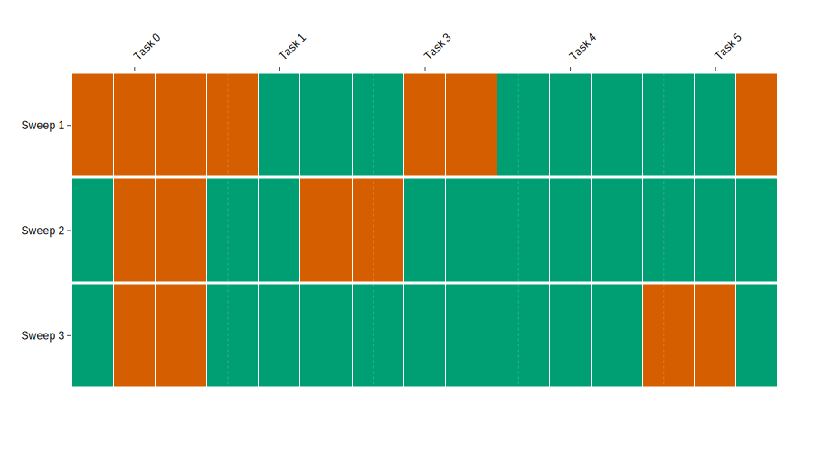
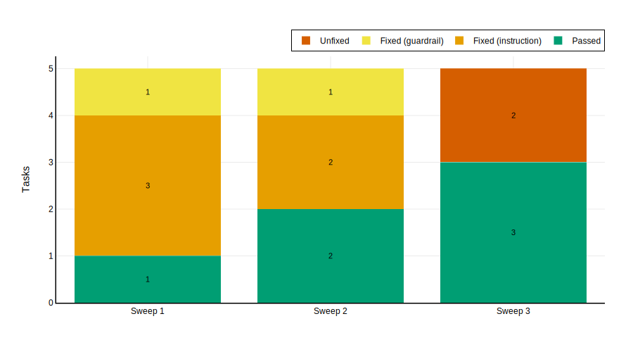
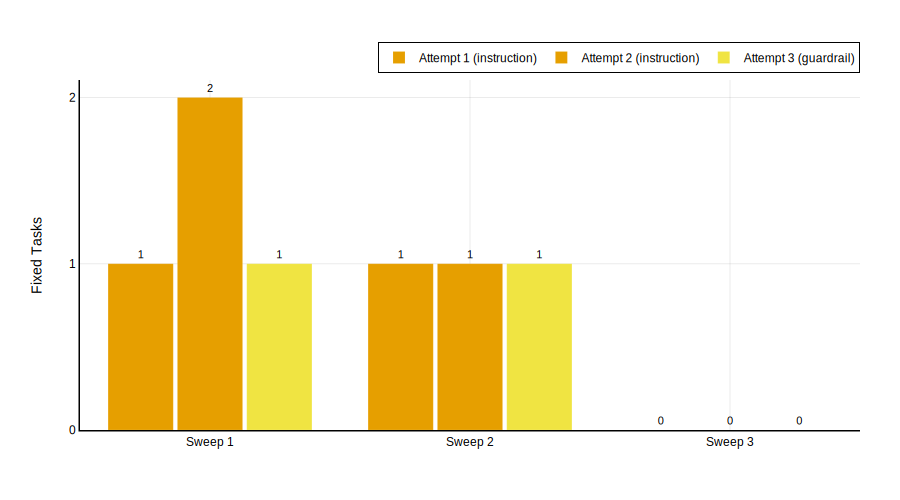
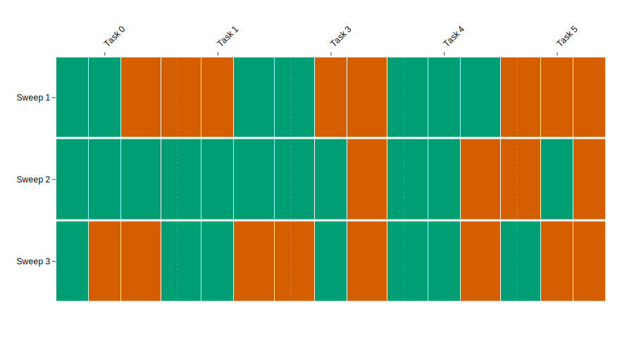
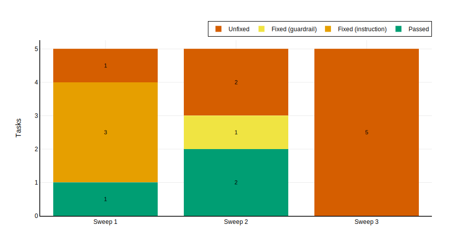
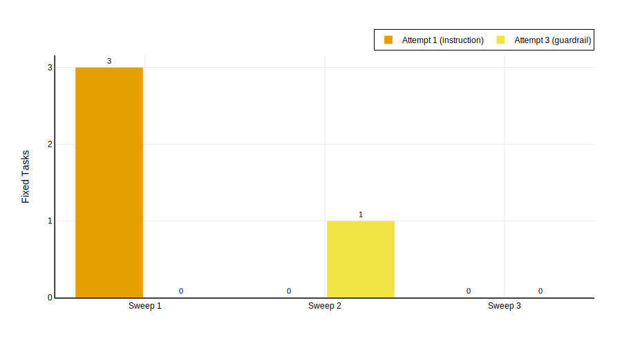

## 3.1 Experimental Results

This chapter presents the results of testing the DPV framework (EDP Phase 6: Test Solution). The experimental setup described in Section 2.4 is executed across three scales and three student models to evaluate whether the framework achieves the project objectives defined in the Introduction.

### 3.1.1 Five-Task Evaluation

#### 3.1.1.1 Qwen3 30B-A3B

##### Baseline and Evolution

The baseline evaluates the unmodified student on five airline tasks with three trials each. @Fig:exp1-heatmap shows the per-task, per-trial results across all three sweeps, and @tbl:exp1-passrate summarises pass rates.

| Sweep | T0 | T1 | T3 | T4 | T5 | Trial rate | Maj. rate |
|-------|-----|-----|-----|-----|-----|------------|-----------|
| 1 (base) | 0/3 | 2/3 | 1/3 | 3/3 | 2/3 | 8/15 (53%) | 3/5 (60%) |
| 2 (post-S1) | 1/3 | 2/3 | 2/3 | 3/3 | 3/3 | 11/15 (73%) | 4/5 (80%) |
| 3 (post-S2) | 1/3 | 3/3 | 3/3 | 3/3 | 1/3 | 11/15 (73%) | 3/5 (60%) |

: Per-sweep evaluation results for Qwen3 30B-A3B on 5 tasks. Each cell shows trial passes out of three. {#tbl:exp1-passrate}

@Fig:exp1-heatmap provides a visual representation of the same data. Each cell represents a single trial; green indicates a pass, red a fail. The heatmap makes the per-task trajectories immediately legible: Task 4's solid green column, Task 0's persistent red, and the progressive greening of Tasks 1 and 3 across sweeps.

{#fig:exp1-heatmap}

The baseline is non-trivial: the student already passes 60% of tasks by majority vote without any intervention. This confirms that the student is not helplessly incapable---the teacher is refining, not teaching from scratch. The headroom for improvement is 40 percentage points (two tasks: 0 and 3).

##### Evolution Trajectory

The evolution loop ran three sweeps. @Tbl:exp1-outcomes shows the per-sweep breakdown of task outcomes during the evolution process.

| Sweep | Already passing | Fixed (instruction) | Fixed (guardrail) | Unfixed |
|-------|----------------|--------------------|--------------------|---------|
| 1 | 1 | 3 | 1 | 0 |
| 2 | 2 | 2 | 1 | 0 |
| 3 | 3 | 0 | 0 | 2 |

: Per-sweep task outcomes during the evolution loop for Qwen3 30B-A3B on 5 tasks. {#tbl:exp1-outcomes}

@Fig:exp1-outcomes visualises the same data as a stacked bar chart. The shrinking of the "Fixed" segments and the growth of the "Already passing" segment across sweeps illustrates the diminishing-returns dynamic.

{#fig:exp1-outcomes}

Sweep 1 is the most productive: all four failing tasks are repaired, three by instruction patches and one by a guardrail preprocessor. Sweep 2 fixes three of three failing tasks. Sweep 3 produces no new fixes; the two remaining failures resist further patching.

@Tbl:exp1-fixes details the individual fix attempts, including the teacher's patch tier, retry count, and session cost.

| Sweep | Task | Base → Patch | Tier | Attempt | Teacher msgs | Tool calls | Duration |
|-------|------|-------------|------|---------|-------------|------------|----------|
| 1 | 3 | Fail → Pass | instruction | 2 | 10 | 3 | 2m 26s |
| 1 | 0 | Fail → Pass | instruction | 2 | 8 | 2 | 2m 33s |
| 1 | 1 | Fail → Pass | instruction | 1 | 15 | 6 | 1m 13s |
| 1 | 5 | Fail → Pass | guardrail | 3 | 44 | 18 | 8m 22s |
| 2 | 0 | Fail → Pass | instruction | 1 | 6 | 2 | 2m 3s |
| 2 | 3 | Fail → Pass | guardrail | 3 | 20 | 6 | 9m 28s |
| 2 | 1 | Fail → Pass | instruction | 2 | 14 | 5 | 7m 32s |

: Individual fix attempts for Qwen3 30B-A3B on 5 tasks. {#tbl:exp1-fixes}

##### Fix Type Analysis

@Fig:exp1-fix-attempts shows the number of tasks fixed per attempt and tier across sweeps.

{#fig:exp1-fix-attempts}

Of seven successful fixes across sweeps 1 and 2, five (71%) were instruction-tier patches and two (29%) were guardrail-tier. Instruction-tier fixes are also cheaper. The median instruction fix took 2 attempts, 10 messages, and 2.5 tool calls; the median guardrail fix took 3 attempts, 32 messages, and 12 tool calls.

The dominance of instruction-tier patches supports the Superficial Alignment Hypothesis [@zhou2023lima]: the student model's failures are primarily failures of instruction following, not of capability.

##### Patch Interference and Regression

The most notable negative result is the regression of Task 5 between sweeps 2 and 3. In sweep 2, Task 5 passes all three trials (3/3). In sweep 3, it passes only one (1/3). Since no patches targeted Task 5 between sweeps 2 and 3 (it was already passing), the regression is attributable either to stochastic variation or to interference from patches accumulated during sweep 2's fixes of other tasks.

##### Summary

The aggregate trial pass rate rises from 53% (baseline) to 73% (after two sweeps of evolution). Instruction-level patches account for the majority of successful fixes. However, the five-task setting saturates quickly: by sweep 3, no further fixes are possible, and patch interference introduces mild regression.

#### 3.1.1.2 Qwen3.5 Flash

The same five tasks (0, 1, 3, 4, 5) were evaluated with Qwen3.5 Flash as the student model. At baseline, Qwen3.5 Flash achieves a perfect 5/5 majority-vote pass rate (15/15 trials), requiring no evolution intervention. Every task that Qwen3 30B-A3B struggled with---including Task 0 (which never reliably passed even after evolution) and Task 3 (which required multi-sweep patching)---is solved by Qwen3.5 Flash out of the box.

This result establishes a ceiling reference: the five-task airline configuration is within the unassisted capability of a stronger non-thinking model. The evolution framework's contribution on these tasks is to bridge the gap between a weaker model's capability and this ceiling---a gap that a stronger student does not have.

#### 3.1.1.3 GLM 4.7 Flash

##### Baseline and Evolution

@Tbl:glm5-passrate summarises pass rates across sweeps for GLM 4.7 Flash on five tasks. @Fig:glm47-5-heatmap visualises the per-task, per-trial results.

| Sweep | T0 | T1 | T3 | T4 | T5 | Trial rate | Maj. rate |
|-------|-----|-----|-----|-----|-----|------------|-----------|
| 1 (base) | 2/3 | 1/3 | 1/3 | 3/3 | 0/3 | 7/15 (47%) | 2/5 (40%) |
| 2 (post-S1) | 3/3 | 3/3 | 2/3 | 2/3 | 1/3 | 11/15 (73%) | 4/5 (80%) |
| 3 (post-S2) | 1/3 | 2/3 | 1/3 | 2/3 | 1/3 | 7/15 (47%) | 2/5 (40%) |

: Per-sweep evaluation results for GLM 4.7 Flash on 5 tasks. {#tbl:glm5-passrate}

{#fig:glm47-5-heatmap}

The baseline is comparable to Qwen3 30B-A3B's: 47% trial rate and 40% majority rate, with Tasks 0 and 4 passing by majority vote. The three failing tasks (1, 3, 5) represent the headroom for evolution.

##### Evolution Trajectory

| Sweep | Already passing | Fixed (instruction) | Fixed (guardrail) | Unfixed |
|-------|----------------|--------------------|--------------------|---------|
| 1 | 1 | 3 | 0 | 1 |
| 2 | 2 | 0 | 1 | 2 |
| 3 | 0 | 0 | 0 | 5 |

: Per-sweep task outcomes during the evolution loop for GLM 4.7 Flash on 5 tasks. {#tbl:glm5-outcomes}

{#fig:glm47-5-outcomes}

Sweep 1 fixes three tasks (all instruction-tier): Tasks 1, 5, and 0. Task 3 resists repair. Sweep 2 adds one guardrail fix for Task 4 (which was already passing by majority but had failed during the evolution loop's single-trial check). Sweep 3 produces no new fixes; the evolution loop sees all five tasks as failing, reflecting severe regression.

@Tbl:glm5-fixes details the individual fix attempts.

| Sweep | Task | Base → Patch | Tier | Attempt | Teacher msgs | Tool calls | Duration |
|-------|------|-------------|------|---------|-------------|------------|----------|
| 1 | 1 | Fail → Pass | instruction | 1 | 8 | 3 | 2m 59s |
| 1 | 5 | Fail → Pass | instruction | 1 | 8 | 3 | 3m 35s |
| 1 | 0 | Fail → Pass | instruction | 1 | 4 | 1 | 5m 0s |
| 1 | 3 | Fail → Fail | --- | --- | 25 | 9 | 6m 5s |
| 2 | 3 | Fail → Fail | --- | --- | 16 | 5 | 3m 10s |
| 2 | 4 | Fail → Pass | guardrail | 3 | 21 | 7 | 3m 16s |
| 2 | 5 | Fail → Fail | --- | --- | 54 | 24 | 7m 23s |

: Individual fix attempts for GLM 4.7 Flash on 5 tasks. {#tbl:glm5-fixes}

{#fig:glm47-5-fix-attempts}

Total fixes: 4 (3 instruction, 1 guardrail). Of the three genuinely failing tasks at baseline (1, 3, 5), two were fixed---a 67% fix rate, comparable to Qwen3 30B-A3B's performance.

##### Catastrophic Regression in Sweep 3

The defining result for GLM 4.7 Flash at five tasks is the catastrophic regression between sweeps 2 and 3. The majority pass rate drops from 80% (4/5) to 40% (2/5)---a 40-percentage-point collapse. The trial rate drops from 73% to 47%, returning exactly to the baseline. Tasks 0 and 3, which had improved in sweep 2, revert to their baseline state. Even Task 4, which passed perfectly at baseline (3/3), degrades to 2/3.

This regression is far more severe than anything observed with Qwen3 30B-A3B (which lost only one task between sweeps 2 and 3) or Qwen3.5 Flash at ten tasks (which lost 10 percentage points). It suggests that GLM 4.7 Flash is particularly vulnerable to patch interference: the accumulated patches from sweeps 1 and 2 create conflicting directives that the model cannot reconcile.

##### Summary

GLM 4.7 Flash achieves a strong peak improvement (+40pp majority, +26pp trial at sweep 2), demonstrating that the evolution framework can work with this model. However, the gains are entirely erased by sweep 3, indicating that the model lacks the robustness to maintain improvements under patch accumulation. Task 3 is never fixed across either sweep, remaining the sole resistant task.

#### 3.1.1.4 Comparative Analysis at Five Tasks

| Metric | Qwen3 30B-A3B | Qwen3.5 Flash | GLM 4.7 Flash |
|--------|---------------|---------------|---------------|
| Baseline trial rate | 53% (8/15) | 100% (15/15) | 47% (7/15) |
| Baseline majority rate | 60% (3/5) | 100% (5/5) | 40% (2/5) |
| Best trial rate (post-evo) | 73% (11/15) | 100% (15/15) | 73% (11/15) |
| Best majority rate (post-evo) | 80% (4/5) | 100% (5/5) | 80% (4/5) |
| Sweep 3 majority | 60% (3/5) | 100% (5/5) | 40% (2/5) |
| Evolution needed? | Yes | No | Yes |
| Genuinely failing tasks | 2 | 0 | 3 |
| Fix rate on failing tasks | 100% | N/A | 67% |
| Total fixes (instr/guard) | 7 (5/2) | 0 | 4 (3/1) |

: Five-task comparison across three student models. "Best" refers to the sweep with the highest pass rate. {#tbl:5task-comparison}

Three patterns emerge. First, both weaker models reach the same peak performance (80% majority, 73% trial), suggesting a common ceiling for the five-task setting that prompt evolution can approach but not exceed. Second, the models diverge sharply in their ability to retain gains: Qwen3 30B-A3B holds most of its improvement through sweep 3, while GLM 4.7 Flash collapses back to baseline. Third, Qwen3.5 Flash's perfect baseline confirms that these five tasks are within reach of a sufficiently capable model without any evolution intervention.
