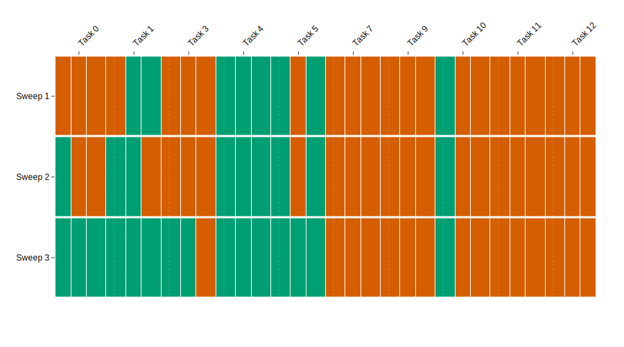
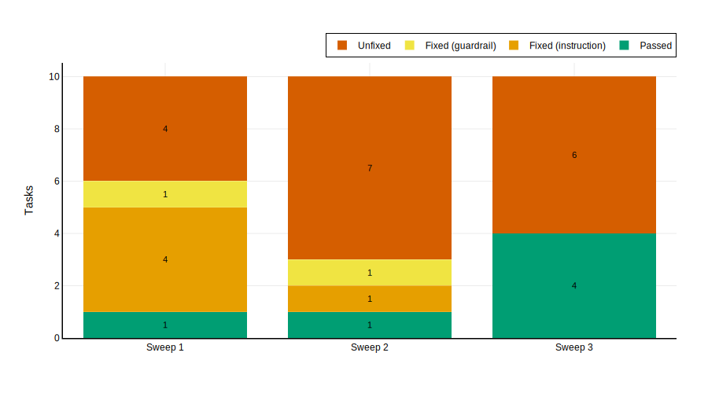
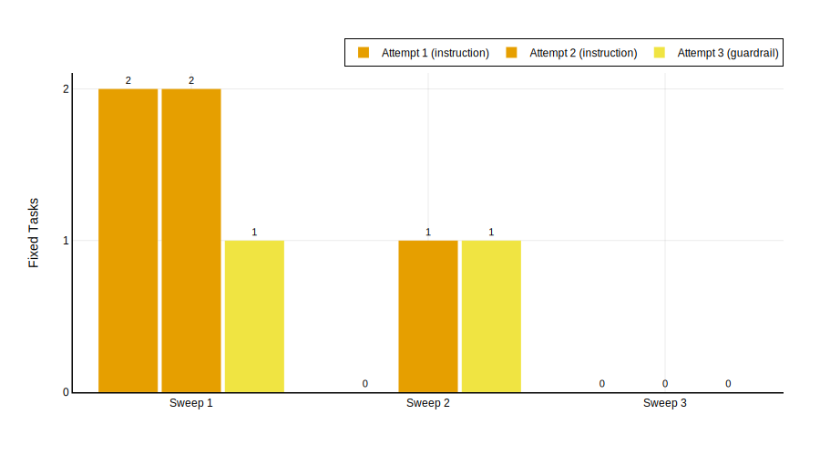
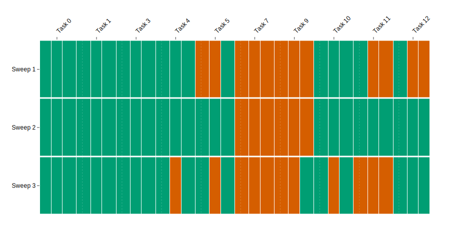
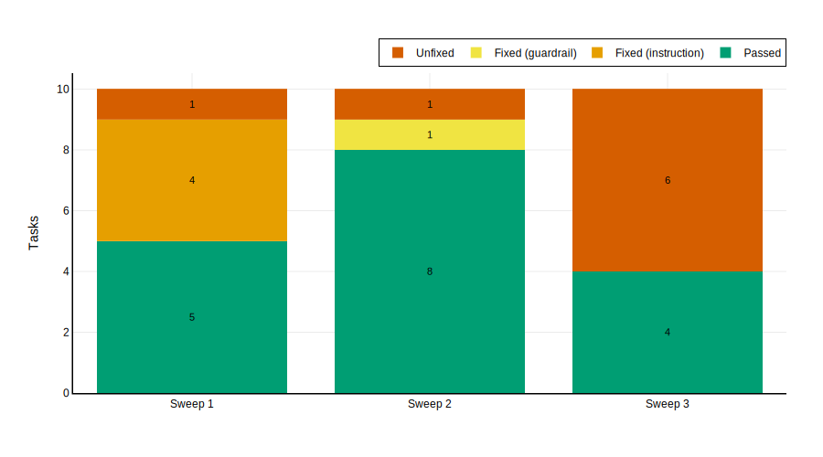
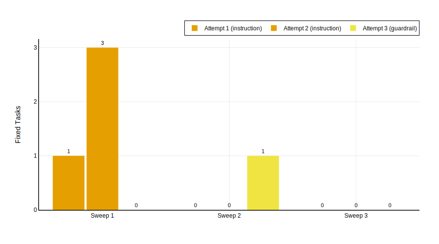
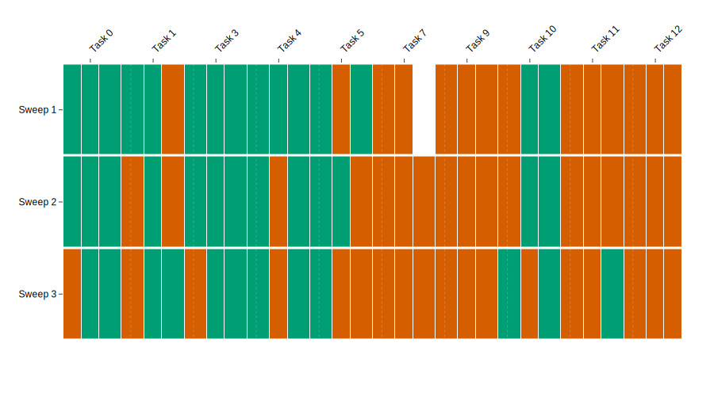
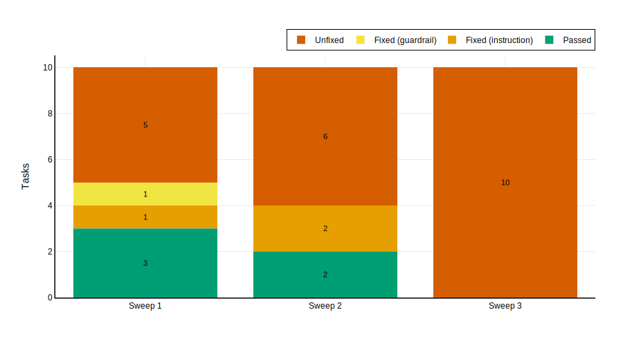
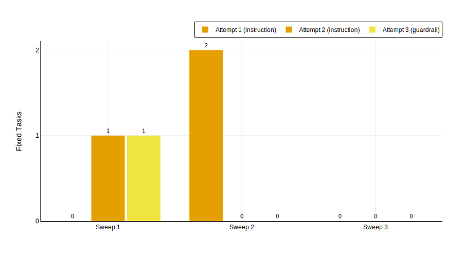

## 3.2 10-Task Experiments

#### Qwen3 30B-A3B

Experiment 2 doubles the task set from five to 10, introducing five additional tasks (7, 9, 10, 11, 12). @Fig:exp2-heatmap shows the per-task, per-trial results across all three sweeps, and @tbl:exp2-passrate summarises pass rates.

| Sweep | T0 | T1 | T3 | T4 | T5 | T7 | T9 | T10 | T11 | T12 | Trial rate | Maj. rate |
|-------|-----|-----|-----|-----|-----|-----|-----|------|------|------|------------|-----------|
| 1 (base) | 0/3 | 2/3 | 0/3 | 3/3 | 2/3 | 0/3 | 0/3 | 1/3 | 0/3 | 0/3 | 8/30 (27%) | 3/10 (30%) |
| 2 (post-S1) | 1/3 | 2/3 | 0/3 | 3/3 | 2/3 | 0/3 | 0/3 | 1/3 | 0/3 | 0/3 | 9/30 (30%) | 3/10 (30%) |
| 3 (post-S2) | 3/3 | 3/3 | 2/3 | 3/3 | 3/3 | 0/3 | 0/3 | 1/3 | 0/3 | 0/3 | 15/30 (50%) | 5/10 (50%) |

: Per-sweep evaluation results for Qwen3 30B-A3B on 10 tasks. {#tbl:exp2-passrate}

@Fig:exp2-heatmap visualises the same data. Compared to the 5-task heatmap, the 10-task version makes the bifurcation between fixable and resistant tasks immediately visible: a cluster of tasks (0, 1, 3, 4, 5) greens progressively across sweeps, while a second cluster (7, 9, 11, 12) remains solidly red throughout. Task 10 occupies a middle ground---it was fixed during sweep 1's evolution but never passed more than 1/3 trials in re-evaluation, suggesting a fragile fix.

{#fig:exp2-heatmap}

The baseline is substantially weaker than in the 5-task setting: only 27% of trials pass (8/30), versus 53% (8/15). By majority vote, 3 of 10 tasks pass (30%), versus 3 of 5 (60%). The five tasks shared with the 5-task experiment exhibit identical baseline performance, confirming that the seed and configuration reproduce consistently.

| Sweep | Already passing | Fixed (instruction) | Fixed (guardrail) | Unfixed |
|-------|----------------|--------------------|--------------------|---------|
| 1 | 1 | 4 | 1 | 4 |
| 2 | 1 | 1 | 1 | 7 |
| 3 | 4 | 0 | 0 | 6 |

: Per-sweep task outcomes for Qwen3 30B-A3B on 10 tasks. {#tbl:exp2-outcomes}

@Fig:exp2-outcomes visualises the same data. The persistent red "Unfixed" segment, absent in the 5-task sweeps 1 and 2, dominates the chart---reflecting a hard core of tasks that resist prompt-level repair.

{#fig:exp2-outcomes}

The trajectory differs markedly from the 5-task experiment. In the 5-task run, sweep 1 fixed all tasks that failed within the evolution loop; here, sweep 1 fixes only 5 of 9 tasks that failed the loop's single-trial check (the 9 includes two tasks---T1 and T5---that pass by majority vote at baseline but failed individual trials). The four unfixed tasks (7, 9, 11, 12) consumed substantial teacher effort---a combined 150 messages, 61 tool calls, and 36 minutes of wall-clock time---without producing a single viable patch.

A second notable difference is the delayed improvement in evaluation metrics. Sweep 2's re-evaluation shows essentially no change from baseline (9/30 trials, 30% majority), despite sweep 1 having fixed five tasks during the evolution loop. The full improvement materialises only in sweep 3 (15/30 trials, 50% majority), after sweep 2's fixes had a chance to reinforce the earlier patches.

@Tbl:exp2-fixes details the individual fix attempts.

| Sweep | Task | Base → Patch | Tier | Attempt | Teacher msgs | Tool calls | Duration |
|------:|-----:|:------------|:-----|--------:|------------:|-----------:|---------:|
| 1 | 0 | Fail → Pass | instruction | 1 | 10 | 4 | 51s |
| 1 | 1 | Fail → Pass | instruction | 1 | 4 | 1 | 21s |
| 1 | 5 | Fail → Pass | instruction | 2 | 16 | 6 | 5m 11s |
| 1 | 3 | Fail → Pass | guardrail | 3 | 36 | 15 | 5m 54s |
| 1 | 10 | Fail → Pass | instruction | 2 | 35 | 14 | 6m 59s |
| 1 | 12 | Fail → Fail | --- | --- | 36 | 15 | 8m 37s |
| 1 | 9 | Fail → Fail | --- | --- | 37 | 14 | 12m 36s |
| 1 | 11 | Fail → Fail | --- | --- | 38 | 16 | 6m 21s |
| 1 | 7 | Fail → Fail | --- | --- | 39 | 16 | 8m 40s |
| 2 | 1 | Fail → Pass | instruction | 2 | 12 | 4 | 3m 42s |
| 2 | 5 | Fail → Pass | guardrail | 3 | 59 | 26 | 11m 49s |
| 2 | 3 | Fail → Fail | --- | --- | 26 | 10 | 3m 33s |
| 2 | 0 | Fail → Fail | --- | --- | 35 | 12 | 5m 9s |
| 2 | 12 | Fail → Fail | --- | --- | 46 | 19 | 7m 50s |
| 2 | 11 | Fail → Fail | --- | --- | 37 | 15 | 8m 45s |
| 2 | 7 | Fail → Fail | --- | --- | 22 | 8 | 7m 22s |
| 2 | 9 | Fail → Fail | --- | --- | 39 | 17 | 10m 0s |
| 2 | 10 | Fail → Fail | --- | --- | 38 | 16 | 19m 0s |

: Individual fix attempts for Qwen3 30B-A3B on 10 tasks. {#tbl:exp2-fixes}

@Fig:exp2-fix-attempts shows the number of tasks fixed per attempt and tier across sweeps.

{#fig:exp2-fix-attempts}

Across sweeps 1 and 2, seven successful fixes were applied: five instruction-tier (71%) and two guardrail-tier (29%). This ratio is identical to the 5-task experiment's, suggesting that the instruction-guardrail balance is a stable property of the framework rather than an artefact of the specific task set.

The cost distribution shifts substantially. In the 5-task run, the teacher encountered no unfixable tasks until sweep 3. In the 10-task run, the teacher exhausted all retries on four tasks in sweep 1 and seven in sweep 2, burning 393 messages, 162 tool calls, and over 107 minutes on failed attempts.

In summary, the trial pass rate rises from 27% (baseline) to 50% (after two sweeps), a 23-percentage-point gain comparable to the 5-task run's +20pp. The instruction-guardrail ratio (71%/29%) is identical. However, four of seven majority-vote failures (Tasks 7, 9, 11, 12) resist all fix attempts, and improvement is delayed by one sweep due to patch fragility.

#### Qwen3.5 Flash

The same 10 tasks were evaluated with Qwen3.5 Flash as the student model. @Tbl:exp2-flash-passrate summarises pass rates across sweeps.

| Sweep | T0 | T1 | T3 | T4 | T5 | T7 | T9 | T10 | T11 | T12 | Trial rate | Maj. rate |
|-------|-----|-----|-----|-----|-----|-----|-----|------|------|------|------------|-----------|
| 1 (base) | 3/3 | 3/3 | 3/3 | 3/3 | 1/3 | 0/3 | 0/3 | 3/3 | 1/3 | 1/3 | 18/30 (60%) | 5/10 (50%) |
| 2 (post-S1) | 3/3 | 3/3 | 3/3 | 3/3 | 3/3 | 0/3 | 0/3 | 3/3 | 3/3 | 3/3 | 24/30 (80%) | 8/10 (80%) |
| 3 (post-S2) | 3/3 | 3/3 | 3/3 | 2/3 | 2/3 | 0/3 | 1/3 | 2/3 | 0/3 | 3/3 | 19/30 (63%) | 7/10 (70%) |

: Per-sweep evaluation results for Qwen3.5 Flash on 10 tasks. {#tbl:exp2-flash-passrate}

{#fig:exp2-flash-heatmap}

The baseline is dramatically stronger than Qwen3 30B-A3B's on the same tasks: 60% trial pass rate versus 27%, and 50% majority pass rate versus 30%. Crucially, the five tasks that Qwen3 30B-A3B needed evolution to pass (0, 1, 3, 4, 10) are already solved by Qwen3.5 Flash at baseline. The failing tasks are a different set: Tasks 5, 7, 9, 11, and 12. Of these, Task 7 is the same resistant task that Qwen3 30B-A3B also could not fix. As shown below, however, Qwen3.5 Flash is able to fix Task 9 (along with Tasks 5, 11, and 12), demonstrating that most of these failures are model-specific rather than task-intrinsic.

| Sweep | Already passing | Fixed (instruction) | Fixed (guardrail) | Unfixed |
|-------|----------------|--------------------|--------------------|---------|
| 1 | 5 | 4 | 0 | 1 |
| 2 | 8 | 0 | 1 | 1 |
| 3 | 4 | 0 | 0 | 6 |

: Per-sweep task outcomes during the evolution loop for Qwen3.5 Flash on 10 tasks. {#tbl:exp2-flash-outcomes}

{#fig:exp2-flash-outcomes}

The evolution trajectory is markedly more efficient than Qwen3 30B-A3B's. In sweep 1, 5 of 10 tasks are already passing; of the 5 failing tasks, 4 are fixed by instruction patches and only Task 7 resists repair. Sweep 2 sees 8 tasks already passing; the one remaining fixable task (Task 9) requires escalation to a guardrail fix. By sweep 2, the framework has raised Qwen3.5 Flash's majority pass rate from 50% to 80%---a +30pp gain.

@Tbl:exp2-flash-fixes details the individual fix attempts.

| Sweep | Task | Base → Patch | Tier | Attempt | Teacher msgs | Tool calls | Duration |
|------:|-----:|:------------|:-----|--------:|------------:|-----------:|---------:|
| 1 | 11 | Fail → Pass | instruction | 1 | 6 | 2 | 42s |
| 1 | 12 | Fail → Pass | instruction | 2 | 21 | 8 | 3m 25s |
| 1 | 9 | Fail → Pass | instruction | 2 | 26 | 11 | 6m 34s |
| 1 | 7 | Fail → Fail | --- | --- | 50 | 22 | 8m 37s |
| 1 | 5 | Fail → Pass | instruction | 2 | 8 | 2 | 72m 27s |
| 2 | 7 | Fail → Fail | --- | --- | 24 | 9 | 6m 18s |
| 2 | 9 | Fail → Pass | guardrail | 3 | 39 | 16 | 7m 28s |

: Individual fix attempts for Qwen3.5 Flash on 10 tasks. {#tbl:exp2-flash-fixes}

A notable finding is that Qwen3.5 Flash can fix tasks that Qwen3 30B-A3B could not. Tasks 11 and 12---part of Qwen3 30B-A3B's "hard core" of unfixable tasks---are both fixed by instruction patches on Qwen3.5 Flash (Task 11 on the first attempt in just 42 seconds, Task 12 on the second attempt). This confirms that these tasks are not inherently beyond the reach of prompt-level correction; rather, Qwen3 30B-A3B lacked the baseline capability to execute even well-specified instructions for these tasks. The stronger student can act on the same guidance that the weaker student could not.

Task 7, however, resists repair on both models, consuming substantial teacher effort (50 messages, 22 tool calls in sweep 1; 24 messages, 9 tool calls in sweep 2) without success. This task appears to represent a genuinely structural challenge that neither model can handle through prompt-level intervention alone.

{#fig:exp2-flash-fix-attempts}

Across sweeps 1 and 2, five successful fixes were applied: four instruction-tier (80%) and one guardrail-tier (20%). The instruction dominance is even more pronounced than with Qwen3 30B-A3B (71%), consistent with the hypothesis that a stronger student can execute instruction-level guidance more reliably and therefore requires less escalation to guardrail interventions.

The most striking result is the regression in sweep 3. The majority pass rate drops from 80% (sweep 2) to 70% (sweep 3), and the trial pass rate drops sharply from 80% to 63%. Tasks 4, 5, 10, and 11 all degrade: Task 4 drops from 3/3 to 2/3, Task 5 from 3/3 to 2/3, Task 10 from 3/3 to 2/3, and Task 11 from 3/3 to 0/3. This is a more severe regression than observed with Qwen3 30B-A3B, where only Task 5 regressed significantly.

The likely explanation is patch interference compounded by the stronger model's sensitivity to instruction changes. A model that follows instructions more precisely may also be more disrupted when accumulated patches create conflicting directives. Task 11's complete regression (3/3 → 0/3) is particularly concerning---this task was successfully fixed in sweep 1 with a simple instruction patch (42 seconds, 6 messages), yet the patches accumulated during sweep 2 appear to have undone this fix entirely.

#### GLM 4.7 Flash

@Tbl:glm10-passrate summarises pass rates across sweeps. @Fig:glm47-10-heatmap visualises the per-task, per-trial results.

| Sweep | T0 | T1 | T3 | T4 | T5 | T7 | T9 | T10 | T11 | T12 | Trial rate | Maj. rate |
|-------|-----|-----|-----|-----|-----|-----|-----|------|------|------|------------|-----------|
| 1 (base) | 3/3 | 2/3 | 3/3 | 3/3 | 2/3 | 0/3 | 0/3 | 2/3 | 0/3 | 0/3 | 15/30 (50%) | 6/10 (60%) |
| 2 (post-S1) | 3/3 | 1/3 | 3/3 | 2/3 | 2/3 | 0/3 | 0/3 | 2/3 | 0/3 | 0/3 | 13/30 (43%) | 5/10 (50%) |
| 3 (post-S2) | 2/3 | 2/3 | 2/3 | 2/3 | 1/3 | 0/3 | 0/3 | 2/3 | 1/3 | 0/3 | 12/30 (40%) | 5/10 (50%) |

: Per-sweep evaluation results for GLM 4.7 Flash on 10 tasks. {#tbl:glm10-passrate}

{#fig:glm47-10-heatmap}

The baseline is the strongest of any model at this scale: 50% trial rate and 60% majority rate, compared to 27%/30% for Qwen3 30B-A3B and 60%/50% for Qwen3.5 Flash. Six of 10 tasks pass at baseline (0, 1, 3, 4, 5, 10). The four genuinely failing tasks are the same hard core seen across other models: Tasks 7, 9, 11, and 12.

| Sweep | Already passing | Fixed (instruction) | Fixed (guardrail) | Unfixed |
|-------|----------------|--------------------|--------------------|---------|
| 1 | 3 | 1 | 1 | 5 |
| 2 | 2 | 2 | 0 | 6 |
| 3 | 0 | 0 | 0 | 10 |

: Per-sweep task outcomes during the evolution loop for GLM 4.7 Flash on 10 tasks. {#tbl:glm10-outcomes}

{#fig:glm47-10-outcomes}

The evolution trajectory tells a story of failure. @Tbl:glm10-fixes details the individual fix attempts.

| Sweep | Task | Base → Patch | Tier | Attempt | Teacher msgs | Tool calls | Duration |
|------:|-----:|:------------|:-----|--------:|------------:|-----------:|---------:|
| 1 | 10 | Fail → Pass | instruction | 2 | 18 | 7 | 4m 25s |
| 1 | 1 | Fail → Pass | guardrail | 3 | 18 | 6 | 5m 53s |
| 1 | 7 | Fail → Fail | --- | --- | 26 | 10 | 4m 0s |
| 1 | 11 | Fail → Fail | --- | --- | 56 | 24 | 5m 11s |
| 1 | 5 | Fail → Fail | --- | --- | 44 | 18 | 5m 41s |
| 1 | 12 | Fail → Fail | --- | --- | 56 | 24 | 8m 37s |
| 1 | 9 | Fail → Fail | --- | --- | 54 | 21 | 8m 40s |
| 2 | 4 | Fail → Pass | instruction | 1 | 8 | 3 | 1m 10s |
| 2 | 1 | Fail → Pass | instruction | 1 | 13 | 5 | 1m 19s |
| 2 | 7 | Fail → Fail | --- | --- | 45 | 20 | 3m 52s |
| 2 | 12 | Fail → Fail | --- | --- | 71 | 30 | 5m 46s |
| 2 | 11 | Fail → Fail | --- | --- | 43 | 19 | 6m 39s |
| 2 | 10 | Fail → Fail | --- | --- | 45 | 20 | 7m 41s |
| 2 | 9 | Fail → Fail | --- | --- | 58 | 24 | 29m 3s |
| 2 | 5 | Fail → Fail | --- | --- | 35 | 14 | 30m 38s |

: Individual fix attempts for GLM 4.7 Flash on 10 tasks. {#tbl:glm10-fixes}

{#fig:glm47-10-fix-attempts}

The critical finding is that all four successful fixes targeted tasks that were already passing by majority vote at baseline. Tasks 10 and 1 (sweep 1) and Tasks 4 and 1 (sweep 2) all had majority-vote baselines of ≥2/3. The four genuinely failing tasks---7, 9, 11, 12---were attempted in both sweeps and failed every time, yielding a 0% fix rate on genuinely failing tasks.

The evolution loop produces patches, and the teacher diagnoses failures correctly, but GLM 4.7 Flash cannot translate these patches into reliable execution at this scale. The patches fix one behaviour but introduce new errors elsewhere. This is visible in the progressive degradation of the trial rate across sweeps: 50% → 43% → 40%. Even tasks that were comfortably passing at baseline (e.g., Task 1 at 2/3, Task 5 at 2/3) become more fragile after patches are applied.

The sweep 3 result is especially revealing: the evolution loop sees all 10 tasks as failing, even though the 3-trial re-evaluation shows five passing by majority. The model's behaviour is becoming increasingly unstable as patches accumulate.

In summary, GLM 4.7 Flash at 10 tasks represents the framework's clearest failure mode. Despite a strong baseline (60% majority), the evolution loop cannot fix any genuinely failing task and actively degrades performance on passing tasks. The trial rate declines monotonically from 50% to 40% across three sweeps. This result motivated dropping GLM 4.7 Flash from the 20-task experiment.

#### Comparative Analysis at 10 Tasks

@Tbl:10task-comparison summarises the key metrics for all three models at 10 tasks.

| Metric | Qwen3 30B-A3B | Qwen3.5 Flash | GLM 4.7 Flash |
|--------|---------------|---------------|---------------|
| Baseline trial rate | 27% (8/30) | 60% (18/30) | 50% (15/30) |
| Baseline majority rate | 30% (3/10) | 50% (5/10) | 60% (6/10) |
| Best trial rate (post-evo) | 50% (15/30) | 80% (24/30) | 50% (15/30) |
| Best majority rate (post-evo) | 50% (5/10) | 80% (8/10) | 60% (6/10) |
| Improvement (pp, trial) | +23 | +20 | 0 |
| Improvement (pp, majority) | +20 | +30 | 0 |
| Fix rate on failing tasks | 3/7 (43%) | 4/5 (80%) | 0/4 (0%) |
| Total fixes (instr/guard) | 7 (5/2) | 5 (4/1) | 4 (3/1) |
| Unfixable tasks | 4 (7, 9, 11, 12) | 1 (7) | 4 (7, 9, 11, 12) |
| Sweep 3 regression? | Mild | Severe (-17pp trial) | Continuous decline |

: 10-task comparison across three student models. "Best" refers to the sweep with the highest pass rate. GLM 4.7 Flash's "best" is the baseline itself, since evolution produces no net improvement. Fix rate counts tasks failing by majority vote at baseline that the teacher successfully fixed at least once. {#tbl:10task-comparison}

Four patterns emerge from the 3-model comparison:

The framework is not universally beneficial. GLM 4.7 Flash receives the same teacher patches as the other models but cannot convert them into durable improvements at this scale. The framework's value is contingent on the student model's ability to execute patched instructions reliably.

The stronger student benefits most from evolution. Qwen3.5 Flash achieves the highest ceiling (80% majority) and the highest fix rate on genuinely failing tasks (80%). Qwen3 30B-A3B achieves moderate improvement (+20pp majority) with a 43% fix rate. GLM 4.7 Flash achieves none.

The hard core of resistant tasks is consistent. Tasks 7, 9, 11, and 12 resist repair for both Qwen3 30B-A3B and GLM 4.7 Flash. With Qwen3.5 Flash, three of these (9, 11, 12) become fixable, leaving only Task 7 as genuinely resistant across all three models.

Regression risk varies by model architecture. Qwen3.5 Flash shows discrete regression in sweep 3 (-17pp trial, -10pp majority). GLM 4.7 Flash shows continuous decline across all sweeps. Qwen3 30B-A3B shows the mildest regression. The relationship between instruction-following quality and regression severity is not monotonic---GLM 4.7 Flash's regression is the worst despite not being the strongest instruction follower.
