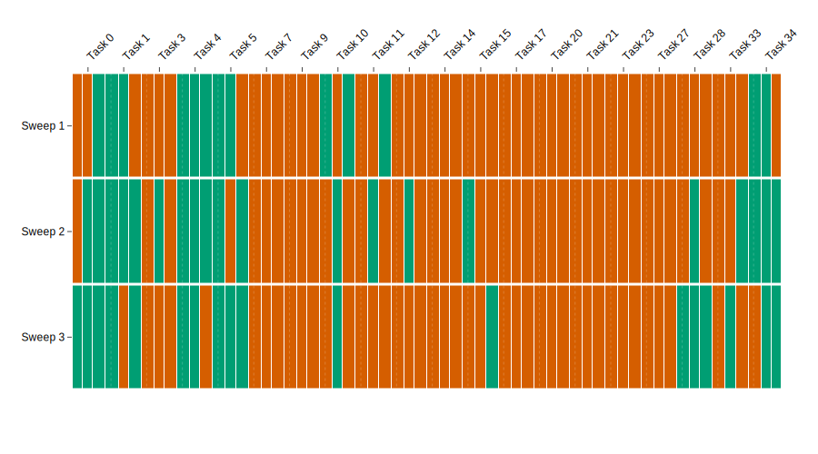
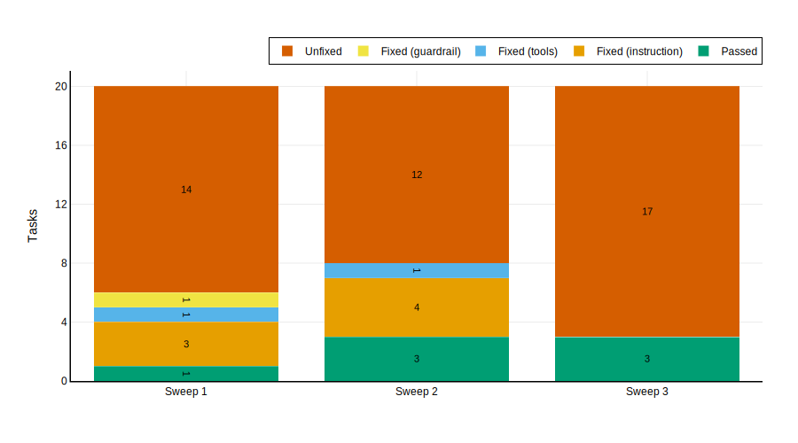
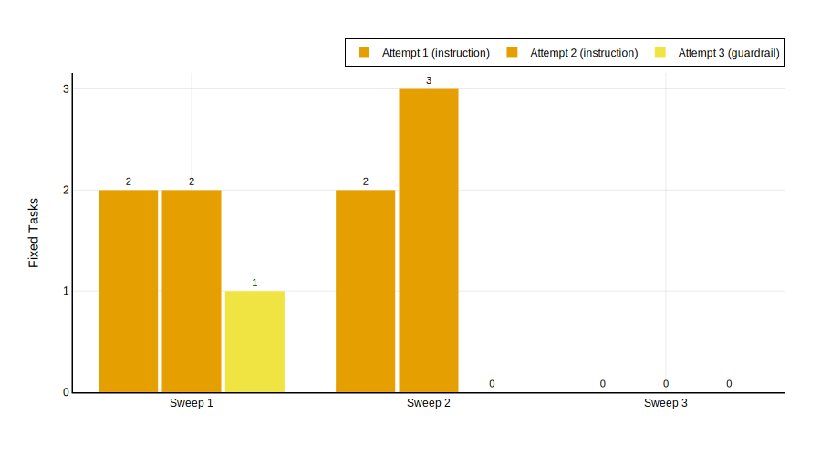
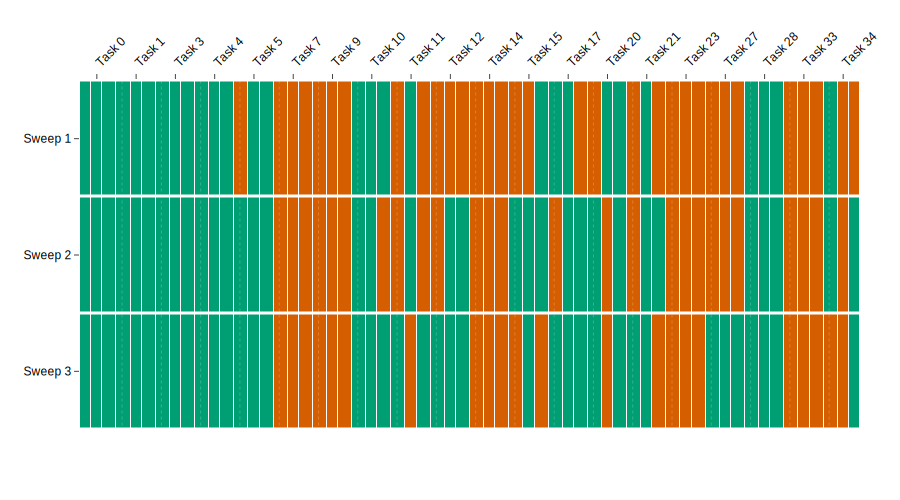
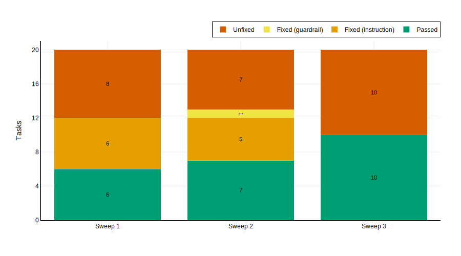
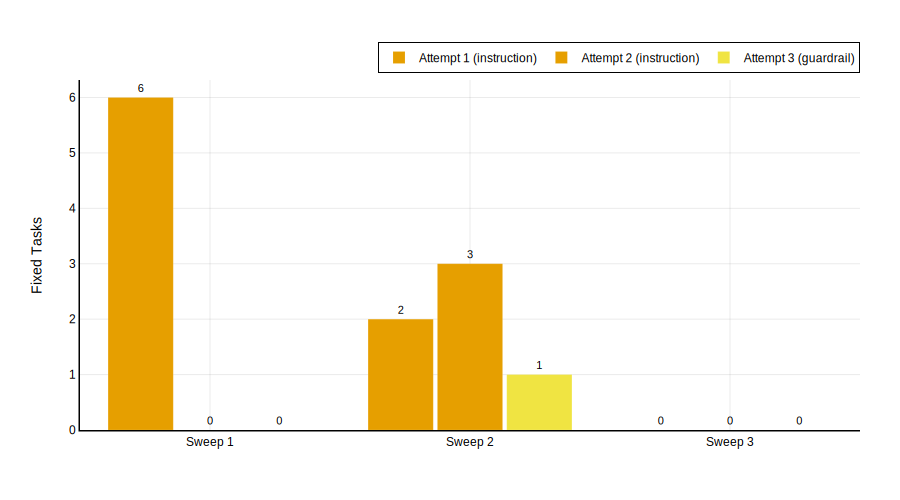

### 3.1.3 Twenty-Task Experiments

#### 3.1.3.1 Qwen3 30B-A3B

Experiment 3 doubles the task set again to twenty, introducing ten additional tasks (14, 15, 17, 20, 21, 23, 27, 28, 33, 34) alongside the original ten. This tests whether the framework's gains continue to scale and how the teacher's strategy adapts to a larger and more diverse failure surface.

##### Baseline Performance

@Tbl:exp3-passrate summarises pass rates across sweeps.

| Sweep | Trial rate | Maj. rate |
|-------|------------|-----------|
| 1 (base) | 13/60 (22%) | 5/20 (25%) |
| 2 (post-S1) | 20/60 (33%) | 5/20 (25%) |
| 3 (post-S2) | 18/60 (30%) | 6/20 (30%) |

: Per-sweep pass rates for Qwen3 30B-A3B on 20 tasks. {#tbl:exp3-passrate}

The per-task baseline results reveal the scale of the challenge. Of 20 tasks, only 5 pass by majority vote at baseline: Tasks 1 (2/3), 4 (3/3), 5 (2/3), 10 (2/3), and 34 (2/3). The remaining 15 tasks fail, with 11 scoring 0/3. The baseline trial rate (22%) is the lowest of any experiment, confirming the expected dilution effect as harder tasks are added.

{#fig:exp3-heatmap}

@Fig:exp3-heatmap visualises the per-task trajectories. The heatmap is overwhelmingly red, with progressive greening visible only in the leftmost cluster (Tasks 0, 1, 3, 4, 5) and scattered improvements in Tasks 28, 33, and 34. The right half of the heatmap---Tasks 14 through 27---remains solidly red across all three sweeps, representing a wall of failures that no amount of prompt evolution can penetrate.

The per-task breakdown for all three sweeps:

| Task | Sweep 1 | Sweep 2 | Sweep 3 | Trajectory |
|------|---------|---------|---------|------------|
| 0 | 1/3 | 2/3 | 3/3 | Improving |
| 1 | 2/3 | 3/3 | 2/3 | Stable pass |
| 3 | 0/3 | 1/3 | 0/3 | Fragile |
| 4 | 3/3 | 3/3 | 2/3 | Stable pass |
| 5 | 2/3 | 2/3 | 3/3 | Improving |
| 7 | 0/3 | 0/3 | 0/3 | Resistant |
| 9 | 0/3 | 0/3 | 0/3 | Resistant |
| 10 | 2/3 | 1/3 | 1/3 | Regressing |
| 11 | 1/3 | 1/3 | 0/3 | Regressing |
| 12 | 0/3 | 1/3 | 0/3 | Resistant |
| 14 | 0/3 | 0/3 | 0/3 | Resistant |
| 15 | 0/3 | 1/3 | 1/3 | Fragile |
| 17 | 0/3 | 0/3 | 0/3 | Resistant |
| 20 | 0/3 | 0/3 | 0/3 | Resistant |
| 21 | 0/3 | 0/3 | 0/3 | Resistant |
| 23 | 0/3 | 0/3 | 0/3 | Resistant |
| 27 | 0/3 | 0/3 | 0/3 | Resistant |
| 28 | 0/3 | 1/3 | 3/3 | Late bloomer |
| 33 | 0/3 | 1/3 | 1/3 | Fragile |
| 34 | 2/3 | 3/3 | 2/3 | Stable pass |

: Per-task trajectories for Qwen3 30B-A3B on 20 tasks. Trajectories classify tasks by their evolution arc: "Improving" tasks trend from fail to pass; "Stable pass" tasks pass throughout; "Fragile" tasks show inconsistent results; "Resistant" tasks never pass by majority vote; "Regressing" tasks degrade across sweeps; "Late bloomer" tasks only pass in the final sweep. {#tbl:exp3-trajectories}

##### Evolution Trajectory

| Sweep | Already passing | Fixed (instruction) | Fixed (tools) | Fixed (guardrail) | Unfixed |
|-------|----------------|--------------------|----|---------|---------|
| 1 | 1 | 3 | 1 | 1 | 14 |
| 2 | 3 | 4 | 1 | 0 | 12 |
| 3 | 3 | 0 | 0 | 0 | 17 |

: Per-sweep task outcomes for Qwen3 30B-A3B on 20 tasks. A new fix tier---"tools" (tool-schema patching)---appears for the first time. {#tbl:exp3-outcomes}

{#fig:exp3-outcomes}

A new phenomenon appears at this scale: **tool-schema fixes** emerge as a distinct tier. In both sweeps 1 and 2, one task (Task 0) was fixed via tool-schema patching rather than instruction or guardrail modification. This is the first time in any experiment that tool-level patches contributed to successful fixes, suggesting that the larger and more diverse failure surface exposes failure modes that cannot be addressed at the instruction or guardrail level alone.

@Tbl:exp3-fixes details the individual fix attempts.

| Sweep | Task | Base → Patch | Tier | Attempt | Teacher msgs | Tool calls | Duration |
|-------|------|-------------|------|---------|-------------|------------|----------|
| 1 | 5 | Fail → Pass | instruction | 1 | 8 | 3 | 17s |
| 1 | 1 | Fail → Pass | instruction | 1 | 6 | 2 | 1m 2s |
| 1 | 0 | Fail → Pass | tools | 2 | 18 | 7 | 3m 33s |
| 1 | 3 | Fail → Pass | guardrail | 3 | 26 | 9 | 5m 15s |
| 1 | 34 | Fail → Pass | instruction | 2 | 20 | 8 | 5m 31s |
| 1 | 28 | Fail → Fail | --- | --- | 48 | 17 | 5m 28s |
| 1 | 14 | Fail → Fail | --- | --- | 20 | 7 | 8m 28s |
| 1 | 11 | Fail → Fail | --- | --- | 42 | 17 | 7m 53s |
| 1 | 17 | Fail → Fail | --- | --- | 39 | 16 | 8m 40s |
| 1 | 7 | Fail → Fail | --- | --- | 36 | 14 | 8m 15s |
| 1 | 9 | Fail → Fail | --- | --- | 40 | 15 | 11m 2s |
| 1 | 15 | Fail → Fail | --- | --- | 34 | 14 | 11m 4s |
| 1 | 27 | Fail → Fail | --- | --- | 36 | 15 | 9m 33s |
| 1 | 33 | Fail → Fail | --- | --- | 44 | 19 | 13m 17s |
| 1 | 10 | Fail → Fail | --- | --- | 38 | 14 | 13m 23s |
| 1 | 21 | Fail → Fail | --- | --- | 36 | 14 | 12m 38s |
| 1 | 23 | Fail → Fail | --- | --- | 30 | 12 | 10m 38s |
| 1 | 12 | Fail → Fail | --- | --- | 38 | 15 | 16m 48s |
| 1 | 20 | Fail → Fail | --- | --- | 55 | 25 | 19m 38s |
| 2 | 3 | Fail → Pass | instruction | 1 | 8 | 3 | 2m 7s |
| 2 | 10 | Fail → Pass | instruction | 1 | 12 | 5 | 3m 46s |
| 2 | 28 | Fail → Pass | instruction | 2 | 12 | 4 | 7m 16s |
| 2 | 5 | Fail → Pass | instruction | 2 | 15 | 5 | 6m 32s |
| 2 | 0 | Fail → Pass | tools | 2 | 32 | 12 | 8m 9s |
| 2 | 17 | Fail → Fail | --- | --- | 20 | 7 | 7m 22s |
| 2 | 11 | Fail → Fail | --- | --- | 45 | 19 | 10m 41s |
| 2 | 15 | Fail → Fail | --- | --- | 38 | 15 | 14m 47s |
| 2 | 20 | Fail → Fail | --- | --- | 43 | 18 | 16m 23s |
| 2 | 14 | Fail → Fail | --- | --- | 41 | 17 | 13m 55s |
| 2 | 27 | Fail → Fail | --- | --- | 22 | 8 | 11m 2s |
| 2 | 12 | Fail → Fail | --- | --- | 54 | 21 | 16m 23s |
| 2 | 7 | Fail → Fail | --- | --- | 34 | 14 | 20m 21s |
| 2 | 9 | Fail → Fail | --- | --- | 44 | 19 | 19m 18s |
| 2 | 23 | Fail → Fail | --- | --- | 36 | 15 | 18m 44s |
| 2 | 21 | Fail → Fail | --- | --- | 44 | 19 | 16m 29s |
| 2 | 33 | Fail → Fail | --- | --- | 2 | --- | 72m 6s |

: Individual fix attempts for Qwen3 30B-A3B on 20 tasks. {#tbl:exp3-fixes}

The wasted effort is staggering. Across sweeps 1 and 2, the teacher exhausted all retries on 25 task-sweep combinations (14 in sweep 1, 11 in sweep 2), spending a combined 800+ messages, 300+ tool calls, and over 7 hours of wall-clock time on failed attempts. The most expensive single failed attempt was Task 33 in sweep 2, which consumed 72 minutes---more than any successful fix in the entire experimental programme---likely due to a timeout or network issue during the teacher's analysis. Task 20 in sweep 1 was the next most expensive at nearly 20 minutes (55 messages, 25 tool calls).

##### Fix Type Analysis

{#fig:exp3-fix-attempts}

Across sweeps 1 and 2, ten successful fixes were applied: seven instruction-tier (70%), two tools-tier (20%), and one guardrail-tier (10%). The instruction-tier dominance persists but its share drops slightly compared to the 71% observed in both previous experiments. The emergence of tool-schema fixes as a meaningful category is a new development: at 5 and 10 tasks, no tools-tier fixes were recorded.

The fix success rate continues its decline with scale: $\text{FSR}_{20} = 8/19 \approx 42\%$ of unique failing tasks were fixed at least once, down from 56% at 10 tasks and 100% at 5 tasks. Of the 15 tasks that failed at baseline, only 8 were ever successfully fixed (0, 1, 3, 5, 10, 28, 33, 34). The remaining 11 tasks constitute an expanded hard core: 7, 9, 11, 12, 14, 15, 17, 20, 21, 23, 27.

##### Scaling Observations

**Task 28 is a late bloomer.** It fails all trials in sweeps 1 and 2 but passes 3/3 in sweep 3---the only task to achieve a perfect sweep after two rounds of evolution. This suggests that accumulated patches from earlier sweeps can produce delayed, cross-task benefits: patches targeting other tasks may have incidentally improved the student's handling of Task 28's underlying policy or tool-use pattern.

**Improvement is real but modest.** The trial pass rate rises from 22% (baseline) to 33% (sweep 2), a +11pp gain---roughly half the improvement observed at 5 and 10 tasks. By majority vote, the improvement is smaller still: 25% → 30% (+5pp). The framework's impact is diluted by the large denominator of resistant tasks.

**Patch fragility persists.** The trial pass rate actually drops between sweeps 2 and 3 (33% → 30%), and the majority rate barely changes (25% → 30%, but this is driven entirely by Task 28's late bloom). Several tasks that showed marginal improvement in sweep 2 (Tasks 3, 11, 12, 15, 33) regress in sweep 3.

##### Summary

The twenty-task experiment confirms the diminishing returns hypothesis. The evolution framework produces a smaller absolute improvement (+8pp trial rate from baseline to best sweep) compared to 10 tasks (+23pp) and 5 tasks (+20pp). The fix success rate drops to 42%. The hard core of resistant tasks expands from 4 (at 10 tasks) to 11 (at 20 tasks). Tool-schema fixes emerge as a new category, but their frequency (2 of 10 fixes) is too low to offset the growing proportion of unfixable failures. The practical implication is clear: at 20 tasks, the teacher spends the vast majority of its time and tokens on tasks it cannot repair.

#### 3.1.3.2 Qwen3.5 Flash

##### Baseline Performance

@Tbl:flash20-passrate summarises pass rates across sweeps. @Fig:flash20-heatmap visualises the per-task, per-trial results.

| Sweep | Trial rate | Maj. rate |
|-------|------------|-----------|
| 1 (base) | 28/60 (47%) | 9/20 (45%) |
| 2 (post-S1) | 34/60 (57%) | 13/20 (65%) |
| 3 (post-S2) | 35/60 (58%) | 13/20 (65%) |

: Per-sweep pass rates for Qwen3.5 Flash on 20 tasks. {#tbl:flash20-passrate}

{#fig:flash20-heatmap}

The per-task baseline results:

| Task | Sweep 1 | Sweep 2 | Sweep 3 | Trajectory |
|------|---------|---------|---------|------------|
| 0 | 3/3 | 3/3 | 3/3 | Stable pass |
| 1 | 3/3 | 3/3 | 3/3 | Stable pass |
| 3 | 3/3 | 3/3 | 3/3 | Stable pass |
| 4 | 3/3 | 3/3 | 3/3 | Stable pass |
| 5 | 2/3 | 3/3 | 3/3 | Improving |
| 7 | 0/3 | 0/3 | 0/3 | Resistant |
| 9 | 0/3 | 0/3 | 0/3 | Resistant |
| 10 | 3/3 | 2/3 | 3/3 | Stable pass |
| 11 | 1/3 | 1/3 | 2/3 | Late improver |
| 12 | 0/3 | 2/3 | 3/3 | Improving |
| 14 | 0/3 | 0/3 | 0/3 | Resistant |
| 15 | 1/3 | 3/3 | 1/3 | Fragile |
| 17 | 2/3 | 2/3 | 3/3 | Stable pass |
| 20 | 2/3 | 2/3 | 2/3 | Stable pass |
| 21 | 1/3 | 2/3 | 2/3 | Improving |
| 23 | 0/3 | 0/3 | 0/3 | Resistant |
| 27 | 0/3 | 0/3 | 3/3 | Late bloomer |
| 28 | 3/3 | 3/3 | 3/3 | Stable pass |
| 33 | 0/3 | 0/3 | 0/3 | Resistant |
| 34 | 1/3 | 2/3 | 1/3 | Fragile |

: Per-task trajectories for Qwen3.5 Flash on 20 tasks. {#tbl:flash20-trajectories}

The baseline is dramatically stronger than Qwen3 30B-A3B's at the same scale: 47% trial rate versus 22%, and 45% majority versus 25%. Nine tasks pass at baseline, compared to five for Qwen3 30B-A3B. Critically, Qwen3.5 Flash passes Tasks 17, 20, and 28 at baseline---tasks that Qwen3 30B-A3B scored 0/3 on. The eleven failing tasks include familiar resistant cases (7, 9, 14, 23, 33) as well as tasks that responded to evolution (5, 11, 12, 15, 21, 27, 34).

##### Evolution Trajectory

| Sweep | Already passing | Fixed (instruction) | Fixed (guardrail) | Unfixed |
|-------|----------------|--------------------|--------------------|---------|
| 1 | 6 | 6 | 0 | 8 |
| 2 | 7 | 5 | 1 | 7 |
| 3 | 10 | 0 | 0 | 10 |

: Per-sweep task outcomes during the evolution loop for Qwen3.5 Flash on 20 tasks. {#tbl:flash20-outcomes}

{#fig:flash20-outcomes}

The evolution loop is productive across two sweeps. Sweep 1 fixes six tasks (all instruction-tier): Tasks 17, 20, 11, 34, 21, and 5. Sweep 2 fixes six more: Tasks 11, 17, 12, 20, 10 (instruction) and Task 27 (guardrail). Sweep 3 produces no new fixes.

@Tbl:flash20-fixes details the individual fix attempts.

| Sweep | Task | Base → Patch | Tier | Attempt | Teacher msgs | Tool calls | Duration |
|-------|------|-------------|------|---------|-------------|------------|----------|
| 1 | 17 | Fail → Pass | instruction | 1 | 4 | 1 | 1m 51s |
| 1 | 20 | Fail → Pass | instruction | 1 | 6 | 2 | 2m 10s |
| 1 | 11 | Fail → Pass | instruction | 1 | 10 | 4 | 3m 44s |
| 1 | 34 | Fail → Pass | instruction | 1 | 12 | 5 | 3m 54s |
| 1 | 21 | Fail → Pass | instruction | 1 | 8 | 3 | 4m 33s |
| 1 | 5 | Fail → Pass | instruction | 1 | 4 | 1 | 11m 25s |
| 1 | 12 | Fail → Fail | --- | --- | 26 | 10 | 11m 29s |
| 1 | 33 | Fail → Fail | --- | --- | 39 | 16 | 12m 56s |
| 1 | 27 | Fail → Fail | --- | --- | 32 | 13 | 12m 57s |
| 1 | 15 | Fail → Fail | --- | --- | 21 | 7 | 17m 21s |
| 1 | 23 | Fail → Fail | --- | --- | 32 | 13 | 16m 28s |
| 1 | 7 | Fail → Fail | --- | --- | 31 | 12 | 25m 58s |
| 1 | 14 | Fail → Fail | --- | --- | 2 | --- | 76m 3s |
| 1 | 9 | Fail → Fail | --- | --- | 24 | 9 | 82m 51s |
| 2 | 11 | Fail → Pass | instruction | 1 | 8 | 3 | 1m 7s |
| 2 | 17 | Fail → Pass | instruction | 2 | 14 | 5 | 3m 23s |
| 2 | 12 | Fail → Pass | instruction | 2 | 26 | 11 | 4m 15s |
| 2 | 20 | Fail → Pass | instruction | 2 | 22 | 9 | 4m 53s |
| 2 | 27 | Fail → Pass | guardrail | 3 | 35 | 14 | 5m 56s |
| 2 | 10 | Fail → Pass | instruction | 1 | 6 | 2 | 50s |
| 2 | 7 | Fail → Fail | --- | --- | 24 | 9 | 7m 50s |
| 2 | 21 | Fail → Fail | --- | --- | 39 | 16 | 8m 34s |
| 2 | 33 | Fail → Fail | --- | --- | 37 | 15 | 8m 50s |
| 2 | 9 | Fail → Fail | --- | --- | 46 | 18 | 11m 35s |
| 2 | 23 | Fail → Fail | --- | --- | 33 | 13 | 11m 29s |
| 2 | 14 | Fail → Fail | --- | --- | 2 | --- | 15m 45s |
| 2 | 34 | Fail → Fail | --- | --- | 2 | --- | 19m 29s |

: Individual fix attempts for Qwen3.5 Flash on 20 tasks. {#tbl:flash20-fixes}

{#fig:flash20-fix-attempts}

##### Fix Type Analysis

Across sweeps 1 and 2, twelve successful fixes were applied: eleven instruction-tier (92%) and one guardrail-tier (8%). No tool-schema fixes appeared---a notable contrast with Qwen3 30B-A3B, which required two tool-schema fixes at the same scale. The stronger student's instruction-following capability makes prompt-level corrections sufficient for tasks that required tool-level intervention with the weaker model.

The fix success rate on genuinely failing tasks is 45%: of the eleven tasks failing at baseline, five unique tasks were fixed at least once (11, 12, 21, 27, 34). The five persistently unfixable tasks are 7, 9, 14, 23, and 33.

##### Cross-Task Benefits and Regression

Two tasks show notable indirect effects. **Task 15** improves from 1/3 (baseline) to 3/3 (sweep 2) without being directly fixed by the teacher---no successful fix for Task 15 appears in the teachers log. This cross-task benefit likely arises from instruction patches targeting other tasks that incidentally clarify a policy relevant to Task 15. However, Task 15 regresses to 1/3 in sweep 3, suggesting the improvement was fragile.

**Task 27** follows a late-bloomer pattern: 0/3 across sweeps 1 and 2, then suddenly 3/3 in sweep 3. Task 27 received a guardrail fix in sweep 2, but the fix's effect only materialises in the sweep 3 re-evaluation. This mirrors the delayed improvement observed with Task 28 for Qwen3 30B-A3B at the same scale.

The most notable regression is **Task 34**, which is fixed in sweep 1 (1/3 → 2/3 in sweep 2) but regresses to 1/3 in sweep 3. Task 15 similarly regresses (3/3 → 1/3). However, these losses are offset by gains in Tasks 11, 12, and 27, resulting in no net change in the majority pass rate between sweeps 2 and 3 (both 65%).

##### Summary

Qwen3.5 Flash at 20 tasks achieves a +20pp majority improvement (45% → 65%) and +10pp trial improvement (47% → 57%), both substantially larger than Qwen3 30B-A3B's gains at the same scale (+5pp majority, +11pp trial). The fix breakdown is overwhelmingly instruction-tier (92%), with no tool-schema fixes needed. Unlike the severe sweep-3 regression observed at 10 tasks (-17pp trial, -10pp majority), the 20-task experiment shows remarkable stability between sweeps 2 and 3, with the majority rate holding at 65% despite individual task-level churn.

#### 3.1.3.3 Comparative Analysis at Twenty Tasks

@Tbl:20task-comparison summarises the key metrics for both models at twenty tasks. GLM 4.7 Flash is excluded, having been dropped at this scale due to poor performance at ten tasks.

| Metric | Qwen3 30B-A3B | Qwen3.5 Flash |
|--------|---------------|---------------|
| Baseline trial rate | 22% (13/60) | 47% (28/60) |
| Baseline majority rate | 25% (5/20) | 45% (9/20) |
| Best trial rate (post-evo) | 33% (20/60) | 58% (35/60) |
| Best majority rate (post-evo) | 30% (6/20) | 65% (13/20) |
| Improvement (pp, trial) | +11 | +11 |
| Improvement (pp, majority) | +5 | +20 |
| Fix rate on failing tasks | 8/15 (53%) | 5/11 (45%) |
| Total fixes (instr/guard/tools) | 10 (7/1/2) | 12 (11/1/0) |
| Unfixable tasks | 11 | 5 (7, 9, 14, 23, 33) |
| Sweep 3 majority change | +5pp (25→30%) | 0pp (65→65%) |

: Twenty-task comparison between student models. {#tbl:20task-comparison}

Three key findings emerge:

**The stronger student achieves a dramatically higher ceiling.** Qwen3.5 Flash reaches 65% majority (13/20), more than double Qwen3 30B-A3B's 30% (6/20). The gap between the models is larger post-evolution than at baseline, confirming that the framework amplifies rather than equalises capability differences.

**Tool-schema fixes are model-dependent.** Qwen3 30B-A3B required two tool-schema fixes (20% of its total), while Qwen3.5 Flash needed none. The stronger student's instruction-following capability makes prompt-level corrections sufficient for tasks that the weaker student could only address through tool-level intervention.

**The unfixable set shrinks but does not disappear.** Qwen3 30B-A3B has eleven unfixable tasks at this scale; Qwen3.5 Flash has five (7, 9, 14, 23, 33). Of these five, Tasks 7 and 9 are the same cross-model resistant tasks seen at ten tasks. Tasks 14, 23, and 33 represent genuinely hard problems that neither model can address through prompt evolution alone.
